#### Sort Arraylist of String Using Collections

```java
import java.util.*;

public class Coding1 {
	public static void main(String[] args) {
		ArrayList<String> list = new ArrayList<>();
		list.add("A");
		list.add("g");
		list.add("c");
		list.add("L");
		list.add("f");
		list.add("1");
		System.out.println("Unsorted list: " + list);

		Collections.sort(list);
        // Collections.sort(list, Collections.reverseOrder()); 
		// Ascending order
		System.out.println("Sorted list: " + list);
	}
}
```

#### Sorting the class in descending order

```java
public class Student {

    int rollNo;
    String name;
    int age;
    
    public Student(int RollNo, String Name, int Age){
        this.rollNo = RollNo;
        this.name = Name;
        this.age = Age;
    }
}

public class AgeComparator implements Comparator<Student>{

    @Override
    public int compare(Student o1, Student o2) {
        return o1.age > o2.age ? 1 :(o1.age < o2.age ? -1 : 0); //Ascending        
        //return o1.age < o2.age ? -1 :(o1.age > o2.age ? 1 : 0); // Descending
    }

}

public class Comparator_Sort {

    public static void main(String[] args) {
        // TODO Auto-generated method stub
        
        ArrayList<Student> al = new ArrayList<Student>();
        al.add(new Student(5978, "Vishnu", 50));
        al.add(new Student(5979, "Vasanth", 30));
        al.add(new Student(5980, "Santhosh", 40));
        al.add(new Student(5981, "Santhosh", 20));
        al.add(new Student(5982, "Santhosh", 10));
        al.add(new Student(5983, "Santhosh", 5));
        
        
        Collections.sort(al, new AgeComparator());
        
        for(Student s : al){
            System.out.println(s.rollNo+" "+s.name+" "+s.age);
        }
    }
}
```

#### Sort the object using Stream

```java
import java.util.*;

public class Coding1 {
	public static void main(String[] args) {
		List<User> userList = new ArrayList<>();
		userList.add(new User("a", 18));
		userList.add(new User("b", 20));
		userList.add(new User("c", 12));

		User minAge = userList.stream().min(Comparator.comparingInt(User::getAge)).get();
		System.out.println(minAge);

		User maxAge = userList.stream().max(Comparator.comparingInt(User::getAge)).get();
		System.out.println(maxAge);
	}
}

class User {
	private String name;
	private Integer age;

	public User(String name, Integer age) {
		this.name = name;
		this.age = age;
	}

	public Integer getAge () {
		return age;
	}

	@Override
	public String toString() {
		return "Name: " + name + ", Age: " + String.valueOf(age); 
	}

}
```

#### Find an Element in the Arraylist of String

```java
import java.util.*;

public class Coding1 {
	public static void main(String[] args) {
		ArrayList<String> list = new ArrayList<>();
		list.add("Dog");
		list.add("Cat");
		list.add("Bird");
		list.add("fish");

		if (list.contains("Dog")){
			System.out.println("Element found");
		} else {
			System.out.println("No such element");
		}

	}
}
```

#### Add Element in ArrayList in specific index

```java
import java.util.*;

public class Coding1 {
	public static void main(String[] args) {
		List<String> list = new ArrayList<>();
		list.add("Dog");
		list.add("Cat");
		list.add("Bird");
		list.add("fish");

		System.out.println(list);
		list.add(0, "Monkey");
		System.out.println(list);
	}
}
```

#### Replace Element in ArrayList in specific index

```java
import java.util.*;

public class Coding1 {
	public static void main(String[] args) {
		List<String> list = new ArrayList<>();
		list.add("Dog");
		list.add("Cat");
		list.add("Bird");
		list.add("fish");

		System.out.println(list);
		list.set(1, "Kitty");
		System.out.println(list);
	}
}
```

#### Convert HashSet to Array

```java
import java.util.*;
public class Coding1 {
	public static void main(String[] args) {
		Set<Integer> set = new HashSet<>();
		set.add(12);
		set.add(23);
		set.add(5);
		set.add(16);

		System.out.println("Hash Set: " + set);

		Object[] obj = set.toArray();
		for (Object o : obj) {
			System.out.println(o);
		}
	}
}
```

#### Convert TreeSet to Integer Array

```java
import java.util.*;

public class Coding1 {
	public static void main(String[] args) {
		TreeSet<Integer> set = new TreeSet<>();
		set.add(1);
		set.add(2);
		set.add(3);

		Integer[] res = set.toArray(new Integer[set.size()]);
		for (Integer i : res) {
			System.out.println(i);
		}
	}
}
```

#### Convert Map to Stream

```java
import java.util.*;
import java.util.stream.*;

public class Coding1 {
	public static void main(String[] args) {
		Map<Integer, String> map = new HashMap<>();
		map.put(1, "a");
		map.put(2, "b");
		map.put(3, "c");
		System.out.println("Map: " + map);

		Stream<Map.Entry<Integer, String>> stream = mapToStream(map);
		System.out.println(Arrays.toString(stream.toArray()));

	}

	public static <K,V> Stream<Map.Entry<K,V>> mapToStream (Map<K, V> map) {
		return map.entrySet().stream();
	}
}
```

#### Convert HashSet to Stream

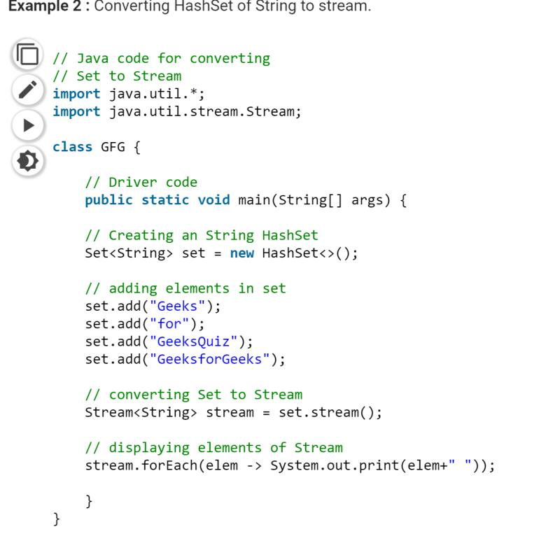

#### Convert Map to List

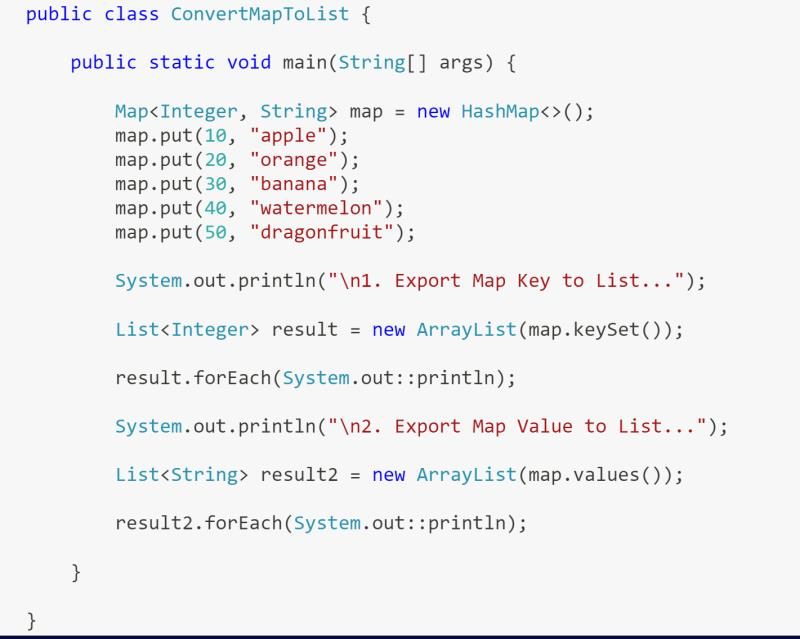

#### Convert Arrays to Stream

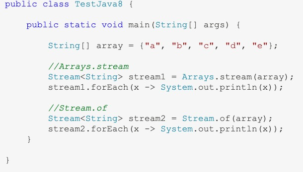

#### Remove the duplicated elements in a String

```java
import java.util.*; 
  
class RemoveDuplicates { 
    /* Function removes duplicate characters from the string 
    This function work in-place */
    void removeDuplicates(String str) { 
        Set<Character> lhs = new HashSet<>(); 
        for(int i=0;i<str.length();i++) lhs.add(str.charAt(i)); 
          
        // print string after deleting duplicate elements 
        for(Character ch : lhs) System.out.print(ch); 
    } 
      
    /* Driver program to test removeDuplicates */
    public static void main(String args[]) 
    { 
        String str = "geeksforgeeks"; 
        RemoveDuplicates r = new RemoveDuplicates(); 
        r.removeDuplicates(str); 
    } 
} 
```

Without Collections and Set

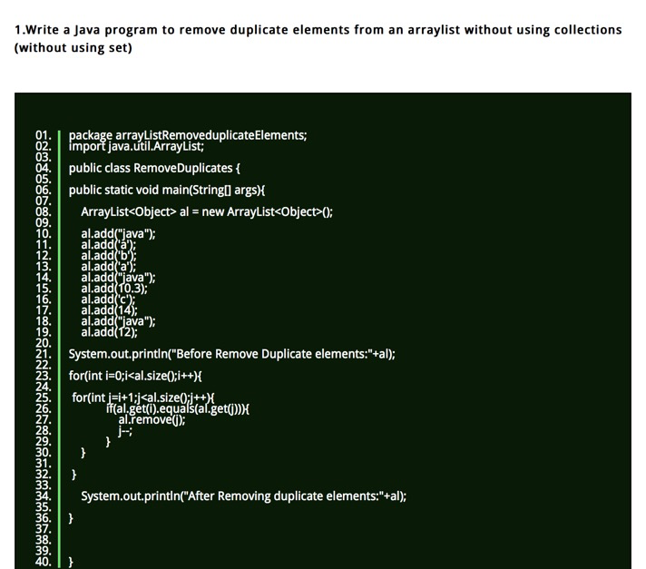

#### Remove the specified element from HashSet

```java
import java.util.*; 
import java.util.HashSet; 
  
public class HashSetDemo { 
    public static void main(String args[]) { 
        // Creating an empty HashSet 
        HashSet<String> set = new HashSet<String>(); 
  
        // Use add() method to add elements into the Set 
        set.add("Welcome"); 
        set.add("To"); 
        set.add("Geeks"); 
        set.add("4"); 
        set.add("Geeks"); 
  
        // Displaying the HashSet 
        System.out.println("HashSet: " + set); 
  
        // Removing elements using remove() method 
        set.remove("Geeks"); 
        set.remove("4"); 
        set.remove("Welcome"); 
  
        // Displaying the HashSet after removal 
        System.out.println("HashSet after removing elements: " + set); 
    } 
} 
```

#### Remove Element from LinkedHashSet

```java
import java.util.*;
public class Coding1 {
	public static void main(String[] args) {
		LinkedHashSet<String> linked = new LinkedHashSet<>();
		linked.add("e1");
		linked.add("e2");
		linked.add("e3");

		System.out.println("Linked Hash Set: " + linked);

		linked.remove("e2");
		System.out.println("Linked Hash Set: " + linked);
	}
}
```

#### Remove element from TreeSet

```java
import java.util.TreeSet;
  
public class RemoveElementTreeSet {
  
  public static void main(String[] args) {
  
    // Create a TreeSet and populate it with elements
    TreeSet treeSet = new TreeSet();
    treeSet.add("element_1");
    treeSet.add("element_2");
    treeSet.add("element_3");
   
    System.out.println("TreeSet contents : " + treeSet);
 
    // boolean remove(Object o) method removes the specific object from the TreeSet if present and returns true, false otherwise
    boolean removed = treeSet.remove("element_2");
   
    System.out.println("TreeSet contents after removal of element_2 : " + treeSet);
 
  }
}
```

#### Remove HTML Tags

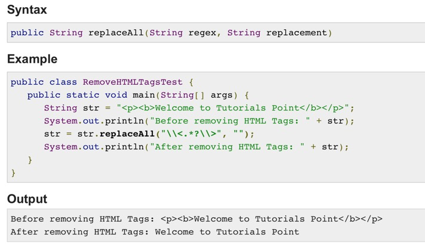

#### Reverse a linked list

```java
class Solution {
    public ListNode reverseList(ListNode head) {
        return reverse (head, null);
    }
    
    public ListNode reverse (ListNode head, ListNode prev) {
        if (head == null) return prev;
        ListNode next = head.next;
        head.next = prev;
        return reverse (next, head);
    }
}
```

#### Reverse number by using Stream

```java
import java.util.*;
import java.util.stream.Collector;
import java.util.stream.Collectors;
import java.util.stream.Stream;

public class Coding1 {
	public static void main(String[] args) {
		Stream<Integer> stream = Stream.of(1,2,3,4,5);
		Stream<Integer> reverse = stream.collect(reverse());
		reverse.forEach(System.out::println);
	}

	public static <T> Collector<T, ?, Stream<T>> reverse() {
		return Collectors.collectingAndThen(Collectors.toList(), list -> {
			Collections.reverse(list);
			return list.stream();
		});
	}
}
```

#### Reverse Elements of a Stream in Java

```java
import java.util.*;
import java.util.stream.Collector;
import java.util.stream.Collectors;
import java.util.stream.Stream;

public class Coding1 {
	public static void main(String[] args) {
		Stream<Integer> stream = Stream.of(1,2,3,4,5);
		Stream<Integer> reverse = stream.collect(reverse());
		reverse.forEach(System.out::println);
	}

	public static <T> Collector<T, ?, Stream<T>> reverse() {
		return Collectors.collectingAndThen(Collectors.toList(), list -> {
			Collections.reverse(list);
			return list.stream();
		});
	}
}
```

#### First and Last elements of TreeSet

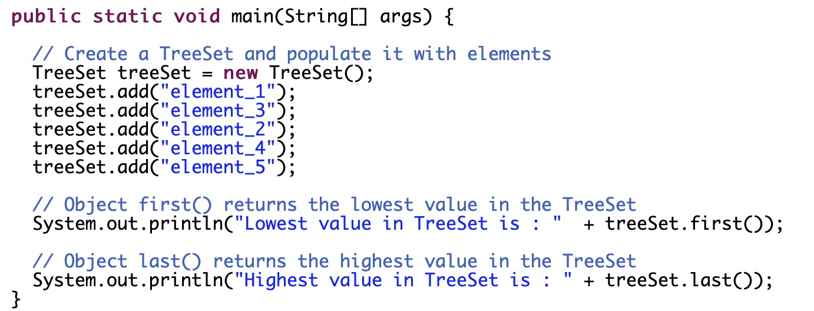

#### Add/Substract n seconds to current date using java 8.

```java
import java.time.LocalDateTime;

/**
 * @author www.Instanceofjava.com
 * @category interview programs
 * 
 * Description: java seconds to java 8 date
 *
 */
public class addSecondsToDate {

 public static void main(String[] args) {
  
  //create data using java 8 LocalDateTime 
  LocalDateTime datetime= LocalDateTime.now();
  
  System.out.println("Before: "+datetime);
  //add seconds by using plusSeconds(seconds) method
  datetime=datetime.plusSeconds(12);
   //datetime=datetime.minusSeconds(12);
  System.out.println("After: "+datetime);
 }

}
```

#### Append char array to String using StringBuilder

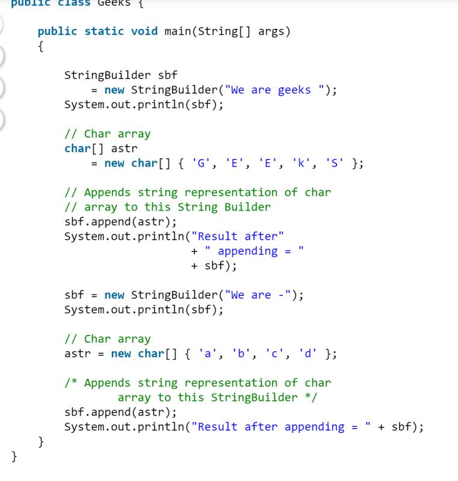

#### Format text using printf() method in java

#### Read text file line by line

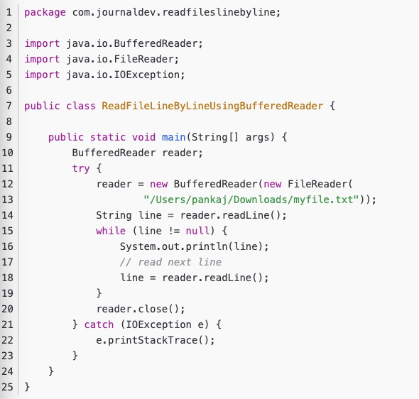

#### Traverse List

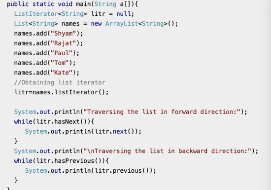

#### Traverse TreeSet of Object

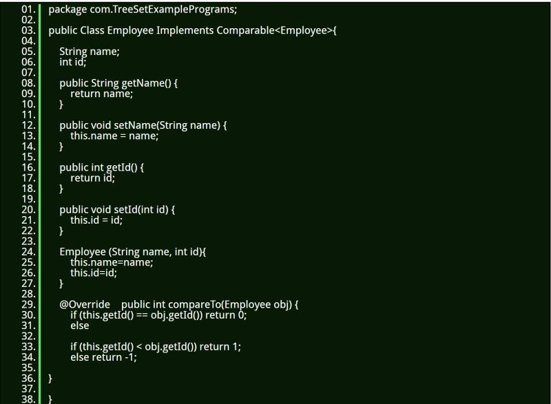

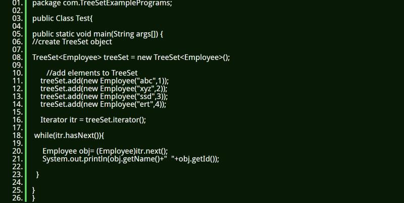

#### Traverse the files and subdirectories with java IO

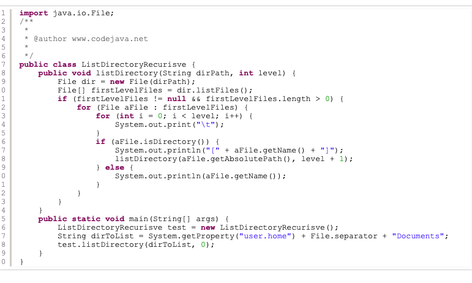