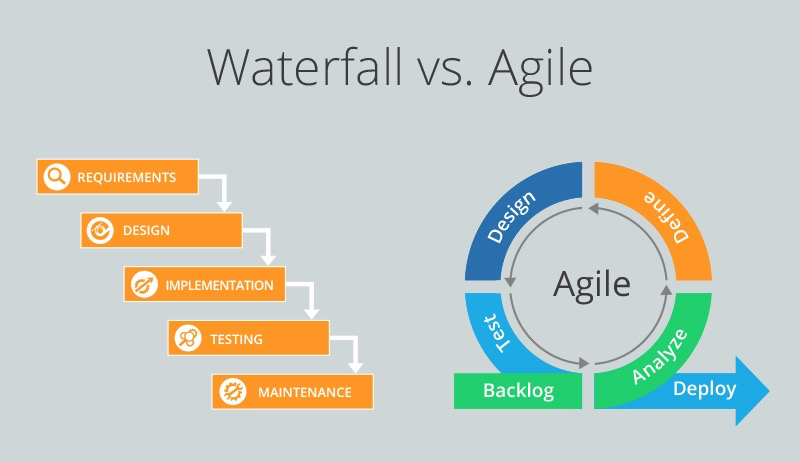

## Self Introduction
Hi my name is Eliana, I am an experienced Java Full-Stack developer with expertise in developing and deploying web applications and microservices in **Java/Java EE** industrial development environment and using related frameworks such as [**Spring MVC**](###Spring-MVC), **Spring boot**, **Spring Cloud**, **Spring Security**, **Spring JDBC** and many others. 

I have previous experience in multiple business domains including E-commerce, Social Media, Health Care and Finance.

I am proficient in **designing, coding, integrating and testing software (SDLC)** implementations and SDLC methodology such as [**Agile Scrum**](####Agile) and [**WaterFall**](####Waterfall). 

I have a solid foundation in data structures and algorithms, and familiar with Core Java concepts such as **OOP concepts**, **collections framework**, **exception handling**, **I/O system**, **Multi-threading**, **garbage collection**.

I have previous experience with Hibernate, I also developed applications using [**JDBC**](###JDBC), [**JSP**](###JSP) and [**Servlet**](###Servlet) with relational databases such as **MySQL**. I also worked with noSQL databases such as **MongoDB**, **DynamoDB**. Beside, I have hands-on experience in Object Relational Mapping (ORM) using **Hibernate** **5.x** and **Spring Data JPA**

I have extensive experience in building distributed systems with **Tomcat Cluster**, **Nginx** and **Redis**

I am also an expert in using Java Messaging Services JMS 2 for reliable information exchange across Java applications, also using [**ActiveMQ**, **RabbitMQ** and **Kafka**](###Kafka-vs-RabbitMQ-vs-ActiveMQ) as brokers.

Besides, I have experience in Microservices development using [**Spring Cloud**](###Spring-Cloud) tools including **Netflix Eureka**, **Ribbon**, **Zuul** API, **Zipkin**, **Hystrix**. 

I also worked on building security modules with **SSO** using Spring security,  [**Spring AOP**](###Spring-AOP). In my previous experience, I achieved Role-Based Access Control (RBAC) using Spring Security and **OAuth** to make [**authentication** and **authorization**](###Authorization-vs-Authentication).

Furthermore, I have a deep understanding of Testing with [**Test Driven Development (TDD)**](###TDD) environment and multiple testing tools like [**JUnit**](###JUnit), **Mockito**.

I worked on [**CICD**](###CICD) process, Integrated [**Docker**](###Docker), [**Git**](###Git-vs-Svn) and Maven plugin with [**Jenkins**](###Jenkins) for continuous deployment. 

I have expertise in Amazon Web Services (**AWS**) including launching, managing and troubleshooting [**EC2 instances**](####EC2), [**S3 Buckets**](####S3), **Elastic Beanstalk**, **Relational Database Services** (RDS), **EBS** volumes, **Elastic load Balancers**, **Auto Scaling Groups**, **Route 53**, **IAM** and **AWS Lambda**.

As a full-stack developer. I am also familiar with front-end technologies such as **Angular**, **HTML**, **CSS**, **Bootstrap**, **Ajax**, **freemarker** and **jQuery** and I’m able to build robust and easy to use UI pages.I’m also experienced in building web application using **React**, **React Native** and **Redux**

I am also skilled in **Tableau, D3.JS**, **JFreeChart** and **Jasper** for visualization and reporting

Personally, I’m self-motivated and capable of working independently. I am also a team player with excellent analytical, technical and communicational skills.I’m also capable of working under changing requirements and tight deadlines.

## Project 1

In my most recent project, I worked in Catholic Health Initiatives which offers expertise, convenience, resources and best-in-class health care.In this project to improve the existing modules including messaging, employee management, and build a reusable and robust security module to improve the management of employee and user [authentication and authorization](###Authentication-vs-Authorization) by using **Spring Security**.

- My responsibility is to improve the security module and the employee management system.

- To do this, I added **Single Sign On (SSO)** with [**JSON Web Token (JWT)**](###JWT) to the web application.

- I Designed the user management module and authorization control with **MySQL** based on **Role-Based Access Control (RBAC)**

- To make it convenient for users to login, I also achieved Social Login with Google and Facebook using **Spring Boot OAuth2**.

- Add message authentication using **AuthenticationToken** and **AuthenticationFilter** to improve the security of the old services.

The AuthenticationToken contains information about an authenticated HTTP client and doubles as the Principal to be returned by authenticated HttpServletRequestsThe token can be serialized/deserialized to and from a string as it is sent and received in HTTP client responses and requests as a HTTP cookie (this is done by the AuthenticationFilter).

- To make the security model robust, I developed a **RESTful API** with **JSON** which can be used by the application across the system using Spring Boot, which is for the purpose of testing the messaging. 

- Besides, I utilized **WireMock** to test and mock the API during the development process to make it fast and reliable.

- To improve the efficiency of developments. I utilized automatically generated html files of **RESTful API** design documents by **Swagger** and **Swagger UI**.

- Defined aspects with transaction advice and pointcut provided by **Spring AOP**. Applied **Filter** and **Interceptor** to cut across the application.

- Applied **Spring JMS** module to create, send and receive messages among different modules (employee manegement, messaging) using **ActiveMQ**.

- Designed and developed the UI of user authentication and employee management using **HTML5**, **CSS3** and **Angular 8**.

- I applied the **Test Driven Development (TDD)** throughout the development and created unit test cases using **JUnit**.

## Project 2

In my second most recent project, I build a scalable Micro-Services for dish ordering and delivering with customer services on mobile and restaurant online management services using Spring Boot Cloud, it allows customers to order, make payment, refund and track the food delivery process. It also provides restaurants with convenient management service of orders and inventories. There are other features including instant status update and notification, authorization using Spring Security which makes the application reliable and easy to use.

Responsibilities:

- In this project, I implemented [**Micro-Services**](###Microservices) Architecture for making applications compartmentalized and independent using **Spring Boot** 2.0.0.M3 and **Spring Cloud** Finchley.M2.

- Used Spring **dependency injection**, **annotations** and **Spring MVC components** to implement dish sales platform and order management services.Involved in designing, building, testing and deployment stages of **Software Development Life Cycle (SDLC)** under **Agile SCRUM** methodology.

- Utilized **Eureka** to monitor and maintain the registry of all the microservices.

- Made **RESTful** calls using **Netflix Feign client** to reduce code complexity.

- Managed containers using **Docker** 17.12 and **Rancher** 2.0. 

- Achieved event-driven communication using **JMS** with message broker **RabbitMQ** 3.7.to send and receive messages. 

- To make the application more scalable, I designed the asynchronous process of product inventory control with **RabbitMQ** and **Redis** 3.2.8.

- Used Distributed Tracing technology with **Spring Cloud Sleuth** and **Spring Cloud Zipkin** to easily stand up new services.

- In order to let the customers receive the updated status of their orders instantly. I also achieved instant messages notification using **WebSocket**.

- To make the application more secure and the services more reliable. I implemented restaurant authentication using **Spring AOP** 4.3. Implemented user authorization and authentication using **Spring Security**.

- For the web application built for restaurants. I designed and developed cross-browser front-end web pages using **HTML5**, **CSS3**, **jQuery** and **Angular 8**. Designed effective UI pages using **Angular.js routers**.

- Built the application with **Test Driven Development (TDD)**. Create unit test cases with **JUnit 5 and Mockito 2** and test REST API using **postman**.

- Utilized **GIT** for version control.

- Worked on **Agile Scrum** development methodology.

##  Concepts

[Application Context vs Bean Factory](###Application-Context-vs-Bean-Factory)

[Spring IOC](###Spring-IOC)

[JPA vs Hibernate](####JPA-vs-Hibernate)

[SAML vs LDAP vs Ouath2](###SAML-vs-LDAP-vs-Ouath2)

[Thymeleaf](###Thymeleaf)

[Design Pattern](###Design-Pattern)

[SOAP vs Rest](####SOAP-vs-Rest)

[Feature of Java 8](###Feature-of-Java-8)

### Spring IOC

Spring IoC is the mechanism to achieve loose-coupling between Objects dependencies. To achieve loose coupling and dynamic binding of the objects at runtime, objects dependencies are injected by other assembler objects. Spring IoC container is the program that **injects** dependencies into an object and make it ready for our use.

### **Application Context** vs **Bean Factory**

The interfaces Bean Factory and Appl ication Context represent the Spring IOC container. Bean Factory is the root interface for accessing the Spring container. It provides basic functionalities for managing beans. But Application Context is a sub-interface of the Bean Factory. Hence, it offers all the functionalities of Bean Factory. Bean Factory doesn't provide support for internationalization but Application Context provides support for it.

### Agile vs Waterfall

#### Agile

Agile is an iterative, team-based approach. This approach emphasizes the rapid delivery of an application in complete functional components. which is often implemented using Scrum.

The phases in the Agile model includes:

1. Requirements gathering
2. Design the requirements
3. Construction/ iteration
4. Testing/ Quality assurance
5. Deployment
6. Feedback

**1. Requirements gathering:** In this phase, you must define the requirements. You should explain business opportunities and plan the time and effort needed to build the project. Based on this information, you can evaluate technical and economic feasibility.

**2. Design the requirements:** When you have identified the project, work with stakeholders to define requirements. You can use the user flow diagram or the high-level UML diagram to show the work of new features and show how it will apply to your existing system.

**3. Construction/ iteration:** When the team defines the requirements, the work begins. Designers and developers start working on their project, which aims to deploy a working product. The product will undergo various stages of improvement, so it includes simple, minimal functionality.

**4. Testing:** In this phase, the Quality Assurance team examines the product's performance and looks for the bug.

**5. Deployment:** In this phase, the team issues a product for the user's work environment.

**6. Feedback:** After releasing the product, the last step is feedback. In this, the team receives feedback about the product and works through the feedback.

#### Waterfall

Waterfall is the traditional way of developing a software. It’s a linear approach to software development. In this methodology, the sequence of events is something like:

1. Gather and document requirements
2. Design
3. Code implemetation and unit test
4. Perform system testing
5. Perform user acceptance testing (UAT)
6. Fix any issues
7. Deliver the finished product
8. maintenance

| **Agile**                                                    | **Waterfall**                                                |
| :----------------------------------------------------------- | :----------------------------------------------------------- |
| It separates the project development lifecycle into sprints. | Software development process is divided into distinct phases. |
| It follows an incremental approach                           | Waterfall methodology is a sequential design process.        |
| Agile methodology is known for its flexibility.              | Waterfall is a structured software development methodology so most times it can be quite rigid. |
| Agile can be considered as a collection of many different projects. | Software development will be completed as one single project. |
| Agile is quite a flexible method which allows changes to be made in the project development requirements even if the initial planning has been completed. | There is no scope of changing the requirements once the project development starts. |
| Agile methodology, follow an iterative development approach because of this planning, development, prototyping and other software development phases may appear more than once. | All the project development phases like designing, development, testing, etc. are completed once in the Waterfall model. |
| Test plan is reviewed after each sprint                      | The test plan is rarely discussed during the test phase.     |
| Agile development is a process in which the requirements are expected to change and evolve. | The method is ideal for projects which have definite requirements and changes not at all expected. |
| In Agile methodology, testing is performed concurrently with software development. | In this methodology, the "Testing" phase comes after the "Build" phase |
| Agile introduces a product mindset where the software product satisfies needs of its end customers and changes itself as per the customer's demands. | This model shows a project mindset and places its focus completely on accomplishing the project. |
| Agile methdology works exceptionally well with Time & Materials or non-fixed funding. It may increase stress in fixed-price scenarios. | Reduces risk in the firm fixed price contracts by getting risk agreement at the beginning of the process. |
| Prefers small but dedicated teams with a high degree of coordination and synchronization. | Team coordination/synchronization is very limited.           |
| Products owner with team prepares requirements just about every day during a project. | Business analysis prepares requirements before the beginning of the project. |
| Test team can take part in the requirements change without problems. | It is difficult for the test to initiate any change in requirements. |
| Description of project details can be altered anytime during the SDLC process. | Detail description needs to implement waterfall software development approach. |
| The Agile Team members are interchangeable, as a result, they work faster. There is also no need for project managers because the projects are managed by the entire team | In the waterfall method, the process is always straightforward so, project manager plays an essential role during every stage of SDLC. |

### TDD

“Test-driven development” refers to a style of programming in which three activities are tightly interwoven: coding, testing (in the form of writing unit tests) and design (in the form of refactoring).
This process relies on the repetition of a very short development cycle: requirements are turned into very specific test cases, then the code is improved so that the tests pass.

It can be succinctly described by the following set of rules:
1. write a “single” unit test describing an aspect of the program
2. run the test, which should fail because the program lacks that feature
3. write “just enough” code, the simplest possible, to make the test pass
4. “refactor” the code until it conforms to the simplicity criteria
5. repeat, “accumulating” unit tests over time

### Feature of Java 8:

**Default method**: The default methods were introduced to provide backward compatibility so that existing interfaces can use the lambda expressions without implementing the methods in the implementation class. Default methods are also known as **defender methods** or **virtual extension methods**.

**Lambda:** A lambda expression is a short block of code which takes in parameters and returns a value. Lambda expressions are similar with methods, but they do not need a name and they can be implemented right in the body of a method.

**Stream API:** It is used to process collections of objects. A stream is a sequence of objects that supports various methods which can be pipelined to produce the desired result.
 The features of Java stream are:

A stream is not a data structure instead it takes input from the Collections, Arrays or I/O channels.

Streams don’t change the original data structure, they only provide the result as per the pipelined methods.

Each intermediate operation is lazily executed and returns a stream as a result, hence various intermediate operations can be pipelined. Terminal operations mark the end of the stream and return the result.

**Functional Interfaces:** It is an interface that contains only one abstract method. They can have only one functionality to exhibit. From Java 8 onwards, lambda expressions can be used to represent the instance of a functional interface. A functional interface can have any number of default methods.

### JDBC

#### JDBC vs ORM

**JDBC** (Java Database Connectivity) is the Java API that manages connecting to a database, issuing queries and commands, and handling result sets obtained from the database. ORM responsible for establishing connections with the database, unlike JDBC. It uses Query Language to communicate with the database and execute the queries. After, ORM maps itself the results to corresponding Java objects. 

### Servlet

A **servlet** is a Java programming language class that is used to extend the capabilities of servers that host applications accessed by means of a request-response programming model. Although **servlets** can respond to any type of request, they are commonly used to extend the applications hosted by web servers.

### Spring MVC

A Spring MVC is a Java framework which is used to build web applications. It follows the Model-View-Controller design pattern and ready components that can be used to develop flexible and loosely coupled web applications.

- The **Model** encapsulates the application data and in general they will consist of POJO.
- The **View** is responsible for rendering the model data and in general it generates HTML output that the client's browser can interpret.
- The **Controller** is responsible for processing user requests and building an appropriate model and passes it to the view for rendering.
- **Front Controller** - In Spring Web MVC, the DispatcherServlet class works as the front controller. It is responsible to manage the flow of the Spring MVC application.

---

#### Work Flow

A Spring MVC provides an elegant solution to use MVC in spring framework by the help of **DispatcherServlet**. Here, **DispatcherServlet** is a class that receives the incoming request and maps it to the right resource such as controllers, models, and views.

- As displayed in the figure, all the incoming request is intercepted by the DispatcherServlet that works as the front controller.
- The DispatcherServlet gets an entry of handler mapping from the XML file and forwards the request to the controller.
- The controller calls the appropriate service methods based on used GET or POST method and returns an object of ModelAndView.
- The DispatcherServlet checks the entry of view resolver in the XML file and invokes the specified view component.

---

#### Advantages

Let's see some of the advantages of Spring MVC Framework:-

- **Separate roles** - The Spring MVC separates each role, where the model object, controller, command object, view resolver, DispatcherServlet, validator, etc. can be fulfilled by a specialized object.
- **Light-weight** - It uses light-weight servlet container to develop and deploy your application.
- **Powerful Configuration** - It provides a robust configuration for both framework and application classes that includes easy referencing across contexts, such as from web controllers to business objects and validators.
- **Rapid development** - The Spring MVC facilitates fast and parallel development.
- **Reusable business code** - Instead of creating new objects, it allows us to use the existing business objects.
- **Easy to test** - In Spring, generally we create JavaBeans classes that enable you to inject test data using the setter methods.
- **Flexible Mapping** - It provides the specific annotations that easily redirect the page.

#### Spring MVC vs Struts2

Well, Apache Struts 2 is an elegant and extensible framework that is used for creating enterprise-level Java web applications. It is designed to streamline the development cycle, starting from building to deployment and maintenance of the application. In Struts, the object that is taking care of a request and routes it for further processing is known as “Action”.

On the other hand, Spring MVC is a part of a huge Spring framework stack containing other Spring modules. This means that it doesn’t allow developers to run it without Spring, but the developers can run the Spring Core without Spring MVC. The Spring MVC (Model View Controller) is designed around a DispatcherServlet, which dispatches the requests to handler with configurable handler mappings, view resolution and theme resolution.

While the objects responsible for handling requests and routing for processing in Struts called an Action, the same object is referred as Controller in Spring Web MVC framework. This is one of the very first differences between Spring MVC and Struts2. Struts 2 Actions are initiated every time when a request is made, whereas in Spring MVC the Controllers are created only once, stored in memory and shared among all the requests. So, Spring Web MVC framework is far efficient to handle the requests than Struts 2.

###Kafka vs RabbitMQ vs ActiveMQ

**ActiveMQ** is an open-source, multi-protocol, Java-based messaging server. It implements the JMS (Java Message Service) API and is able to support various messaging protocols including AMQP, STOMP, and MQTT. It is commonly used for sending messages between applications/services.
It translates messages from sender to receiver. It can connect multiple clients and servers and allows messages to be held in queue, instead of requiring both the client and server to be available simultaneously in order to communicate. Messaging can still happen even if one application is temporarily indisposed.

**Kafka** is an open-source stream-processing software developed by LinkedIn (and later donated to Apache) to effectively manage their growing data and switch to real-time processing from batch-processing. It is written in Scala and Java and based on the publish-subscribe model of messaging.
Applications (producers) send messages (records) to a Kafka node (broker) and said messages are processed by other applications called consumers. Said messages get stored in a topic and consumers subscribe to the topic to receive new messages.

**RabbitMQ** is a message-queueing software also known as a message broker or queue manager. Simply said; it is software where queues are defined, to which applications connect in order to transfer a message or messages.
A message can include any kind of information. It could, for example, have information about a process or task that should start on another application (which could even be on another server), or it could be just a simple text message. The queue-manager software stores the messages until a receiving application connects and takes a message off the queue. The receiving application then processes the message.
A message broker acts as a middleman for various services (e.g. a web application, as in this example). They can be used to reduce loads and delivery times of web application servers by delegating tasks that would normally take up a lot of time or resources to a third party that has no other job.

### Jenkins

It is an open-source automation tool written in Java with plugins built for Continuous Integration purposes. Jenkins is used to build and test your software projects continuously making it easier for developers to integrate changes to the project and making it easier for users to obtain a fresh build.

**Say something about Pipeline in Jenkins**

Jenkins Pipeline (or simply "Pipeline") is a suite of plugins which supports implementing and integrating continuous delivery pipelines into Jenkins. A continuous delivery pipeline is an automated expression of your process for getting software from version control right through to your users and customers.

### Git vs Svn

Git and SVN are both enterprise version control systems (VCS) that help with workflow and project management in coding, they do have their differences. The difference between Git and SVN version control systems is that Git is a distributed version control system, whereas SVN is a centralized version control system. Git uses multiple repositories including a centralized repository and server, as well as some local repositories. SVN does not have a centralized repository or server.

### Docker

**Docker** is an open platform for developing, shipping, and running applications. Docker enables you to separate your applications from your infrastructure so you can deliver software quickly. With Docker, you can manage your infrastructure in the same ways you manage your applications. By taking advantage of Docker’s methodologies for shipping, testing, and deploying code quickly, you can significantly reduce the delay between writing code and running it in production.

### Junit

A JUnit test is a method contained in a class which is only used for testing. This is called a Test class. To define that a certain method is a test method, annotate it with the @Test annotation.This method executes the code under test. You use an assert method, provided by JUnit or another assert framework, to check an expected result versus the actual result. These method calls are typically called asserts or assert statements

### Microservices

**Definition**: According to **Sam Newman**, "Microservices are the small services that work together."

According to **James Lewis and Martin Fowler**, "The microservice architectural style is an approach to develop a single application as a suite of small services. Each microservice runs its process and communicates with lightweight mechanisms. These services are built around business capabilities and independently developed by fully automated deployment machinery."

There is a bare minimum of centralized management of these services, which may be written in different programming language and use different data storage technologies.

##### Points to remember

- These are the services which are exposed by REST.
- These are small well-chosen deployable units.
- The services must be cloud-enabled.

The microservice defines an approach to the architecture that divides an application into a pool of loosely coupled services that implements business requirements. It is next to **Service-Oriented Architecture (SOA)**. The most important feature of the microservice-based architecture is that it can perform **continuous delivery** of a large and complex application.

Microservice helps in breaking the application and build a logically independent smaller applications. For example, we can build a cloud application with the help of Amazon AWS with minimum efforts.

#### Monolithic vs Microservices

Monolithic architecture is built as one large system and is usually one code base. Monolithic application is tightly coupled and entangled as the application evolves, making it difficult to isolate services for purposes such as independent scaling or code maintainability.

It extremely difficult to change technology or language or framework because everything is tightly coupled and depend on each other.

Microservices architecture is built as small independent module based on business functionality. In microservices application, each project and services are independent from each other at the code level. Therefore, it is easy to configure and deploy completely and also to scale based on demand.

### Spring Cloud

Spring Cloud is a framework for building robust cloud applications. Spring Cloud provides a solution to the commonly encountered patterns when developing a distributed system. Spring Cloud framework provides tools for developers to build a robust cloud application quickly. We can also build the microservice-based applications, for example, **configuration management, service discovery, circuit breakers, intelligent routing, cluster state, micro-proxy, a control bus, one time tokens, etc**.

#### Netflix Eureka/ Hystrix / Zuul / Ribbon /Zipkin

**Eureka** Server is an application that holds the information about all client-service applications. Every Micro service will register into the **Eureka** server and **Eureka** server knows all the client applications running on each port and IP address. **Eureka** Server is also known as Discovery Server.

**Hystrix** watches for failing calls to that method, and, if failures build up to a threshold, **Hystrix** opens the circuit so that subsequent calls automatically fail. While the circuit is open, **Hystrix** redirects calls to the method, and they are passed to your specified fallback method.

**Zuul** Server is a gateway application that handles all the requests and does the dynamic routing of microservice applications. The **Zuul** Server is also known as Edge Server.

**Ribbon** is a client-side load balancer that gives you a lot of control over the behavior of HTTP and TCP clients.

#### Spring Cloud Components

There are the following components:

- Configuration
- Service Discovery
- Circuit Breakers
- Routing and Messaging
- API Gateway
- Tracing
- CI Pipeline and Testing

##### Configuration

Spring Cloud configuration components provide server-side and client-side support for externalized configuration in a distributed system. We can manage the external properties with config server for applications across all environments. Spring Cloud config server can use Git, SVN (Apache Subversion), filesystem, and Vault to Store config. Config clients (microservice app) retrieve the configuration client from the server on startup.

##### Service Discovery

The service discovery is the automatic detection of devices and services over the network. In other words, service discovery is how an application and microservices connect in the distributed environment. Service discovery implementations include both:

- The **central server** that maintains a global view of the address.
- The **clients** that connect to the central server can update and retrieve the address.

There are **two** discovery patterns: **Client-side discovery** and **Server-side discovery**.

- **Client-side discovery:** In the Client-side discovery, client is responsible for determining the network location of available services. The client uses a **load-balancing algorithm** to select one of the available services and make a request. **Netflix OSS** is an example of a client-side discovery pattern.
- **Server-side discovery:** In the server-side discovery, the client makes an HTTP request to a service through a load balancer. The load balancer contacts to service registry and route each request to an available service instance. Similar to client-side discovery, service instances are registered and deregistered with the service registry. The **AWS ELB** (Elastic Load Balancer) is an example of server-side discovery. ELB balances the external traffic from the internet.

##### Circuit Breakers

Netflix has created a library called **Hystrix**. It implements the circuit breakers pattern. Circuit breakers calculate when to open and close the circuit and what to do in case of failure. When all services fail at some point, the circuit breaker handles these failures gracefully. The circuit breakers have three states: **OPEN, CLOSED,** and **HALF-OPEN** State.

##### Routing and Messaging

The cloud application made up of many microservices so the communication will be critical. Spring Cloud supports communication via messaging or HTTP request. Routing uses **Netflix Ribbon** and **Open Feign while** messaging uses Kafka or Rabbit MQ.

##### Tracing

Spring Cloud's other functionality is **distributed tracing**. Tracing is a single request to get data from the application. Tracing results in an exponentially larger number of requests to various microservices.

We can add **Spring Cloud Sleuth** library in our project to enable tracing. Sleuth is responsible for recording **timing**, which is used for **latency analysis**. We can export this timing to Zipkin.

Zipkin is a distributed tracing tool specially designed for **analyzing latency problem** inside the microservice architecture. It exposes HTTP endpoint used for collecting input data. If we required to add tracing in our project, we should add the **spring-cloud-starter-zipkin** dependency.

In the microservices, the input traffic volume is so high, so we cannot collect an only certain amount of data. For that purpose, the Spring Cloud Sleuth provides a **sampling policy**. The sampling policy allows us how much input traffic is sent to Zipkin for analysis. To enable this feature, we have to add the **spring-cloud-sleuth-stream** dependency.

##### Cl Pipeline and Testing

Spring Cloud pipeline is an opinionated (self-important) pipeline for Jenkins and Concourse, which creates pipeline automatically for the application. The building, testing, and deploying in various services is critical to having a successful cloud-native application.

The Jenkins pipeline provides a set of the tool designed for modeling simple and more advanced delivery pipeline as code. The definition of a pipeline is written into a text file called Jenkinsfile.

The pipeline has **two** syntaxes: **Declarative** and **Scripted** pipeline. These syntaxes are divided into two parts: Steps, and Stages. **Steps** are the fundamental part of the pipeline as they tell the Jenkins server what to do. **Stages** are the major part of a pipeline. Stages logically group a couple of steps, which displayed on the pipeline's result screen.

### JPA

#### JPA vs Hibernate

JPA: The Java Persistence API (JPA) is the Java standard for mapping Java objects to a relational database**.**

Hibernate: Hibernate is a Java framework that simplifies the development of Java application to interact with the database. It is an open source, lightweight, ORM tool. Hibernate implements the specifications of JPA for data persistence.

In short, JPA is the interface while Hibernate is the implementation.

#### JSP and Directives and JSF

Java Server Pages (***JSP***) is a server-side programming technology that enables the creation of dynamic, platform-independent method for building Web-based applications. ***JSP*** have access to the entire family of Java APIs, including the JDBC API to access enterprise databases.

**Directives** are elements that relay messages to the **JSP** container and affect how it compiles the **JSP** page. The **directives** themselves do not appear in the XML output. There are three **directives**: include, page, and taglib.

Java Server Faces (JSF) is a UI component based Java Web application framework. JSF is server based, e.g. the JSF UI components and their state are represented on the server with a defined life cycle of the UI components. JSF is part of the Java EE standard.A JSF application run in a standard web container, for example Tomcat.

### SAML vs LDAP vs Ouath2

**SAML** stands for Security Assertion Markup Language, it works by passing information about users, logins, and attributes between the identity provider and service providers. Each user logs in once to Single Sign On with the identify provider, and then the identify provider can pass SAML attributes to the service provider when the user attempts to access those services.

**LDAP** stands for Lightweight Directory Access Protocol.  It is used to authenticate users stored in the IDP to on-prem applications or other Linux Server processes. User authentication is the process of validating a username and password combination with a directory server such MS Active Directory, OpenLDAP or OpenDJ. Directories are standard technology for storaging user, group and permission information and serving that to applications in the enterprise.

**Ouath2** works by delegating user authentication to the service that hosts the user account and authorizing third-party applications to access the user account. OAuth 2 provides authorization flows for web and desktop applications, and mobile devices

### SOAP

#### SOAP vs Rest

SOAP stands for Simple Object Access Protocol whereas REST stands for Representational State Transfer.

SOAP is a protocol whereas REST is an architectural pattern.

SOAP uses service interfaces to expose its functionality to client applications while REST uses Uniform Service locators to access to the components on the hardware device.

SOAP needs more bandwidth for its usage whereas REST doesn’t need much bandwidth.

SOAP only works with XML formats whereas REST work with plain text, XML, HTML and JSON.

SOAP cannot make use of REST whereas REST can make use of SOAP.

### Authentication vs Authorization

Authentication: the process of determining whether or not an entity is who or what it declares itself to be

Authorization: the process of giving an entity permission to do, use, or obtain something. Logically, authentication precedes authorization.

### JWT

**JWT** stands for JSON Web Token. It is an Internet standard for creating data with optional signature and/or optional encryption whose payload holds JSON that asserts some number of claims. The tokens are signed either using a private secret or a public/private key. For example, a server could generate a token that has the claim "logged in as admin" and provide that to a client. The client could then use that token to prove that it is logged in as admin. The tokens can be signed by one party's private key (usually the server's) so that party can subsequently verify the token is legitimate. If the other party, by some suitable and trustworthy means, is in possession of the corresponding public key, they too are able to verify the token's legitimacy.

### Thymeleaf

It is a HTML5/XHTML/XML template engine. It is a server-side Java template engine for both web (servlet-based) and non-web (offline) environments. It is perfect for modern-day HTML5 JVM web development. It provides full integration with Spring FrameWork. It applies a set of transformations to template files in order to display data or text produced by the application.

### AWS

#### EC2

It is a virtual server in Amazon's Elastic Compute Cloud (**EC2**) for running applications on the Amazon Web Services (**AWS**) infrastructure. With **Amazon EC2**, you can set up and configure the operating system and applications that run on your **instance**.

#### S3

It is a public cloud storage resource available in **Amazon Web Services**' (**AWS**) Simple Storage Service (**S3**), an object storage offering. **Amazon S3 buckets**, which are similar to file folders, store objects, which consist of data and its descriptive metadata.

### Design Pattern

a **design pattern** is a general repeatable solution to a commonly occurring problem in software **design**. A **design pattern** isn't a finished **design** that can be transformed directly into code. It is a description or template for how to solve a problem that can be used in many different situations.

#### Factory

A Factory Pattern says that just define an interface or abstract class for creating an **object** but let the subclasses decide which class to instantiate. In other words, subclasses are responsible to create the instance of the class.

#### Singleton

It is used to restrict the instantiation of a class and ensures that only one instance of the class exists in the JVM. In other words, a **singleton** class is a class that can have only one object (an instance of the class) at a time per JVM instance.

#### Observer

The observer **pattern** defines a one-to-many dependency between objects so that when one object changes state, all of its dependents are notified and updated automatically. The object which is being watched is called the subject. The objects which are watching the state changes are called observers or listeners.

### Intermediate vs Terminal Operation                                                    

 When you invoke an intermediate operation on a stream, the operation is not executed immediately. It is executed only when a terminal operation is invoked on that stream. In a way, an intermediate operation is memorized and is recalled as soon as a terminal operation is invoked.Terminal operations produces a non-stream, result such as primitive value, a collection or no value at all. Terminal operations are typically preceded by intermediate operations which return another Stream which allows operations to be connected in a form of a query.

 

### CICD

**What is CI?**

The "CI" in CI/CD always refers to continuous integration, which is an automation process for developers. Successful CI means new code changes to an app are regularly built, tested, and merged to a shared repository. It’s a solution to the problem of having too many branches of an app in development at once that might conflict with each other.

**What is CD?**

Continuous deployment (the other possible "CD") can refer to automatically releasing a developer’s changes from the repository to production, where it is usable by customers. It addresses the problem of overloading operations teams with manual processes that slow down app delivery. It builds on the benefits of continuous delivery by automating the next stage in the pipeline.

### Spring AOP

Spring AOP enables Aspect-Oriented Programming in spring applications. In AOP, aspects enable the modularization of concerns such as transaction management, logging or security that cut across multiple types and objects (often termed crosscutting concerns).

AOP provides the way to dynamically add the cross-cutting concern before, after or around the actual logic using simple pluggable configurations. It makes easy to maintain code in the present and future as well. You can add/remove concerns without recompiling complete source code simply by changing configuration files (if you are applying aspects suing XML configuration).

### MERN Stack

**MERN** stack is a web development framework. It consists of MongoDB, ExpressJS, ReactJS, and NodeJS as its working components. Here are the details of what each of these components is used for in developing a web application when using MERN stack:

**MongoDB**: A document-oriented, No-SQL database used to store the application data.

**NodeJS**: The JavaScript runtime environment. It is used to run JavaScript on a machine rather than in a browser.

**ExpressJS**: A framework layered on top of NodeJS, used to build the backend of a site using NodeJS functions and structures. Since NodeJS was not developed to make websites but rather run JavaScript on a machine, ExpressJS was developed.

**ReactJS**: A library created by Facebook. It is used to build UI components that create the user interface of the single page web application.

### Topic vs Queue

In JMS, a Topic implements *publish and subscribe* semantics. When you publish a message, it goes to all the subscribers who are interested - so zero to many subscribers will receive a copy of the message. Only subscribers who had an active subscription at the time the broker receives the message will get a copy of the message. JMS Queue implements *load balancer* semantics. A single message will be received by exactly one consumer. If there are no consumers available at the time the message is sent it will be kept until a consumer is available that can process the message. If a consumer receives a message and does not acknowledge it before closing, then the message will be redelivered to another consumer. A queue can have many consumers with messages *load balanced* across the available consumers.

 

### Session Factory vs Session

Session Factory is a factory class for Session objects. It is available for the whole application while a Session is only available for particular transaction. Session is short-lived while Session Factory objects are long-lived. Session Factory provides a second level cache and Session provides a first level cache.

### Log4j

It is a tool to help the programmer output log statements to a variety of output targets. In case of problems with an application, it is helpful to enable logging so that the problem can be located. With log4j it is possible to enable logging at runtime without modifying the application binary.

### Comparable vs Comparetor

**Comparable**: an interface which defines a way to compare an object with other objects of the same type. It helps to sort the objects that have self-tendency to sort themselves, the objects must know how to order themselves. Eg: Roll number, age, salary. This interface is found in the Java.lang package and it contains only one method which is compareTo(). Comparable is not capable of sorting the object on its own, but the interface defines a method compareTo() which is responsible for sorting.

The compareTo() method returns an int value. The value can be either positive, negative, or zero.

**Comparator**: an interface is used to order the objects of a specific class. This interface is found in the java.util package. It contains two methods: compare(Object obj1,Object obj2), equals(Object element)

The first method, compare(Object obj1,Object obj2), compares its two input arguments and showcases the output. It returns a negative integer, zero, or a positive integer to state whether the first argument is less than, equal to, or greater than the second.

The second method, equals(Object element), requires an Object as a parameter and shows if the input object is equal to the comparator. The method will return true, only if the mentioned object is also a Comparator. The order remains the same as that of the Comparator.

### ArrayList vs Vector

Vector is similar with ArrayList, but it is synchronized. ArrayList is a better choice if your program is thread-safe. Vector and ArrayList require space as more elements are added. Vector each time doubles its array size, while ArrayList grow 50% of its size each time.

### 