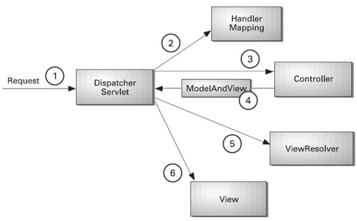

## Self Introduction
Hi my name is Eliana, I am an experienced Java Full-Stack developer with expertise in developing and deploying web applications and microservices in **Java/Java EE** industrial development environment and using related frameworks such as [**Spring MVC**](###Spring-MVC), **Spring boot**, **Spring Cloud**, **Spring Security**, etc. 

I have previous experience in multiple business domains including E-commerce, Social Media, Health Care and Finance.

I am proficient in **designing, coding, integrating and testing software (SDLC)** implementations and SDLC methodology such as [**Agile Scrum**](####Agile) and [**WaterFall**](####Waterfall). 

I have a solid foundation in Core Java such as **OOP concepts**, **collections framework**, **exception handling**, **I/O system**, **Multi-threading**. I also developed applications using **JDBC**, **JSP** and **Servlet** with relational databases such as **MySQL**. I also worked with noSQL databases such as **MongoDB**, **DynamoDB**.

I have extensive experience in building distributed systems with **Tomcat Cluster**, **Nginx** and **Redis**

I am also an expert in using Java Messaging Services JMS 2 for reliable information exchange across Java applications, also using [**ActiveMQ**, **RabbitMQ** and **Kafka**](###Kafka-vs-RabbitMQ-vs-ActiveMQ) as brokers.

Besides, I have experience in Microservices development using [**Spring Cloud**](###Spring-Cloud) tools including **Netflix Eureka**, **Ribbon**, **Zuul** API, **Zipkin**, **Hystrix**. 

I also worked on building security modules with **SSO** using Spring security, **Spring AOP**. In my previous experience, I achieved Role-Based Access Control (RBAC) using Spring Security and **OAuth** to make **authentication** and **authorization**.

Furthermore, I have a deep understanding of Testing with [**Test Driven Development (TDD)**](###TDD) environment and multiple testing tools like [**JUnit**](###JUnit), **Mockito**.

I worked on **CICD** process, Integrated [**Docker**](###Docker), [**Git**](###Git-vs-Svn) and Maven plugin with [**Jenkins**](###Jenkins) for continuous deployment. 

I have expertise in Amazon Web Services (**AWS**) such as **IAM**, **EC2**, **S3**, **Lambda**, **RDS**, etc

As a full-stack developer. I am also familiar with front-end technologies such as **Angular**, **HTML**, **CSS**, **Bootstrap**, **Ajax**, **freemarker** and **jQuery** and I’m able to build robust and easy to use UI pages.I’m also experienced in building web application using **React**, **React Native** and **Redux**

Personally, I’m self-motivated and capable of working independently. I am also a team player with excellent analytical, technical and communicational skills.I’m also capable of working under changing requirements and tight deadlines.

## Project 1

In my most recent project, I worked in Catholic Health Initiatives which offers expertise, convenience, resources and best-in-class health care.In this project to improve the existing modules including messaging, employee management, and build a reusable and robust security module to improve the management of employee and user authentication and authorization by using **Spring Security**.

- My responsibility is to improve the security module and the employee management system.

- To do this, I added **Single Sign On (SSO)** with **JSON Web Token (JWT)** to the web application.

- I Designed the user management module and authorization control with **MySQL** based on **Role-Based Access Control (RBAC)**

- To make it convenient for users to login, I also achieved Social Login with Google and Facebook using **Spring Boot OAuth2**.

- Add message authentication using **AuthenticationToken** and **AuthenticationFilter** to improve the security of the old services.

The AuthenticationToken contains information about an authenticated HTTP client and doubles as the Principal to be returned by authenticated HttpServletRequestsThe token can be serialized/deserialized to and from a string as it is sent and received in HTTP client responses and requests as a HTTP cookie (this is done by the AuthenticationFilter).

- To make the security model robust, I developed a **RESTful API** with **JSON** which can be used by the application across the system using Spring Boot, which is for the purpose of testing the messaging. 

- Besides, I utilized **WireMock** to test and mock the API during the development process to make it fast and reliable.

- To improve the efficiency of developments. I utilized automatically generated html files of **RESTful API** design documents by **Swagger** and **Swagger UI**.

- Defined aspects with transaction advice and pointcut provided by **Spring AOP**. Applied **Filter** and **Interceptor** to cut across the application.

- Applied **Spring JMS** module to create, send and receive messages among different modules (employee manegement, messaging) using **ActiveMQ**.

- Designed and developed the UI of user authentication and employee management using **HTML5**, **CSS3** and **Angular 8**.

- I applied the **Test Driven Development (TDD)** throughout the development and created unit test cases using **JUnit**.

## Project 2

In my second most recent project, I build a scalable Micro-Services for dish ordering and delivering with customer services on mobile and restaurant online management services using Spring Boot Cloud, it allows customers to order, make payment, refund and track the food delivery process. It also provides restaurants with convenient management service of orders and inventories. There are other features including instant status update and notification, authorization using Spring Security to make the application reliable and easy to use.

Responsibilities:

- In this project, I implemented [**Micro-Services**](###Microservices) Architecture for making applications compartmentalized and independent using **Spring Boot** 2.0.0.M3 and **Spring Cloud** Finchley.M2.

- Used Spring **dependency injection**, **annotations** and **Spring MVC components** to implement dish sales platform and order management services.Involved in designing, building, testing and deployment stages of **Software Development Life Cycle (SDLC)** under **Agile SCRUM** methodology.

- Utilized **Eureka** to monitor and maintain the registry of all the microservices.

- Made **RESTful** calls using **Netflix Feign client** to reduce code complexity.

- Managed containers using **Docker** 17.12 and **Rancher** 2.0. 

- Achieved event-driven communication using **JMS** with message broker **RabbitMQ** 3.7.to send and receive messages. 

- To make the application more scalable, I designed the asynchronous process of product inventory control with **RabbitMQ** and **Redis** 3.2.8.

- Used Distributed Tracing technology with **Spring Cloud Sleuth** and **Spring Cloud Zipkin** to easily stand up new services.

- In order to let the customers receive the updated status of their orders instantly. I also achieved instant messages notification using **WebSocket**.

- To make the application more secure and the services more reliable. I implemented restaurant authentication using **Spring AOP** 4.3. Implemented user authorization and authentication using **Spring Security**.

- For the web application built for restaurants. I designed and developed cross-browser front-end web pages using **HTML5**, **CSS3**, **jQuery** and **Angular 8**. Designed effective UI pages using **Angular.js routers**.

- Built the application with **Test Driven Development (TDD)**. Create unit test cases with **JUnit 5 and Mockito 2** and test REST API using **postman**.

- Utilized **GIT** for version control.

- Worked on **Agile Scrum** development methodology.

##  Concepts

### Agile vs Waterfall

#### Agile

Agile is an iterative, team-based approach. This approach emphasizes the rapid delivery of an application in complete functional components. which is often implemented using Scrum.

The phases in the Agile model includes:

1. Requirements gathering
2. Design the requirements
3. Construction/ iteration
4. Testing/ Quality assurance
5. Deployment
6. Feedback

**1. Requirements gathering:** In this phase, you must define the requirements. You should explain business opportunities and plan the time and effort needed to build the project. Based on this information, you can evaluate technical and economic feasibility.

**2. Design the requirements:** When you have identified the project, work with stakeholders to define requirements. You can use the user flow diagram or the high-level UML diagram to show the work of new features and show how it will apply to your existing system.

**3. Construction/ iteration:** When the team defines the requirements, the work begins. Designers and developers start working on their project, which aims to deploy a working product. The product will undergo various stages of improvement, so it includes simple, minimal functionality.

**4. Testing:** In this phase, the Quality Assurance team examines the product's performance and looks for the bug.

**5. Deployment:** In this phase, the team issues a product for the user's work environment.

**6. Feedback:** After releasing the product, the last step is feedback. In this, the team receives feedback about the product and works through the feedback.

#### Waterfall

Waterfall is the traditional way of developing a software. It’s a linear approach to software development. In this methodology, the sequence of events is something like:

1. Gather and document requirements
2. Design
3. Code implemetation and unit test
4. Perform system testing
5. Perform user acceptance testing (UAT)
6. Fix any issues
7. Deliver the finished product
8. maintenance

| **Agile**                                                    | **Waterfall**                                                |
| :----------------------------------------------------------- | :----------------------------------------------------------- |
| It separates the project development lifecycle into sprints. | Software development process is divided into distinct phases. |
| It follows an incremental approach                           | Waterfall methodology is a sequential design process.        |
| Agile methodology is known for its flexibility.              | Waterfall is a structured software development methodology so most times it can be quite rigid. |
| Agile can be considered as a collection of many different projects. | Software development will be completed as one single project. |
| Agile is quite a flexible method which allows changes to be made in the project development requirements even if the initial planning has been completed. | There is no scope of changing the requirements once the project development starts. |
| Agile methodology, follow an iterative development approach because of this planning, development, prototyping and other software development phases may appear more than once. | All the project development phases like designing, development, testing, etc. are completed once in the Waterfall model. |
| Test plan is reviewed after each sprint                      | The test plan is rarely discussed during the test phase.     |
| Agile development is a process in which the requirements are expected to change and evolve. | The method is ideal for projects which have definite requirements and changes not at all expected. |
| In Agile methodology, testing is performed concurrently with software development. | In this methodology, the "Testing" phase comes after the "Build" phase |
| Agile introduces a product mindset where the software product satisfies needs of its end customers and changes itself as per the customer's demands. | This model shows a project mindset and places its focus completely on accomplishing the project. |
| Agile methdology works exceptionally well with Time & Materials or non-fixed funding. It may increase stress in fixed-price scenarios. | Reduces risk in the firm fixed price contracts by getting risk agreement at the beginning of the process. |
| Prefers small but dedicated teams with a high degree of coordination and synchronization. | Team coordination/synchronization is very limited.           |
| Products owner with team prepares requirements just about every day during a project. | Business analysis prepares requirements before the beginning of the project. |
| Test team can take part in the requirements change without problems. | It is difficult for the test to initiate any change in requirements. |
| Description of project details can be altered anytime during the SDLC process. | Detail description needs to implement waterfall software development approach. |
| The Agile Team members are interchangeable, as a result, they work faster. There is also no need for project managers because the projects are managed by the entire team | In the waterfall method, the process is always straightforward so, project manager plays an essential role during every stage of SDLC. |

### TDD

“Test-driven development” refers to a style of programming in which three activities are tightly interwoven: coding, testing (in the form of writing unit tests) and design (in the form of refactoring).
This process relies on the repetition of a very short development cycle: requirements are turned into very specific test cases, then the code is improved so that the tests pass.

It can be succinctly described by the following set of rules:
1. write a “single” unit test describing an aspect of the program
2. run the test, which should fail because the program lacks that feature
3. write “just enough” code, the simplest possible, to make the test pass
4. “refactor” the code until it conforms to the simplicity criteria
5. repeat, “accumulating” unit tests over time

### Spring MVC

A Spring MVC is a Java framework which is used to build web applications. It follows the Model-View-Controller design pattern and ready components that can be used to develop flexible and loosely coupled web applications.

- The **Model** encapsulates the application data and in general they will consist of POJO.
- The **View** is responsible for rendering the model data and in general it generates HTML output that the client's browser can interpret.
- The **Controller** is responsible for processing user requests and building an appropriate model and passes it to the view for rendering.
- **Front Controller** - In Spring Web MVC, the DispatcherServlet class works as the front controller. It is responsible to manage the flow of the Spring MVC application.

---

#### Work Flow

A Spring MVC provides an elegant solution to use MVC in spring framework by the help of **DispatcherServlet**. Here, **DispatcherServlet** is a class that receives the incoming request and maps it to the right resource such as controllers, models, and views.

- As displayed in the figure, all the incoming request is intercepted by the DispatcherServlet that works as the front controller.
- The DispatcherServlet gets an entry of handler mapping from the XML file and forwards the request to the controller.
- The controller calls the appropriate service methods based on used GET or POST method and returns an object of ModelAndView.
- The DispatcherServlet checks the entry of view resolver in the XML file and invokes the specified view component.

---

#### Advantages

Let's see some of the advantages of Spring MVC Framework:-

- **Separate roles** - The Spring MVC separates each role, where the model object, controller, command object, view resolver, DispatcherServlet, validator, etc. can be fulfilled by a specialized object.
- **Light-weight** - It uses light-weight servlet container to develop and deploy your application.
- **Powerful Configuration** - It provides a robust configuration for both framework and application classes that includes easy referencing across contexts, such as from web controllers to business objects and validators.
- **Rapid development** - The Spring MVC facilitates fast and parallel development.
- **Reusable business code** - Instead of creating new objects, it allows us to use the existing business objects.
- **Easy to test** - In Spring, generally we create JavaBeans classes that enable you to inject test data using the setter methods.
- **Flexible Mapping** - It provides the specific annotations that easily redirect the page.

###Kafka vs RabbitMQ vs ActiveMQ

**ActiveMQ** is an open-source, multi-protocol, Java-based messaging server. It implements the JMS (Java Message Service) API and is able to support various messaging protocols including AMQP, STOMP, and MQTT. It is commonly used for sending messages between applications/services.
It translates messages from sender to receiver. It can connect multiple clients and servers and allows messages to be held in queue, instead of requiring both the client and server to be available simultaneously in order to communicate. Messaging can still happen even if one application is temporarily indisposed.

**Kafka** is an open-source stream-processing software developed by LinkedIn (and later donated to Apache) to effectively manage their growing data and switch to real-time processing from batch-processing. It is written in Scala and Java and based on the publish-subscribe model of messaging.
Applications (producers) send messages (records) to a Kafka node (broker) and said messages are processed by other applications called consumers. Said messages get stored in a topic and consumers subscribe to the topic to receive new messages.

**RabbitMQ** is a message-queueing software also known as a message broker or queue manager. Simply said; it is software where queues are defined, to which applications connect in order to transfer a message or messages.
A message can include any kind of information. It could, for example, have information about a process or task that should start on another application (which could even be on another server), or it could be just a simple text message. The queue-manager software stores the messages until a receiving application connects and takes a message off the queue. The receiving application then processes the message.
A message broker acts as a middleman for various services (e.g. a web application, as in this example). They can be used to reduce loads and delivery times of web application servers by delegating tasks that would normally take up a lot of time or resources to a third party that has no other job.

### Jenkins

It is an open-source automation tool written in Java with plugins built for Continuous Integration purposes. Jenkins is used to build and test your software projects continuously making it easier for developers to integrate changes to the project and making it easier for users to obtain a fresh build.

**Say something about Pipeline in Jenkins**

Jenkins Pipeline (or simply "Pipeline") is a suite of plugins which supports implementing and integrating continuous delivery pipelines into Jenkins. A continuous delivery pipeline is an automated expression of your process for getting software from version control right through to your users and customers.

### Git vs Svn

Git and SVN are both enterprise version control systems (VCS) that help with workflow and project management in coding, they do have their differences. The difference between Git and SVN version control systems is that Git is a distributed version control system, whereas SVN is a centralized version control system. Git uses multiple repositories including a centralized repository and server, as well as some local repositories. SVN does not have a centralized repository or server.

### Docker

**Docker** is an open platform for developing, shipping, and running applications. Docker enables you to separate your applications from your infrastructure so you can deliver software quickly. With Docker, you can manage your infrastructure in the same ways you manage your applications. By taking advantage of Docker’s methodologies for shipping, testing, and deploying code quickly, you can significantly reduce the delay between writing code and running it in production.

### Junit

A JUnit test is a method contained in a class which is only used for testing. This is called a Test class. To define that a certain method is a test method, annotate it with the @Test annotation.This method executes the code under test. You use an assert method, provided by JUnit or another assert framework, to check an expected result versus the actual result. These method calls are typically called asserts or assert statements

### Microservices

**Definition**: According to **Sam Newman**, "Microservices are the small services that work together."

According to **James Lewis and Martin Fowler**, "The microservice architectural style is an approach to develop a single application as a suite of small services. Each microservice runs its process and communicates with lightweight mechanisms. These services are built around business capabilities and independently developed by fully automated deployment machinery."

There is a bare minimum of centralized management of these services, which may be written in different programming language and use different data storage technologies.

##### Points to remember

- These are the services which are exposed by REST.
- These are small well-chosen deployable units.
- The services must be cloud-enabled.

The microservice defines an approach to the architecture that divides an application into a pool of loosely coupled services that implements business requirements. It is next to **Service-Oriented Architecture (SOA)**. The most important feature of the microservice-based architecture is that it can perform **continuous delivery** of a large and complex application.

Microservice helps in breaking the application and build a logically independent smaller applications. For example, we can build a cloud application with the help of Amazon AWS with minimum efforts.

### Spring Cloud

Spring Cloud is a framework for building robust cloud applications. Spring Cloud provides a solution to the commonly encountered patterns when developing a distributed system. Spring Cloud framework provides tools for developers to build a robust cloud application quickly. We can also build the microservice-based applications, for example, **configuration management, service discovery, circuit breakers, intelligent routing, cluster state, micro-proxy, a control bus, one time tokens, etc**.

#### Netflix Eureka/ Hystrix / Zuul / Ribbon /Zipkin

**Eureka** Server is an application that holds the information about all client-service applications. Every Micro service will register into the **Eureka** server and **Eureka** server knows all the client applications running on each port and IP address. **Eureka** Server is also known as Discovery Server.

**Hystrix** watches for failing calls to that method, and, if failures build up to a threshold, **Hystrix** opens the circuit so that subsequent calls automatically fail. While the circuit is open, **Hystrix** redirects calls to the method, and they are passed to your specified fallback method.

**Zuul** Server is a gateway application that handles all the requests and does the dynamic routing of microservice applications. The **Zuul** Server is also known as Edge Server.

**Ribbon** is a client-side load balancer that gives you a lot of control over the behavior of HTTP and TCP clients.

#### Spring Cloud Components

There are the following components:

- Configuration
- Service Discovery
- Circuit Breakers
- Routing and Messaging
- API Gateway
- Tracing
- CI Pipeline and Testing

##### Configuration

Spring Cloud configuration components provide server-side and client-side support for externalized configuration in a distributed system. We can manage the external properties with config server for applications across all environments. Spring Cloud config server can use Git, SVN (Apache Subversion), filesystem, and Vault to Store config. Config clients (microservice app) retrieve the configuration client from the server on startup.

##### Service Discovery

The service discovery is the automatic detection of devices and services over the network. In other words, service discovery is how an application and microservices connect in the distributed environment. Service discovery implementations include both:

- The **central server** that maintains a global view of the address.
- The **clients** that connect to the central server can update and retrieve the address.

There are **two** discovery patterns: **Client-side discovery** and **Server-side discovery**.

- **Client-side discovery:** In the Client-side discovery, client is responsible for determining the network location of available services. The client uses a **load-balancing algorithm** to select one of the available services and make a request. **Netflix OSS** is an example of a client-side discovery pattern.
- **Server-side discovery:** In the server-side discovery, the client makes an HTTP request to a service through a load balancer. The load balancer contacts to service registry and route each request to an available service instance. Similar to client-side discovery, service instances are registered and deregistered with the service registry. The **AWS ELB** (Elastic Load Balancer) is an example of server-side discovery. ELB balances the external traffic from the internet.

##### Circuit Breakers

Netflix has created a library called **Hystrix**. It implements the circuit breakers pattern. Circuit breakers calculate when to open and close the circuit and what to do in case of failure. When all services fail at some point, the circuit breaker handles these failures gracefully. The circuit breakers have three states: **OPEN, CLOSED,** and **HALF-OPEN** State.

##### Routing and Messaging

The cloud application made up of many microservices so the communication will be critical. Spring Cloud supports communication via messaging or HTTP request. Routing uses **Netflix Ribbon** and **Open Feign while** messaging uses Kafka or Rabbit MQ.

##### Tracing

Spring Cloud's other functionality is **distributed tracing**. Tracing is a single request to get data from the application. Tracing results in an exponentially larger number of requests to various microservices.

We can add **Spring Cloud Sleuth** library in our project to enable tracing. Sleuth is responsible for recording **timing**, which is used for **latency analysis**. We can export this timing to Zipkin.

Zipkin is a distributed tracing tool specially designed for **analyzing latency problem** inside the microservice architecture. It exposes HTTP endpoint used for collecting input data. If we required to add tracing in our project, we should add the **spring-cloud-starter-zipkin** dependency.

In the microservices, the input traffic volume is so high, so we cannot collect an only certain amount of data. For that purpose, the Spring Cloud Sleuth provides a **sampling policy**. The sampling policy allows us how much input traffic is sent to Zipkin for analysis. To enable this feature, we have to add the **spring-cloud-sleuth-stream** dependency.

##### Cl Pipeline and Testing

Spring Cloud pipeline is an opinionated (self-important) pipeline for Jenkins and Concourse, which creates pipeline automatically for the application. The building, testing, and deploying in various services is critical to having a successful cloud-native application.

The Jenkins pipeline provides a set of the tool designed for modeling simple and more advanced delivery pipeline as code. The definition of a pipeline is written into a text file called Jenkinsfile.

The pipeline has **two** syntaxes: **Declarative** and **Scripted** pipeline. These syntaxes are divided into two parts: Steps, and Stages. **Steps** are the fundamental part of the pipeline as they tell the Jenkins server what to do. **Stages** are the major part of a pipeline. Stages logically group a couple of steps, which displayed on the pipeline's result screen.