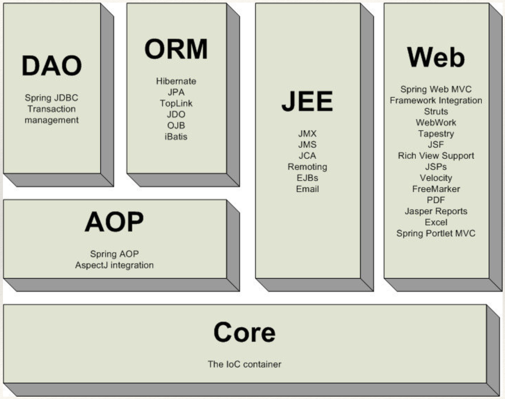
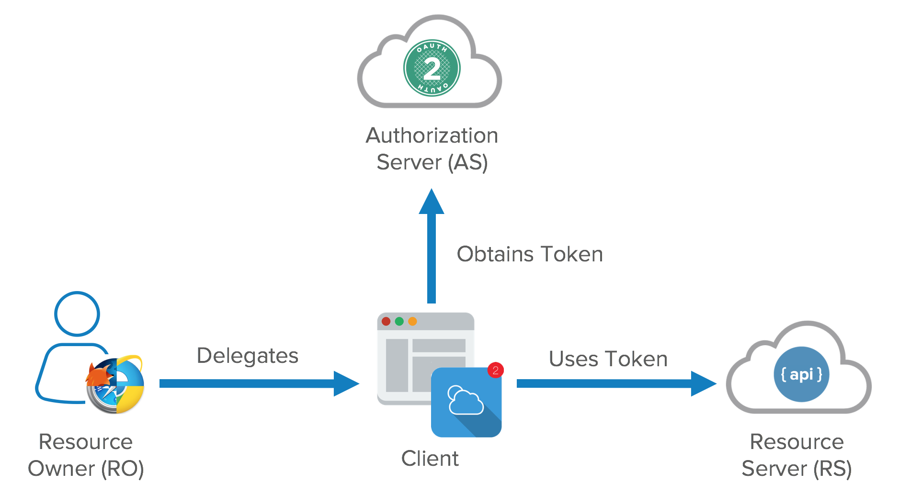
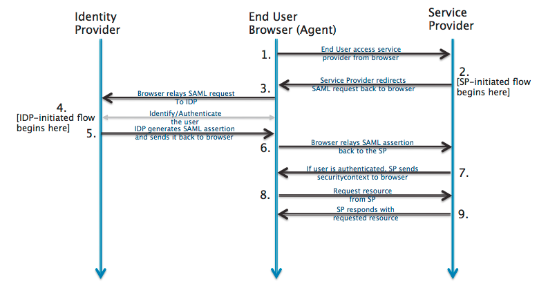

Spring

* IoC Container
* Reduce or replace configuration
* The original concept was how to work better with EJBs
* Enterprise Development without Application Server
* Tomcat is a Standard Java Development Container
* Completely POJO-based
* Is for better, cleaner code with POJO (plain old java objects) & Interface Driven
* Used Best Practices

## Spring Framework 5

Spring framework is an open source Java platform for enterprise Java. It is capable to create high performing, easily testable, and reusable code. It can be thought of as a *framework of frameworks* because it provides support to various frameworks such as [Struts](https://www.javatpoint.com/struts-2-tutorial), [Hibernate](https://www.javatpoint.com/hibernate-tutorial), Tapestry, [EJB](https://www.javatpoint.com/ejb-tutorial), [JSF](https://www.javatpoint.com/jsf-tutorial)

Spring framework targets to make J2EE development easier to use and promotes good programming practices by enabling a POJO-based programming model.

Following is the list of few of the great benefits of using Spring Framework −

- **Integration with existing frameworks** - Spring does not reinvent the wheel, instead it truly makes use of some of the existing technologies like several ORM frameworks, logging frameworks, JEE, Quartz and JDK timers, and other view technologies. Moreover, it  provides **templates** for JDBC, Hibernate, JPA etc. technologies. So there is no need to write too much code. It hides the basic steps of these technologies. Let's take the example of JdbcTemplate, you don't need to write the code for exception handling, creating connection, creating statement, committing transaction, closing connection etc. You need to write the code of executing query only. Thus, it save a lot of JDBC code. 

- **Powerful abstraction** - It provides powerful abstraction to JavaEE specifications such as [JMS](https://www.javatpoint.com/jms-tutorial), [JDBC](https://www.javatpoint.com/java-jdbc), JPA and JTA.

- **Loose Coupling** and  **Easy to test** - The Spring applications are loosely coupled because of dependency injection. It also makes easier to test the application. The EJB or Struts application require server to run the application but Spring framework doesn't require server.

- **Lightweight** - Lightweight IoC containers tend to be lightweight, especially when compared to EJB containers, for example. This is beneficial for developing and deploying applications on computers with limited memory and CPU resources.

- **POJO Based** - Spring enables developers to develop enterprise-class applications using POJOs. The benefit of using only POJOs is that you do not need an EJB container product such as an application server but you have the option of using only a robust servlet container such as Tomcat or some commercial product.

- **Modular** - Spring is organized in a modular fashion. Even though the number of packages and classes are substantial, you have to worry only about the ones you need and ignore the rest.

- **Web MVC** - Spring's web framework is a well-designed web MVC framework, which provides a great alternative to web frameworks such as Struts or other over-engineered or less popular web frameworks.

- **Central Exception Handling** - Spring provides a convenient API to translate technology-specific exceptions (thrown by JDBC, Hibernate, or JDO, for example) into consistent, unchecked exceptions.

- **Transaction management** - Spring provides a consistent transaction management interface that can scale down to a local transaction (using a single database, for example) and scale up to global transactions (using JTA, for example).


### Architecture




**Core Container**
The Core Container consists of the Core, Beans, Context, and Expression Language modules the details of which are as follows −
* The Core module provides the fundamental parts of the framework, including the IoC and Dependency Injection features.
* The Bean module provides BeanFactory, which is a sophisticated implementation of the factory pattern.
* The Context module builds on the solid base provided by the Core and Beans modules and it is a medium to access any objects defined and configured. The ApplicationContext interface is the focal point of the Context module.
* The SpEL module provides a powerful expression language for querying and manipulating an object graph at runtime.

**Data Access/Integration**
The Data Access/Integration layer consists of the JDBC, ORM, OXM, JMS and Transaction modules whose detail is as follows −

* The JDBC module provides a JDBC-abstraction layer that removes the need for tedious JDBC related coding.
* The ORM module provides integration layers for popular object-relational mapping APIs, including JPA, JDO, Hibernate, and iBatis.
* The OXM module provides an abstraction layer that supports Object/XML mapping implementations for JAXB, Castor, XMLBeans, JiBX and XStream.
* The Java Messaging Service JMS module contains features for producing and consuming messages.
* The Transaction module supports programmatic and declarative transaction management for classes that implement special interfaces and for all your POJOs.

**Web**
The Web layer consists of the Web, Web-MVC, Web-Socket, and Web-Portlet modules the details of which are as follows −

* The Web module provides basic web-oriented integration features such as multipart file-upload functionality and the initialization of the IoC container using servlet listeners and a web-oriented application context.
* The Web-MVC module contains Spring's Model-View-Controller (MVC) implementation for web applications.
* The Web-Socket module provides support for WebSocket-based, two-way communication between the client and the server in web applications.
* The Web-Portlet module provides the MVC implementation to be used in a portlet environment and mirrors the functionality of Web-Servlet module.

**Miscellaneous**
There are few other important modules like AOP, Aspects, Instrumentation, Web and Test modules the details of which are as follows −

* The AOP module provides an aspect-oriented programming implementation allowing you to define method-interceptors and pointcuts to cleanly decouple code that implements functionality that should be separated.
* The Aspects module provides integration with AspectJ, which is again a powerful and mature AOP framework.
* The Instrumentation module provides class instrumentation support and class loader implementations to be used in certain application servers.
* The Messaging module provides support for STOMP as the WebSocket sub-protocol to use in applications. It also supports an annotation programming model for routing and processing STOMP messages from WebSocket clients.
* The Test module supports the testing of Spring components with JUnit or TestNG frameworks.


### Spring Core

---

#### IoC (Inversion of Control) Container & Lifecycle
The Spring container is at the core of the Spring Framework. 

The **Spring IoC container makes use of Java POJO classes** and **configuration metadata** to produce a fully configured and executable application.

The container will create the objects, wire them together, configure them, and manage their complete life cycle from creation till destruction. Spring do this by reading the configuration metadata provided. The configuration metadata can be represented either by XML (XML based configuration file), Java annotations (Annotation-based configuration), or Java code (Java-based configuration). 

The Spring container uses DI to manage the components that make up an application. These objects are called Spring Beans.

IOC makes the code loosely coupled. In such case, there is no need to modify the code if our logic is moved to new environment. And it's easy for reuse and testing.

Summary:

* Responsible for instantiating, configuring & assembling the beans
* The container is instructed through configuration metadata
* The configuration metadata is represented as XML, Java Annotations or java code.
* It allows to express objects that compose your application & rich interdependencies between those objects
* Dependency Injection (DI)

##### Dependency Injection (DI)
The Dependency Injection is a design pattern that removes the dependency of the programs. When writing a complex Java application, application classes should be as independent as possible of other Java classes to increase the possibility to reuse these classes and to test them independently of other classes while unit testing. Dependency Injection (or sometime called wiring) helps in gluing these classes together and at the same time keeping them independent.

Two methods to achieve DI:
1. Constructor-based dependency injection
Constructor-based DI is accomplished when the container invokes a class constructor with a number of arguments, each representing a dependency on the other class.

```java
public class TextEditor {
   private SpellChecker spellChecker;
   
   public TextEditor() {
      spellChecker = new SpellChecker();
   }
}
```
What we've done here is, create a dependency between the TextEditor and the SpellChecker. In an inversion of control scenario, we would instead do something like this −
```java
public class TextEditor {
   private SpellChecker spellChecker;
   
   public TextEditor(SpellChecker spellChecker) {
      this.spellChecker = spellChecker;
   }
}
```
Here, the TextEditor should not worry about SpellChecker implementation. The SpellChecker will be implemented independently and will be provided to the TextEditor at the time of TextEditor instantiation. This entire procedure is controlled by the Spring Framework.

Here, we have removed total control from the TextEditor and kept it somewhere else (i.e. XML configuration file) and the dependency (i.e. class SpellChecker) is being injected into the class TextEditor through a Class Constructor. Thus the flow of control has been "inverted" by Dependency Injection (DI) because you have effectively delegated dependences to some external system.

We use the `<bean>` and the `<constructor-arg>` in the .xml file to invoke constructor injection.

```xml
<bean id="e" class="com.javatpoint.Employee">  
<constructor-arg value="10" type="int"></constructor-arg>  
</bean>  
```

2. Setter-based dependency injection
    Setter-based DI is accomplished by the container calling setter methods on your beans after invoking a no-argument constructor or no-argument static factory method to instantiate your bean. For example, in the .xml configuration file, the `<property>` element invokes the setter method. The `<value>` sub element of property will assign the specified value.

You can mix both, Constructor-based and Setter-based DI but it is a good rule of thumb to use constructor arguments for mandatory dependencies and setters for optional dependencies.

The code is cleaner with the DI principle and decoupling is more effective when objects are provided with their dependencies. The object does not look up its dependencies and does not know the location or class of the dependencies, rather everything is taken care by the Spring Framework.

There are many key **differences** between constructor injection and setter injection.

1. **Partial dependency**: can be injected using setter injection but it is not possible by constructor. Suppose there are 3 properties in a class, having 3 arg constructor and setters methods. In such case, if you want to pass information for only one property, it is possible by setter method only.
2. **Overriding**: Setter injection overrides the constructor injection. If we use both constructor and setter injection, IOC container will use the setter injection.
3. **Changes**: We can easily change the value by setter injection. It doesn't create a new bean instance always like constructor. So setter injection is flexible than constructor injection.

**DI is one of the implementation mechanism for IoC, where objects define their dependent objects with which they work. This is done by an assembler rather than by the objects themselves**

* Methods of DI 
  * Setter methods
  * Constructor Arguments
* Advantages
  * The object does not lookup its dependencies
  * The object does not know the location of the dependencies **(Location Transparency)**

###### Autowiring

Autowiring feature of spring framework enables you to inject the object dependency implicitly. It internally uses setter or constructor injection. Autowiring can't be used to inject primitive and string values. It works with reference only.

**Autowiring Mode**

- **no**: It is the default autowiring mode. It means no autowiring by default.

- **byName**: The byName mode injects the object dependency according to name of the bean. In such case, property name and bean name must be same. It internally calls setter method.
```java
<bean id="b1" class="org.sssit.B"></bean>  
<bean id="b2" class="org.sssit.B"></bean>  
<bean id="a" class="org.sssit.A" autowire="byName"></bean>  
```
- **byType**: The byType mode injects the object dependency according to type. So property name and bean name can be different. It internally calls setter method.
```java
<bean id="b1" class="org.sssit.B"></bean>  
<bean id="a" class="org.sssit.A" autowire="byType"></bean>  
```
- **constructor**: The constructor mode injects the dependency by calling the constructor of the class. It calls the constructor having large number of parameters.  If you have 3 constructors in a class, zero-arg, one-arg and two-arg then injection will be performed by calling the two-arg constructor.

- **autodetect**: It is deprecated since Spring 3.

###### Factory Method

A method that returns instance of a class is called **factory method**. Spring framework provides facility to inject bean using factory method. To do so, we can use two attributes of bean element.

1. **factory-method:** represents the factory method that will be invoked to inject the bean.
2. **factory-bean:** represents the reference of the bean by which factory method will be invoked. It is used if factory method is non-static.

**Factory Method Types**
There can be three types of factory method:

1. A **static factory method** that returns instance of **its own** class. It is used in singleton design pattern.
```xml
<bean id="a" **class**="com.javatpoint.A" factory-method="getA"></bean> 
```
2. A **static factory method** that returns instance of **another** class. It is used instance is not known and decided at runtime.
```xml
<bean id="b" **class**="com.javatpoint.A" factory-method="getB"></bean> 
```
3) A **non-static factory** method that returns instance of **another** class. It is used instance is not known and decided at runtime.

```xml
<bean id="a" **class**="com.javatpoint.A"></bean> 
<bean id="b" **class**="com.javatpoint.A" factory-method="getB" factory-bean="a"></bean> 
```

---


#### Configuration

##### Spring XML Configuration

applicationContext.xml
* Name doesn’t matter
* Spring context sort of a HashMap
* Can simply be a registry
* XML Configuration begins with this file Namespaces aid in configuration/validation

##### Java Configuration

Java-based configuration option enables you to write most of your Spring configuration without XML.

**@Configuration & @Bean**
Annotating a class with the @Configuration indicates that the class can be used by the Spring IoC container as a source of bean definitions. The @Bean annotation tells Spring that a method annotated with @Bean will return an object that should be registered as a bean in the Spring application context. The simplest possible @Configuration class would be as follows −

```java
package com.tutorialspoint;
import org.springframework.context.annotation.*;

@Configuration
public class HelloWorldConfig {
   @Bean 
   public HelloWorld helloWorld(){
      return new HelloWorld();
   }
}
```
**Injecting Bean Dependencies**
When @Beans have dependencies on one another, expressing that the dependency is as simple as having one bean method calling another as follows −
```java
package com.tutorialspoint;
import org.springframework.context.annotation.*;

@Configuration
public class AppConfig {
   @Bean
   public Foo foo() {
      return new Foo(bar());
   }
   @Bean
   public Bar bar() {
      return new Bar();
   }
}

```

Here, the foo bean receives a reference to bar via the constructor injection.
**@Import**
The @Import annotation allows for loading @Bean definitions from another configuration class. Consider a ConfigA class as follows −
```java
@Configuration
public class ConfigA {
   @Bean
   public A a() {
      return new A(); 
   }
}
```
You can import above Bean declaration in another Bean Declaration as follows −
```java
@Configuration
@Import(ConfigA.class)
public class ConfigB {
   @Bean
   public B b() {
      return new B(); 
   }
}
```

**Specifying Bean Scope Using @Scope**
The default scope is singleton, but you can override this with the @Scope annotation as follows −
```java
@Configuration
public class AppConfig {
   @Bean
   @Scope("prototype")
   public Foo foo() {
      return new Foo();
   }
}
```
##### Annotation Based Configuration

**@Required**
The @Required annotation applies to bean property setter methods.
**@Autowired**
The @Autowired annotation can apply to bean property setter methods, non-setter methods, constructor and properties.
**@Qualifier**
The @Qualifier annotation along with @Autowired can be used to remove the confusion by specifiying which exact bean will be wired.
**JSR-250 Annotations**
Spring supports JSR-250 based annotations which include @Resource, @PostConstruct and @PreDestroy annotations.

---

#### Bean

##### Bean Definition
The objects that form the backbone of your application and that are managed by the Spring IoC container are called beans. A bean is an object that is instantiated, assembled, and otherwise managed by a Spring IoC container. These beans are created with the configuration metadata that you supply to the container.

Bean definition contains the information called configuration metadata, which is needed for the container to know the following −
- How to create a bean
- Bean's lifecycle details
- Bean's dependencies

##### Bean Scopes
Beans
* Essentially Classes 
* Replaces keyword ‘new’ 
* Define Class, use Interface

When defining a \<bean> you have the option of declaring a scope for that bean. For example, to force Spring to produce a new bean instance each time one is needed, you should declare the bean's scope attribute to be prototype. Similarly, if you want Spring to return the same bean instance each time one is needed, you should declare the bean's scope attribute to be singleton.

The Spring Framework supports the following five scopes, three of which are available only if you use a web-aware ApplicationContext.


**singleton**
This scopes the bean definition to a single instance per Spring IoC container (default).
If a scope is set to singleton, the Spring IoC container creates exactly one instance of the object defined by that bean definition. This single instance is stored in a cache of such singleton beans, and all subsequent requests and references for that named bean return the cached object.

The default scope is always singleton. However, when you need one and only one instance of a bean, you can set the scope property to singleton in the bean configuration file, as shown in the following code snippet −
```xml
<!-- A bean definition with singleton scope -->
<bean id = "..." class = "..." scope = "singleton">
   <!-- collaborators and configuration for this bean go here -->
</bean>
```

Summary: Singleton in Java
- Single Instance per JVM Instance 
- Lazy / Eager types

Singleton Bean in Spring
- One Instantiation
- Default Bean Scope
- Single Instance per Spring Container


**prototype**
This scopes a single bean definition to have any number of object instances.
If the scope is set to prototype, the Spring IoC container creates a new bean instance of the object every time a request for that specific bean is made. As a rule, use the prototype scope for all state-full beans and the singleton scope for stateless beans.

**request**
This scopes a bean definition to an HTTP request. Only valid in the context of a web-aware Spring ApplicationContext.

**session**
This scopes a bean definition to an HTTP session. Only valid in the context of a web-aware Spring ApplicationContext.

**global-session**
This scopes a bean definition to a global HTTP session. Only valid in the context of a web-aware Spring ApplicationContext.

##### Bean Life Cycle
The life cycle of a Spring bean is easy to understand. When a bean is instantiated, it may be required to perform some initialization to get it into a usable state. Similarly, when the bean is no longer required and is removed from the container, some cleanup may be required.

Two important bean life cycle callback methods, which are required at the time of bean initialization and its destruction.

**Initialization callbacks**
The org.springframework.beans.factory.InitializingBean interface specifies a single method −
```java
void afterPropertiesSet() throws Exception;
```
Thus, you can simply implement the above interface and initialization work can be done inside afterPropertiesSet() method as follows −
```java
public class ExampleBean implements InitializingBean {
   public void afterPropertiesSet() {
      // do some initialization work
   }
}
```
In the case of XML-based configuration metadata, you can use the init-method attribute to specify the name of the method that has a void no-argument signature. For example −
```xml
<bean id = "exampleBean" class = "examples.ExampleBean" init-method = "init"/>
```
Following is the class definition −
```java
public class ExampleBean {
   public void init() {
      // do some initialization work
   }
}
```

**Destruction callbacks**
The org.springframework.beans.factory.DisposableBean interface specifies a single method −
```java
void destroy() throws Exception;
```
Thus, you can simply implement the above interface and finalization work can be done inside destroy() method as follows −
```java
public class ExampleBean implements DisposableBean {
   public void destroy() {
      // do some destruction work
   }
}
```
In the case of XML-based configuration metadata, you can use the destroy-method attribute to specify the name of the method that has a void no-argument signature. For example −

```xml
<bean id = "exampleBean" class = "examples.ExampleBean" destroy-method = "destroy"/>
```
Following is the class definition −
```java
public class ExampleBean {
   public void destroy() {
      // do some destruction work
   }
}
```
If you are using Spring's IoC container in a non-web application environment; for example, in a rich client desktop environment, you register a shutdown hook with the JVM. Doing so ensures a graceful shutdown and calls the relevant destroy methods on your singleton beans so that all resources are released.

It is recommended that you do not use the InitializingBean or DisposableBean callbacks, because XML configuration gives much flexibility in terms of naming your method.
##### Bean Post Processor
The BeanPostProcessor interface defines callback methods that you can implement to provide your own instantiation logic, dependency-resolution logic, etc.
##### Bean Definition Inheritance
A bean definition can contain a lot of configuration information, including constructor arguments, property values, and container-specific information such as initialization method, static factory method name, and so on.

A child bean definition inherits configuration data from a parent definition. The child definition can override some values, or add others, as needed.

Spring Bean definition inheritance has nothing to do with Java class inheritance but the inheritance concept is same. You can define a parent bean definition as a template and other child beans can inherit the required configuration from the parent bean.

When you use XML-based configuration metadata, you indicate a child bean definition by using the parent attribute, specifying the parent bean as the value of this attribute.

---

#### Annotation

##### Stereotype Annotation
@Component, @Service, @Repository Semantically the same
@Component - any POJO
@Service - business logic layer 
@Repository - data layer

@Component is one Stereotype annotation used to mark a Class as a Component 
@Service & @Repository annotations inherit @Component
All these 3 annotations are complimentary to each other

**@Component vs @Service vs @Repository vs @Controller**
**@Component**
Is the most generic stereotype and marks a bean as a Spring-managed component. The @Component annotation marks a java class as a bean so the component-scanning mechanism of
spring can pick it up and pull it into the application context. To use this annotation, apply it over class. Both @Service and @Repository annotations are the specializations over the @Component annotation

**@Repository**
Although above use of @Component is good enough but you can use more suitable annotation that
provides additional benefits specifically for DAOs i.e. @Repository annotation. The @Repository annotation is a specialization of the @Component annotation with similar use and functionality. In addition to importing the DAOs into the DI container, it also makes the unchecked exceptions (thrown from DAO methods) eligible for translation into Spring DataAccessException.
Is a stereotype used for persistence layer. It translates any persistence related exceptions into a Spring’s DataAccessException

**@Service**
The @Service annotation is also a specialization of the component annotation. It doesn’t currently
provide any additional behavior over the @Component annotation, but it’s a good idea to use @Service over @Component in service-layer classes because it specifies intent better.
Is used for the beans at the service layer. Currently, it doesn’t offer any additional functionality over @Component

**@Controller**
@Controller annotation marks a class as a Spring Web MVC controller. It too is a @Component
specialization, so beans marked with it are automatically imported into the DI container. When you add the @Controller annotation to a class, you can use another annotation i.e. @RequestMapping; to map URLs to instance methods of a class.

It’s always preferable to use @Repository and @Service annotations over @Component, wherever applicable. It communicates the bean’s intent more clearly

##### Autowired Annotation
Better with Annotations 
Tied to location 
Member Variables 
Constructor
Setter

The @Autowired annotation provides more fine-grained control over where and how autowiring should be accomplished. The @Autowired annotation can be used to autowire bean on the setter method just like @Required annotation, constructor, a property or methods with arbitrary names and/or multiple arguments.

**@Autowired on Setter Methods**
You can use @Autowired annotation on setter methods to get rid of the \<property\> element in XML configuration file. When Spring finds an @Autowired annotation used with setter methods, it tries to perform byType autowiring on the method.
**@Autowired on Properties/Member Variable**
You can use @Autowired annotation on properties to get rid of the setter methods. When you will pass values of autowired properties using \<property\> Spring will automatically assign those properties with the passed values or references.


### Spring AOP

**Aspect Oriented Programming** (AOP) compliments OOPs in the sense that it also provides modularity. The key unit of modularity in OOP is the class, whereas in AOP the unit of modularity is the aspect. Dependency Injection helps you decouple your application objects from each other and AOP helps you decouple cross-cutting concerns from the objects that they affect.

The core construct of AOP is the **aspect** that encapsulates behaviors affecting multiple classes into reusable modules. Aspect is a module which has a set of APIs providing cross-cutting concerns. For example, a logging module would be called AOP aspect for logging. There are various common examples of aspects like auditing, declarative transactions, security, caching, etc. An application can have any number of aspects depending on the requirement. In spring AOP, aspects are implemented using regular classes annotated with @Aspect annotation (@AspectJ style).

AOP breaks the program logic into distinct parts (called concerns). It is used to increase modularity by **cross-cutting concerns**. A **cross-cutting concern** is a concern that can affect the whole application and should be centralized in one location in code as possible.

**Concern vs. Cross-cutting Concern**

The concern is behavior that we want to have in a particular module of an application. A concern may be defined as a functionality we want to implement.

The cross-cutting concern is a concern which is applicable throughout the application and it affects the entire application. For example, logging, security and data transfer is applicable for every module of an application hence they are cross-cutting concerns.

---

#### Terminologies

**Aspect**
This is a module which has a set of APIs providing cross-cutting requirements. For example, a logging module would be called AOP aspect for logging. An application can have any number of aspects depending on the requirement.

**Join point**
This represents a point in your application where you can plug-in the AOP aspect. You can also say, it is the actual place in the application where an action will be taken using Spring AOP framework.

**Advice**
This is the actual action to be taken either before or after the method execution. This is an actual piece of code that is invoked during the program execution by Spring AOP framework. There are multiple types of advice.

1. before: Run advice before the a method execution.
2. after: Run advice after the method execution, regardless of its outcome.
3. after-returning: Run advice after the a method execution only if method completes successfully.
4. after-throwing: Run advice after the a method execution only if method exits by throwing an exception.
5. around: Run advice before and after the advised method is invoked.

**Pointcut**
This is a set of one or more join points where an advice should be executed. You can specify pointcuts using expressions or patterns as we will see in our AOP examples.

**Introduction**
An introduction allows you to add new methods or attributes to the existing classes.

**Target** **object**
The object being advised by one or more aspects. This object will always be a proxied object, also referred to as the advised object.

**Weaving**
Weaving is the process of linking aspects with other application types or objects to create an advised object. This can be done at compile time, load time, or at runtime.

---

#### Implementation

1. **XML Schema based**: Aspects are implemented using the regular classes along with XML based configuration.
2. **@AspectJ based**: @AspectJ refers to a style of declaring aspects as regular Java classes annotated with Java 5 annotations.


### Spring ORM (Object-Relational Mapping)
Spring provides API to easily integrate Spring with ORM frameworks such as Hibernate, JPA(Java Persistence API), JDO(Java Data Objects), Oracle Toplink and iBATIS.

There are a lot of **advantages** of Spring framework in respect to ORM frameworks. There are as follows:

- **Less coding is required**: By the help of Spring framework, you don't need to write extra codes before and after the actual database logic such as getting the connection, starting transaction, commiting transaction, closing connection etc.
- **Easy to test**: Spring's IoC approach makes it easy to test the application.
- **Better exception handling**: Spring framework provides its own API for exception handling with ORM framework.
- **Integrated transaction management**: By the help of Spring framework, we can wrap our mapping code with an explicit template wrapper class or AOP style method interceptor.

------

#### Spring JPA

##### **Spring Data JPA (Java Persistence API)**

Object-Relational Mapping (ORM)Tools used to achieve ORM / implement JPA: Hibernate, iBatis, TopLink

**JPA**: is a Java specification for accessing, persisting, and managing data between Java objects / classes and a relational database. It allows you to do the Object-Relational Mapping (ORM). JPA is now considered the standard industry approach for Object to Relational Mapping (ORM) in the Java Industry. JPA itself is just a specification, not a product; it cannot perform persistence or anything else by itself. JPA is just a set of interfaces, and it requires an implementation.

**Spring Data JPA** API provides `JpaTemplate` class to integrate spring application with JPA.

##### **Advantage of Spring JpaTemplate**

You don't need to write the before and after code for persisting, updating, deleting or searching object such as creating Persistence instance, creating EntityManagerFactory instance, creating EntityTransaction instance, creating EntityManager instance, commiting EntityTransaction instance and closing EntityManager.

So, it **save a lot of code**.

##### Caching

------

#### Spring Hibernate

##### **Hibernate and Spring Integration**

We can simply integrate **hibernate application with spring application**.

In hibernate framework, we provide all the database information hibernate.cfg.xml file.

But if we are going to integrate the hibernate application with spring, we don't need to create the hibernate.cfg.xml file. We can provide all the information in the applicationContext.xml file.

##### **Advantage of Spring framework with hibernate**

The Spring framework provides **HibernateTemplate** class, so you don't need to follow so many steps like create Configuration, BuildSessionFactory, Session, beginning and committing transaction etc.

So **it saves a lot of code**.

------

#### **Hibernate vs. JPA vs. Spring Data JPA**

Hibernate is an ORM toll and a JPA implementation, while Spring Data JPA is a JPA Data Access Abstraction. Spring Data offers a solution to `GenericDao` custom implementations. It can also generate JPA queries on your behalf through method name conventions.

With Spring Data, you may use Hibernate, Eclipse Link, or any other JPA provider. Spring Data JPA is not an implementation or JPA provider, it's just an abstraction used to significantly reduce the amount of boilerplate code required to implement data access layers for various persistence stores.

---

#### Spring MVC + ORM + XML

---

#### Spring MVC + ORM + Annotations


### Spring JDBC

**Problems of JDBC API**
The problems of JDBC API are as follows:
- We need to write a lot of code before and after executing the query, such as creating connection, statement, closing resultset, connection etc.
- We need to perform exception handling code on the database logic.
- We need to handle transaction.
- Repetition of all these codes from one to another database logic is a time consuming task.

**Advantage of Spring JdbcTemplate**
Spring JdbcTemplate eliminates all the above mentioned problems of JDBC API. It provides you methods to write the queries directly, so it saves a lot of work and time.

All the classes in Spring JDBC are divided into four separate packages:

- **core** – the core functionality of JDBC. Some of the important classes under this package include *JdbcTemplate*, *SimpleJdbcInsert,* *SimpleJdbcCall* and *NamedParameterJdbcTemplate*.
- **datasource** – utility classes to access a datasource. It also has various datasource implementations for testing JDBC code outside the Jakarta EE container.
- **object** – DB access in an object-oriented manner. It allows executing queries and returning the results as a business object. It also maps the query results between the columns and properties of business objects.
- **support** – support classes for classes under *core* and *object* packages. E.g. provides the *SQLException* translation functionality.

---

#### JdbcTemplate

It is the central class in the Spring JDBC support classes. The functionalities of JdbcTemplate:

- Creation and closing of connections
- Executing statements and stored procedure calls
- Iterating over the ResultSet and returning results 

It handles the exception and provides the informative exception messages by the help of excepion classes defined in the **org.springframework.dao** package.

We can perform all the database operations by the help of JdbcTemplate class such as insertion, updation, deletion and retrieval of the data from the database.

Let's see the methods of spring JdbcTemplate class.

| No.  | Method                                                       | Description                                                  |
| :--- | :----------------------------------------------------------- | :----------------------------------------------------------- |
| 1)   | public int update(String query)                              | is used to insert, update and delete records.                |
| 2)   | public int update(String query,Object... args)               | is used to insert, update and delete records using PreparedStatement using given arguments. |
| 3)   | public void execute(String query)                            | is used to execute DDL query.                                |
| 4)   | public T execute(String sql, PreparedStatementCallback action) | executes the query by using PreparedStatement callback.      |
| 5)   | public T query(String sql, ResultSetExtractor rse)           | is used to fetch records using ResultSetExtractor.           |
| 6)   | public List query(String sql, RowMapper rse)                 | is used to fetch records using RowMapper.                    |

Firstly, let’s start with a simple example to see what the *JdbcTemplate* can do:

```java
int result = jdbcTemplate.queryForObject(
    "SELECT COUNT(*) FROM EMPLOYEE", Integer.class);
```
and also here's a simple INSERT:
```java
public int addEmplyee(int id) {
    return jdbcTemplate.update(
      "INSERT INTO EMPLOYEE VALUES (?, ?, ?, ?)", id, "Bill", "Gates", "USA");
}
```

---

#### NamedParameterJdbcTemplate

To get **support for named parameters**, we'll use the other JDBC template provided by the framework – the *NamedParameterJdbcTemplate*.

Additionally, this wraps the *JbdcTemplate* and provides an alternative to the traditional syntax using “*?*” to specify parameters. Under the hood, it substitutes the named parameters to JDBC “?” placeholder and delegates to the wrapped *JDCTemplate* to execute the queries:

```java
SqlParameterSource namedParameters = new MapSqlParameterSource().addValue("id", 1);
return namedParameterJdbcTemplate.queryForObject(
  "SELECT FIRST_NAME FROM EMPLOYEE WHERE ID = :id", namedParameters, String.class);
```

Notice how we are using the *MapSqlParameterSource* to provide the values for the named parameters.

For instance, let's look at below example that uses properties from a bean to determine the named parameters:

```java
Employee employee = new Employee();
employee.setFirstName("James");
 
String SELECT_BY_ID = "SELECT COUNT(*) FROM EMPLOYEE WHERE FIRST_NAME = :firstName";
 
SqlParameterSource namedParameters = new BeanPropertySqlParameterSource(employee);
return namedParameterJdbcTemplate.queryForObject(
  SELECT_BY_ID, namedParameters, Integer.class);
```

Note how we're now making use of the *BeanPropertySqlParameterSource* implementations instead of specifying the named parameters manually like before.

---

#### RowMapper

**RowMapper** interface allows to map a row of the relations with the instance of user-defined class. It iterates the ResultSet internally and adds it into the collection. So we don't need to write a lot of code to fetch the records as ResultSetExtractor.

**Advantage of RowMapper over ResultSetExtractor**

RowMapper saves a lot of code becuase it internally adds the data of ResultSet into the collection.

Another very useful feature is the ability to map query results to Java objects – by implementing *the RowMapper* interface.

For example – for every row returned by the query, Spring uses the row mapper to populate the java bean:

```java
public class EmployeeRowMapper implements RowMapper<Employee> {
    @Override
    public Employee mapRow(ResultSet rs, int rowNum) throws SQLException {
        Employee employee = new Employee();
 
        employee.setId(rs.getInt("ID"));
        employee.setFirstName(rs.getString("FIRST_NAME"));
        employee.setLastName(rs.getString("LAST_NAME"));
        employee.setAddress(rs.getString("ADDRESS"));
 
        return employee;
    }
}
```

Subsequently, we can now pass the row mapper to the query API and get fully populated Java objects:

```java
String query = "SELECT * FROM EMPLOYEE WHERE ID = ?";
Employee employee = jdbcTemplate.queryForObject(
  query, new Object[] { id }, new EmployeeRowMapper());
```

---

#### PreparedStatement

---

#### ResultSetExtractor

---

#### SimpleJdbcTemplate

---

#### Implementing CRUD ops

CRUD:

Create

Read

Update

Delete

---

#### Spring Transactions


### Spring MVC

A Spring MVC is a Java framework which is used to build web applications. It follows the Model-View-Controller design pattern and ready components that can be used to develop flexible and loosely coupled web applications.

- The **Model** encapsulates the application data and in general they will consist of POJO.
- The **View** is responsible for rendering the model data and in general it generates HTML output that the client's browser can interpret.
- The **Controller** is responsible for processing user requests and building an appropriate model and passes it to the view for rendering.
- **Front Controller** - In Spring Web MVC, the DispatcherServlet class works as the front controller. It is responsible to manage the flow of the Spring MVC application.

---

#### Work Flow

A Spring MVC provides an elegant solution to use MVC in spring framework by the help of **DispatcherServlet**. Here, **DispatcherServlet** is a class that receives the incoming request and maps it to the right resource such as controllers, models, and views.


- As displayed in the figure, all the incoming request is intercepted by the DispatcherServlet that works as the front controller.
- The DispatcherServlet gets an entry of handler mapping from the XML file and forwards the request to the controller.
- The controller returns an object of ModelAndView.
- The DispatcherServlet checks the entry of view resolver in the XML file and invokes the specified view component.

---

#### Advantages

Let's see some of the advantages of Spring MVC Framework:-

- **Separate roles** - The Spring MVC separates each role, where the model object, controller, command object, view resolver, DispatcherServlet, validator, etc. can be fulfilled by a specialized object.
- **Light-weight** - It uses light-weight servlet container to develop and deploy your application.
- **Powerful Configuration** - It provides a robust configuration for both framework and application classes that includes easy referencing across contexts, such as from web controllers to business objects and validators.
- **Rapid development** - The Spring MVC facilitates fast and parallel development.
- **Reusable business code** - Instead of creating new objects, it allows us to use the existing business objects.
- **Easy to test** - In Spring, generally we create JavaBeans classes that enable you to inject test data using the setter methods.
- **Flexible Mapping** - It provides the specific annotations that easily redirect the page.

---

#### ModelAndView

---

#### Form Validations


### SpEL (Spring Expression Language) 

**SpEL** is an exression language supporting the features of querying and manipulating an object graph at runtime.

There are many expression languages available such as JSP EL, OGNL, MVEL and JBoss EL. SpEL provides some additional features such as method invocation and string templating functionality.

---

#### SpEL API

The SpEL API provides many interfaces and classes. They are as follows:

- Expression interface
- SpelExpression class
- ExpressionParser interface
- SpelExpressionParser class
- EvaluationContext interface
- StandardEvaluationContext class


### Spring REST
#### Introduction

REpresentational State Transfer (REST) is an architectural style that defines a set of constraints and properties based on HTTP.

CRUD:

Create - POST

Read - GET

Update - PUT

Delete - DELETE


#### Architecture


#### Exception Handling


#### Spring MVC + Jackson

Jackson is a very popular and efficient java based library to serialize or map java objects to JSON and vice versa. 

#### Spring REST Template
#### Testing


### Spring Security

Spring SecurityApplication level securitySpring security is an application security frameworkSpring Security is a powerful and highly customizable authentication and access-control framework. It is a de- facto standard for securing Spring-based applications
2 Questions asked by Spring 

- SecurityWho are you? Provide ID to prove who you are
- What do you want?

##### Advantages

- Spring Security + Configuration => Flexibility and Cuatomizable
- Handles common vulnerabilities
- Widely adopted

##### What can Spring Security do?

- User name / password authenticationSSO/Okta/LDAP
- App level authenticationIntra 
- App Authorization like OAuth
- Microservice security (using tokens, JWT)
- Methods level security

##### Mechanisms of Spring Security

- Authentication
- Authorization
- Multi-Factor Authentication
- Captcha
- Encoding
- Identifying / Registering Client Devices Key Pairs
- Tracking Failed Attempts
- Auto Logout / Session Timeout

##### 5 Core Concepts in Spring Security

- **Authentication** (answer who you are by providing an ID)
  - Knowledge Based Authentication
    - Password
    - Pin code
    - Answer to a personal question
  - Possession based Authentication
    - Phone/text messages
    - Key cards and badges
    - Access token device
  - Multi factor Authentication (combination of the 2 above)
- **Authorization** (answer what the user can do)
- **Principal**: currently logged in user / account and context of the application
- **Granted** **Authority**: permissions of actions of one user (fine-grained)
- **Roles**: group of users that has the same permissions of actions (coarse-grained permission)

##### How to add Spring Security to Spring Boot

- Dependency: spring-boot-starter-security (maven dependency)
  - Spring Security Default Behavior (only add the dependency without configuration):
    - Adds mandatory authentication for URLs
    - Add login form
    - Handles login error
    - Create a user and sets a default password (in the console: user, password)

- Configuration: in “application.properties”

##### How to configure authentication in Spring Security

- AuthenticationManager: authentication()
- AuthenticationManagerBuilder: configure AuthenticationManager
  - Get hold of AuthenticationManagerBuilder
    - Create a class extends WebSecurityConfigurerAdapter
    - Override configure(AuthenticationManagerBuilder) to set the authentication configure
    - Add @EnableWebSecurity annotation
    - Add @Bean public PasswordEncoder getPasswordEncoder() {return ...}
  - Set the configuration on it

##### How to configure authorization in Spring Security

HttpSecurity

- Create APIs for different Roles
- In the same class
  - Override configure(HttpSecurity) to set the authorization configure
- Set the configuration on it

---

#### Security using JWT

Spring Boot + Spring Security + JWT:

- JWT: JSON Web Tokens

  JSON Web Token (JWT) is an open standard (RFC 7519) that defines a compact and self-contained way for securely transmitting information between parties as a JSON object. This information can be verified and trusted because it is digitally signed.

- JWT focus on authorization

  Authorization Strategies:

  - Session token (Reference token)
  - JSON web token (Value token)

(HTTP is stateless protocol) Session ID + Cookies: 

Load Balancer: shared cache Redis to store the session and session ID

##### JWT Structure

JSON Web Tokens consist of three parts separated by dots (.), which are:

- Header
  - The header typically consists of two parts: the type of the token, which is JWT, and the signing algorithm being used, such as HMAC SHA256 or RSA.
  - For example:{ "alg": "HS256", "typ": "JWT"}
  - Then, this JSON is Base64Url encoded to form the first part of the JWT.
- Payload
  - The second part of the token is the payload, which contains the claims. Claims are statements about an entity (typically, the user) and additional data. There are three types of claims: registered, public, and private claims.
- Signature
  - To create the signature part you have to take the encoded header, the encoded payload, a secret, the algorithm specified in the header, and sign that.
  - The signature is used to verify the message wasn't changed along the way, and, in the case of tokens signed with a private key, it can also verify that the sender of the JWT is who it says it is.

Therefore, a JWT typically looks like the following.Xxxxx.yyyyy.zzzzz
OAuth can be used to protect JWT from stealing

---

#### Security with OAuth2

Authorization between services

OAuth is a delegated authorization framework for REST/APIs. It enables apps to obtain limited access (scopes) to a user’s data without giving away a user’s password. It decouples authentication from authorization and supports multiple use cases addressing different device capabilities. It supports server-to-server apps, browser-based apps, mobile/native apps, and consoles/TVs.

To break it down simply, OAuth is where:

1. App requests authorization from User
2. User authorizes App and delivers proof
3. App presents proof of authorization to server to get a Token
4. Token is restricted to only access what the User authorized for the specific App

OAuth is built on the following central components:

- Scopes and Consent 
  Scopes are what you see on the authorization screens when an app requests permissions. They’re bundles of permissions asked for by the client when requesting a token. These are coded by the application developer when writing the application.

  

- Actors: The actors in OAuth flows are as follows:

  - **Resource Owner**: owns the data in the resource server. For example, I’m the Resource Owner of my Facebook profile.
  - **Resource Server**: The API which stores data the application wants to access
  - **Client**: the application that wants to access your data
  - **Authorization Server**: The main engine of OAuth

  

- Clients: The applications that want to access your data

- Tokens: Access tokens are the token the client uses to access the Resource Server (API). They’re meant to be short-lived. You can get access tokens with public clients. They’re designed to optimize for internet scale problems. The OAuth spec doesn’t define what a token is. It can be in whatever format you want. Usually though, you want these tokens to be JSON Web Tokens (a [standard](https://tools.ietf.org/html/rfc7519)). In a nutshell, a JWT (pronounced “jot”) is a secure and trustworthy standard for token authentication. JWTs allow you to digitally sign information (referred to as claims) with a signature and can be verified at a later time with a secret signing key.

- Authorization Server

- Flows

  The very first flow is what we call the **Implicit Flow**. The reason it’s called the implicit flow is because all the communication is happening through the browser. There is no backend server redeeming the authorization grant for an access token. An SPA is a good example of this flow’s use case. This flow is also called 2 Legged OAuth. Implicit flow is optimized for browser-only public clients. An access token is returned directly from the authorization request (front channel only). It typically does not support refresh tokens. It assumes the Resource Owner and Public Client are on the same device. Since everything happens on the browser, it’s the most vulnerable to security threats.

  The gold standard is the **Authorization Code Flow**, aka 3 Legged, that uses both the front channel and the back channel. This is what we’ve been talking about the most in this article. The front channel flow is used by the client application to obtain an authorization code grant. The back channel is used by the client application to exchange the authorization code grant for an access token (and optionally a refresh token). It assumes the Resource Owner and Client Application are on separate devices. It’s the most secure flow because you can authenticate the client to redeem the authorization grant, and tokens are never passed through a user-agent. There’s not just Implicit and Authorization Code flows, there are additional flows you can do with OAuth. Again, OAuth is more of a framework.

  For server-to-server scenarios, you might want to use a **Client Credential Flow**. In this scenario, the client application is a confidential client that’s acting on its own, not on behalf of the user. It’s more of a service account type of scenario. All you need is the client’s credentials to do the whole flow. It’s a back channel only flow to obtain an access token using the client’s credentials. It supports shared secrets or assertions as client credentials signed with either symmetric or asymmetric keys. Symmetric-key algorithms are cryptographic algorithms that allow you to decrypt anything, as long as you have the password. This is often found when securing PDFs or .zip files. Public key cryptography, or asymmetric cryptography, is any cryptographic system that uses pairs of keys: public keys and private keys. Public keys can be read by anyone, private keys are sacred to the owner. This allows data to be secure without the need to share a password.

  There’s also a legacy mode called **Resource Owner Password Flow**. This is very similar to the direct authentication with username and password scenario and is not recommended. It’s a legacy grant type for native username/password apps such as desktop applications. In this flow, you send the client application a username and password and it returns an access token from the Authorization Server. It typically does not support refresh tokens and it assumes the Resource Owner and Public Client are on the same device. For when you have an API that only wants to speak OAuth, but you have old-school clients to deal with.

  A more recent addition to OAuth is the **Assertion Flow**, which is similar to the client credential flow. This was added to open up the idea of federation. This flow allows an Authorization Server to trust authorization grants from third parties such as SAML IdP. The Authorization Server trusts the Identity Provider. The assertion is used to obtain an access token from the token endpoint. This is great for companies that have invested in SAML or SAML-related technologies and allow them to integrate with OAuth. Because SAML assertions are short-lived, there are no refresh tokens in this flow and you have to keep retrieving access tokens every time the assertion expires.

  Not in the OAuth spec, is a **Device Flow**. There’s no web browser, just a controller for something like a TV. A user code is returned from an authorization request that must be redeemed by visiting a URL on a device with a browser to authorize. A back channel flow is used by the client application to poll for authorization approval for an access token and optionally a refresh token. Also popular for CLI clients.v

---

#### Architecture

---

#### User storage in DB

---

#### Spring Security Client Integration

---

#### Password Storage

---

#### Customizing Spring Security

---

#### Authentication using LDAP

It stands for Lightweight Directory Access Protocol and it's an open, vendor-neutral protocol for accessing directory services over a network.

LDAP directory servers are read-optimized hierarchical data stores. Typically, they're used for storing user-related information required for user authentication and authorization.

---

#### Handling HTTPS

---

#### Security using SAML
SAML (Security Assertion Mark-up Language) is an open standard provide single-sign-on to web-based applications.  The protocol can be used for both authentication and authorization.

The SAML protocol has three entities:

- **User Agent**: User's browser
- **Service Provider (SP)**:  The entity providing the service, the application which you try to access..
- **Identity Provider (IdP)**:  The entity providing the identities, including the ability to authenticate a user. The Identity Provider typically also contains the user profile: additional information about the user such as first name, last name, job code, phone number, address, and so on. Depending on the application, some service providers may require a very simple profile (username, email), while others may require a richer set of user data (job code, department, address, location, manager, and so on).

Other Terminologies

- A **SAML Request**, also known as an authentication request, is generated by the Service Provider to "request" an authentication.
- A **SAML Response** is generated by the Identity Provider. It contains the actual assertion of the authenticated user. In addition, a SAML Response may contain additional information, such as user profile information and group/role information, depending on what the Service Provider can support.
- A **Service Provider Initiated (SP-initiated)** sign-in describes the SAML sign-in flow when initiated by the Service Provider. This is typically triggered when the end user tries to access a resource or sign in directly on the Service Provider side, such as when the browser tries to access a protected resource on the Service Provider side.
- An **Identity Provider Initiated (IdP-initiated)** sign-in describes the SAML sign-in flow initiated by the Identity Provider. Instead of the SAML flow being triggered by a redirection from the Service Provider, in this flow the Identity Provider initiates a SAML Response that is redirected to the Service Provider to assert the user's identity.

##### SAML Flow

- SP initiated flow
- IDP initiated flow

 

#### Differences between OAuth and SAML

SAML (Security Assertion Mark-up Language) is an standard that covers federation, identity management and single sign-on (SSO). 

OAuth (Open Authorisation) is a standard for **authorisation** of resources. Unlike SAML, it doesn’t deal with **authentication**.

Typical use cases for each of the standards. 

Even though SAML was actually designed to be widely applicable, its contemporary usage is typically shifted towards enterprise SSO scenarios. On the other hand, OAuth was designed for use with applications on the Internet, especially for delegated authorisation.


However, both can be used for web SSO, providing single sign-on for multiple web applications. But the terms are different.


##### Differences in Flow


### Spring SOAP

A web service is, in short, a machine-to-machine, platform independent service that allows communication over a network.

SOAP is a messaging protocol. Messages (requests and responses) are **XML documents over HTTP**. **The XML contract is defined by the WSDL** (Web Services Description Language). It provides a set of rules to define the messages, bindings, operations, and location of the service.

The XML used in SOAP can become extremely complex. For this reason, it is best to use SOAP with a framework like [JAX-WS](https://www.baeldung.com/jax-ws) or Spring, as we'll see in this tutorial.

---

#### Contract-First Development Style

There are two possible approaches when creating a web service: Contract-Last and [Contract-First](https://docs.spring.io/spring-ws/sites/1.5/reference/html/why-contract-first.html). When we use a contract-last approach, we start with the Java code, and we generate the web service contract (WSDL) from the classes. When using contract-first, **we start with the WSDL contract, from which we generate the Java classes.**

Spring-WS only supports the contract-first development style.

---

#### Producing & Consuming WSDL


### JMS

JMS (Java Message Service) is an API that provides the facility to create, send and read messages. It provides loosely coupled, reliable and asynchronous communication.
JMS is also known as a messaging service.

#### Overview of Message Brokers
#### Apache ActiveMQ
#### Apache Kafka

Kafka vs RabbitMQ vs ActiveMQ
ActiveMQ is an open-source, multi-protocol, Java-based messaging server. It implements the JMS (Java Message Service) API and is able to support various messaging protocols including AMQP, STOMP, and MQTT. It is commonly used for sending messages between applications/services.
Kafka is an open-source stream-processing software developed by LinkedIn (and later donated to Apache) to effectively manage their growing data and switch to real-time processing from batch-processing. It is written in Scala and Java and based on the publish-subscribe model of messaging.
RabbitMQ is a “traditional” message broker that implements variety of messaging protocols. It was one of the first open source message brokers to achieve a reasonable level of features, client libraries, dev tools, and quality documentation. RabbitMQ was originally developed to implement AMQP, an open wire protocol for messaging with powerful routing features. While Java has messaging standards like JMS, it’s not helpful for non-Java applications that need distributed messaging which is severely limiting to any integration scenario, microservice or monolithic. With the advent of AMQP, cross-language flexibility became real for open source message brokers.


### Design Patterns in Spring5

#### Understanding the role of Design Patterns

#### Spring Modules & Design Patterns


