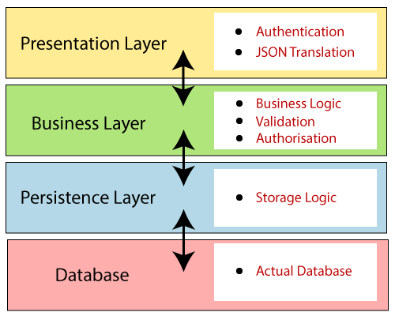
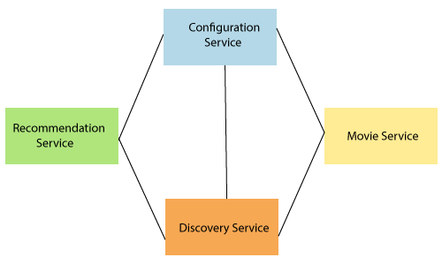
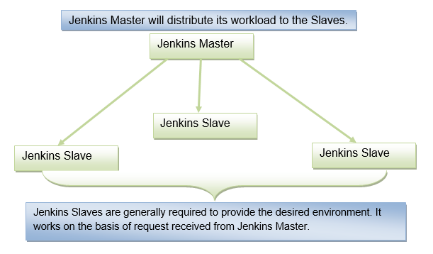

## Spring Boot 2

### Spring Boot Fundamentals
#### Introduction

Spring Boot is a project that is built on the top of the Spring Framework. It provides an easier and faster way to set up, configure, and run both simple and web-based applications. It is a **Spring module** that provides the **RAD (Rapid Application Development)** feature to the Spring Framework.


In short, Spring Boot is the combination of **Spring Framework** and **Embedded Servers**.

In Spring Boot, there is no requirement for XML configuration (deployment descriptor). In this way, it decreases the effort of the developer.

##### Advantages of Spring Boot

- It creates **stand-alone** Spring applications that can be started using Java **-jar**.
- It tests web applications easily with the help of different **Embedded** HTTP servers such as **Tomcat, Jetty,** etc. We don't need to deploy WAR files.
- It provides opinionated '**starter**' POMs to simplify our Maven configuration.
- It provides **production-ready** features such as **metrics, health checks,** and **externalized configuration**.
- There is no requirement for **XML** configuration.
- It offers a **CLI** tool for developing and testing the Spring Boot application.
- It offers the number of **plug-ins**.
- It also minimizes writing multiple **boilerplate codes** (the code that has to be included in many places with little or no alteration), XML configuration, and annotations.
- It **increases productivity** and reduces development time.

---

#### Architecture

There are **four** layers in Spring Boot:

**Presentation Layer:** The presentation layer handles the HTTP requests, translates the JSON parameter to object, and authenticates the request and transfer it to the business layer. In short, it consists of **views** i.e., frontend part.

**Business Layer:** The business layer handles all the **business logic**. It consists of service classes and uses services provided by data access layers. It also performs **authorization** and **validation**.

**Persistence Layer:** The persistence layer contains all the **storage logic** and translates business objects from and to database rows.

**Database Layer:** In the database layer, **CRUD (create, retrieve, update, delete)** operations are performed.



**Flow:**


- Now we have validator classes, view classes, and utility classes.
- Spring Boot uses all the modules of Spring-like Spring MVC, Spring Data, etc. The architecture of Spring Boot is the same as the architecture of Spring MVC, except one thing: there is no need for **DAO** and **DAOImpl** classes in Spring boot.
- Creates a data access layer and performs CRUD operation.
- The client makes the HTTP requests (PUT or GET).
- The request goes to the controller, and the controller maps that request and handles it. After that, it calls the service logic if required.
- In the service layer, all the business logic performs. It performs the logic on the data that is mapped to JPA with model classes.
- A JSP page is returned to the user if no error occurred.

---

#### Leveraging Initializr

---

#### Dev Tools

DevTools stands for **Developer Tool.** The aim of the module is to try and improve the development time while working with the Spring Boot application. Spring Boot DevTools pick up the changes and restart the application.

We can implement the DevTools in our project by adding the following dependency in the pom.xml file.

```xml
<dependency>  
<groupId>org.springframework.boot</groupId>  
<artifactId>spring-boot-devtools</artifactId>  
<scope>runtime<scope >  
</dependency>  
```

##### Spring Boot DevTools Features

Spring Boot DevTools provides the following features:

- **Property Defaults**
- **Automatic Restart**
- **LiveReload**
- **Remote Debug Tunneling**
- **Remote Update and Restart**

**1. Property Defaults:** Spring Boot provides templating technology **Thymeleaf** that contains the property **spring.thymeleaf.cache.** It disables the caching and allows us to update pages without the need of restarting the application. But setting up these properties during the development always creates some problems.

When we use the spring-boot-devtools module, we are not required to set properties. During the development caching for Thymeleaf, Freemarker, Groovy Templates are automatically disabled.

**2. Automatic Restart:** Auto-restart means reloading of Java classes and configure it at the server-side. After the server-side changes, it deployed dynamically, server restarts happen, and load the modified code. It is mostly used in microservice-based applications. Spring Boot uses **two** types of ClassLoaders:

- The classes that do not change (third-Jars) are loaded in the **base ClassLoader.**
- The classes that we are actively developing are loaded in the **restart ClassLoader.**

When the application restarts, the restart ClassLoader is thrown away, and a new one is populated. Therefore, the base ClassLoader is always available and populated.

We can disable the auto-restart of a server by using the property **spring.devtools.restart.enabled** to **false.**

**Remember**

- The DevTools always monitors the classpath resources.
- There is only a way to trigger a restart is to update the classpath.
- DevTools required a separate application classloader to work properly. By default, Maven fork the application process.
- Auto-restart works well with **LiveReload.**
- DevTools depends on the application context's shutdown hook to close it during the restart.

**3. LiveReload:** The Spring Boot DevTools module includes an embedded server called **LiveReload.** It allows the application to automictically trigger a browser refresh whenever we make changes in the resources. It is also known as **auto-refresh.**

**Note:** We can disable the LiveReload by setting the property **spring.devtools.livereload.enabled** to **false.**

It provides browser extensions for Chrome, Firefox, and Safari. By default, LiveReload is enabled. The LiveReload works on the following path:

- /META-INF/maven
- /META-INF/resources
- /resources
- /static
- /public
- /templates

We can also disable auto-reload in browser by excluding the above paths. For example:

```java
spring.devtools.restart.exclude=public/, static/, templates/** 
```

We can see the other additional path by using the property **spring.devtools.restart.additional-paths.** For example:

```java
spring.devtools.restart.additional-paths=/path-to-folder 
```

If we want to exclude additional path and want to keep defaults then use the property **spring.devtools.restart.additional-exclude.** For example:

```java
spring.devtools.restart.additional-exclude=styles/** 
```

**Remember**

- We can run one LiveReload server at a time.
- Before starting the application, ensure that no other LiveReload server is running.
- If we start multiple applications from IDE, it supports only the first LiveReload.

**4. Remote Debug Tunneling:** Spring Boot can tunnel JDWP (Java Debug Wire Protocol) over HTTP directly to the application. It can even work application deployment to Internet Cloud providers that only expose port 80 and 443.

**5. Remote Update and Restart:** There is another trick that DevTools offers is: it supports remote application **updates** and **restarts.** It monitors local classpath for file changes and pushes them to a remote server, which is then restarted. We can also use this feature in combination with LiveReload.

---

#### Custom Auto Configurations

Spring Boot auto-configuration automatically configures the Spring application based on the jar dependencies that we have added.

For example, if the H2 database Jar is present in the classpath and we have not configured any beans related to the database manually, the Spring Boot's auto-configuration feature automatically configures it in the project.

We can enable the auto-configuration feature by using the annotation **@EnableAutoConfiguration**. But this annotation does not use because it is wrapped inside the **@SpringBootApplication** annotation. The annotation @SpringBootApplication is the combination of three annotations: **@ComponentScan, @EnableAutoConfiguration,** and **@Configuration**. However, we use @SpringBootApplication annotation instead of using @EnableAutoConfiguration.

**@SpringBootApplication=@ComponentScan+@EnableAutoConfiguration+@Configuration**

When we add the **spring-boot-starter-web** dependency in the project, Spring Boot auto-configuration looks for the Spring MVC is on the classpath. It auto-configures **dispatcherServlet**, a default **error page,** and **web jars**.

Similarly, when we add the **spring-boot-starter-data-jpa** dependency, we see that Spring Boot Auto-configuration, auto-configures a **datasource** and an **Entity Manager**.

All auto-configuration logic is implemented in **spring-boot-autoconfigure.jar**


#### GET, POST, PUT & DELETE

#### Spring Boot with Security

#### Annotation

**@Required:** It applies to the **bean** setter method. It indicates that the annotated bean must be populated at configuration time with the required property, else it throws an exception **BeanInitilizationException**.

**Example**
```java
public class Machine {
		private Integer cost; 
		@Required 
		public void setCost(Integer cost) { 
				this.cost = cost;
		} 
		public Integer getCost() {
				return cost; 
		}   
} 
```

**@Autowired:** Spring provides annotation-based auto-wiring by providing @Autowired annotation. It is used to **autowire spring bean on setter methods, instance variable, and constructor.** When we use @Autowired annotation, the spring container auto-wires the bean by matching data-type.

**Example**

```java
@Component 
public class Customer { 
		private Person person; 
		@Autowired 
		public Customer(Person person) {
				this.person=person; 
		} 
} 
```

**@Configuration:** It is a class-level annotation. The class annotated with @Configuration used by Spring Containers as a source of bean definitions.

**Example**
```java
@Configuration 
public class Vehicle { 
		@BeanVehicle engine() { 
				return new Vehicle(); 
		} 
} 
```

**@ComponentScan:** It is used when we want to scan a package for beans. It is used with the annotation @Configuration. We can also specify the base packages to scan for Spring Components.

**Example**
```java
@ComponentScan(basePackages = "com.javatpoint") 
@Configuration 
public class ScanComponent {
		// ... 
} 
```

**@Bean:** It is a method-level annotation. It is an alternative of XML\<bean\> tag. It tells the method to produce a bean to be managed by Spring Container.

**Example**
```java
@Bean 
public BeanExample beanExample() { 
		return new BeanExample (); 
} 
```

##### Spring Framework Stereotype Annotations

**@Component:** It is a class-level annotation. It is used to mark a Java class as a bean. A Java class annotated with **@Component** is found during the classpath. The Spring Framework pick it up and configure it in the application context as a **Spring Bean**.

**Example**
```java
@Component 
public class Student { 
		//... 
} 
```

**@Controller:** The @Controller is a class-level annotation. It is a specialization of **@Component**. It marks a class as a web request handler. It is often used to serve web pages. By default, it returns a string that indicates which route to redirect. It is mostly used with **@RequestMapping** annotation.

**Example**
```java
@Controller 
@RequestMapping("books") 
public class BooksController { 
		@RequestMapping(value = "/{name}", method = RequestMethod.GET) 
		public Employee getBooksByName() { 
				**return** booksTemplate; 
		} 
} 
```

**@Service:** It is also used at class level. It tells the Spring that class contains the **business logic**.

**Example**
```java
package com.javatpoint; 
@Service 
public class TestService { 
		public void service1() { 
				//business code 
		} 
} 
```

**@Repository:** It is a class-level annotation. The repository is a **DAOs** (Data Access Object) that access the database directly. The repository does all the operations related to the database.
```java
package com.javatpoint; 
@Repository  
public class TestRepository { 
		public void delete() {   
				//persistence code 
		} 
} 
```

##### Spring Boot Annotations

**@EnableAutoConfiguration:** It auto-configures the bean that is present in the classpath and configures it to run the methods. The use of this annotation is reduced in Spring Boot 1.2.0 release because developers provided an alternative of the annotation, i.e. **@SpringBootApplication**.

**@SpringBootApplication:** It is a combination of three annotations **@EnableAutoConfiguration, @ComponentScan,** and **@Configuration**.

##### Spring MVC and REST Annotations

**@RequestMapping:** It is used to map the **web requests**. It has many optional elements like **consumes, header, method, name, params, path, produces**, and **value**. We use it with the class as well as the method.

**Example**
```java
@Controller 
public class BooksController { 
		@RequestMapping("/computer-science/books") 
		public String getAllBooks(Model model) { 
				//application code 
		return "bookList";
} 
```
- **@GetMapping:** It maps the **HTTP GET** requests on the specific handler method. It is used to create a web service endpoint that **fetches** It is used instead of using: **@RequestMapping(method = RequestMethod.GET)**
- **@PostMapping:** It maps the **HTTP POST** requests on the specific handler method. It is used to create a web service endpoint that **creates** It is used instead of using: **@RequestMapping(method = RequestMethod.POST)**
- **@PutMapping:** It maps the **HTTP PUT** requests on the specific handler method. It is used to create a web service endpoint that **creates** or **updates** It is used instead of using: **@RequestMapping(method = RequestMethod.PUT)**
- **@DeleteMapping:** It maps the **HTTP DELETE** requests on the specific handler method. It is used to create a web service endpoint that **deletes** a resource. It is used instead of using: **@RequestMapping(method = RequestMethod.DELETE)**
- **@PatchMapping:** It maps the **HTTP PATCH** requests on the specific handler method. It is used instead of using: **@RequestMapping(method = RequestMethod.PATCH)**
- **@RequestBody:** It is used to **bind** HTTP request with an object in a method parameter. Internally it uses **HTTP MessageConverters** to convert the body of the request. When we annotate a method parameter with **@RequestBody,** the Spring framework binds the incoming HTTP request body to that parameter.
- **@ResponseBody:** It binds the method return value to the response body. It tells the Spring Boot Framework to serialize a return an object into JSON and XML format.
- **@PathVariable:** It is used to extract the values from the URI. It is most suitable for the RESTful web service, where the URL contains a path variable. We can define multiple @PathVariable in a method.
- **@RequestParam:** It is used to extract the query parameters form the URL. It is also known as a **query parameter**. It is most suitable for web applications. It can specify default values if the query parameter is not present in the URL.
- **@RequestHeader:** It is used to get the details about the HTTP request headers. We use this annotation as a **method parameter**. The optional elements of the annotation are **name, required, value, defaultValue.** For each detail in the header, we should specify separate annotations. We can use it multiple time in a method
- **@RestController:** It can be considered as a combination of **@Controller** and **@ResponseBody** annotations**.** The @RestController annotation is itself annotated with the @ResponseBody annotation. It eliminates the need for annotating each method with @ResponseBody.
- **@RequestAttribute:** It binds a method parameter to request attribute. It provides convenient access to the request attributes from a controller method. With the help of @RequestAttribute annotation, we can access objects that are populated on the server-side.


### Spring Boot JMS

Spring Boot + ActiveMQ
Spring Boot + Kafka
Spring Boot + RabbitMQ


### Docker

Docker Images & Containers
Docker Commands
Docker Hub & Repository


### Microservices

#### Introduction & Architecture

##### What are Microservices

**Definition**: According to **Sam Newman**, "Microservices are the small services that work together."

According to **James Lewis and Martin Fowler**, "The microservice architectural style is an approach to develop a single application as a suite of small services. Each microservice runs its process and communicates with lightweight mechanisms. These services are built around business capabilities and independently developed by fully automated deployment machinery."

There is a bare minimum of centralized management of these services, which may be written in different programming language and use different data storage technologies.

##### Points to remember

- These are the services which are exposed by REST.
- These are small well-chosen deployable units.
- The services must be cloud-enabled.

The microservice defines an approach to the architecture that divides an application into a pool of loosely coupled services that implements business requirements. It is next to **Service-Oriented Architecture (SOA)**. The most important feature of the microservice-based architecture is that it can perform **continuous delivery** of a large and complex application.

Microservice helps in breaking the application and build a logically independent smaller applications. For example, we can build a cloud application with the help of Amazon AWS with minimum efforts.


In the above figure, each microservice has its own business layer and database. If we change in one microservice, it does not affect the other services. These services communicate with each other by using lightweight protocols such as HTTP or REST or messaging protocols.

##### Principles of Microservices

There are the following principles of Microservices:

- Single Responsibility principle
- Modelled around business domain
- Isolate Failure
- Infrastructure automation
- Deploy independently

**Single Responsibility Principle**

The single responsibility principle states that a class or a module in a program should have only one responsibility. Any microservice cannot serve more than one responsibility, at a time.

**Modeled around business domain**

Microservice never restrict itself from accepting appropriate technology stack or database. The stack or database is most suitable for solving the business purpose.

**Isolated Failure**

The large application can remain mostly unaffected by the failure of a single module. It is possible that a service can fail at any time. So, it is important to detect failure quickly, if possible, automatically restore failure.

**Infrastructure Automation**

The infrastructure automation is the process of scripting environments. With the help of scripting environment, we can apply the same configuration to a single node or thousands of nodes. It is also known as configuration management, scripted infrastructures, and system configuration management.

**Deploy independently**

Microservices are platform agnostic. It means we can design and deploy them independently without affecting the other services.

---

#### Microservices Monitoring

Monitoring is the control system of the microservices. As the microservices are more complex and harder to understand its performance and troubleshoot the problems. Given the vivid changes to software delivery, it is required to monitor the service. There are **five** principles of monitoring microservices, as follows:

- Monitor container and what's inside them.
- Alert on service performance.
- Monitor services that are elastic and multi-location.
- Monitor APIs.
- Monitor the organizational structure.

These principles allow us to address technological changes associated with the microservices and organizational changes related to them.

##### Microservices Monitoring Tool

There are three monitoring tools are as follows:

- Hystrix dashboard
- Eureka admin dashboard
- Spring boot admin dashboard

---

#### Microservice Virtualization

Microservices virtualization is the method to simulate the behavior of specific components in various component-based application like cloud-based application, SOA, and API driven architecture. Service virtualization also reduces cost and save time. By combining service virtualization, an organization can develop the application which can be delivered from various locations and dissimilar environments.

---

#### Components of Microservices

There are the following components of microservices:

- Spring Cloud Config Server
- Netflix Eureka Naming Server
- Hystrix Server
- Netflix ZuulAPI Gateway Server
- Netflix Ribbon
- Zipkin Distributed Tracing Server

##### Spring Cloud Config Server

Spring Cloud Config Server provides the HTTP resource-based API for external configuration in the distributed system. We can enable the Spring Cloud Config Server by using the annotation **@EnableConfigServer**.

##### Netflix Eureka Naming Server

Netflix Eureka Server is a discovery server. It provides the REST interface to the outside for communicating with it. A microservice after coming up, register itself as a discovery client. The Eureka server also has another software module called **Eureka Client**. Eureka client interacts with the Eureka server for service discovery. The Eureka client also balances the client requests.

###### Naming server

The **naming server** is a computer application that implements a network service for responding to queries against a directory service.

###### Eureka naming server

**Eureka naming server** is a REST-based server that is used in the **AWS Cloud** services for load balancing and failover of middle-tier services.

Eureka naming server is an application that holds information about all client service applications. Each microservice registers itself with the Eureka naming server. The naming server registers the client services with their **port numbers** and **IP addresses**. It is also known as **Discovery Server.** Eureka naming server comes with the bundle of Spring Cloud. It runs on the default port **8761**. It also comes with a Java-based client component, the eureka client, which makes interactions with the service much easier.

###### The need of naming server

We have another load balancer application, which is known as **AWS Cloud**. Because of its inherent nature, server ups and down. There is no middle-tier load balancer. Eureka naming server fills the gap between the **client** and the **middle tier load balancer.**

Suppose that we want to start another instance of currency-exchange-service that is **CurrencyExchangeService3** and launch it on port 8002. Here a question arises, **will ribbon be able to distribute the load to it?**

If the Ribbon wants to distribute the load to the new server, we need to add it to the configuration. Based on the load, we can increase or decrease the number of instances of the services.

In this section, we will be able to increase or decrease the number of instances dynamically.

If we keep on changing in the CurrencyCalulationService, based on how many CurrenyExchangeService are active right, then, it becomes very difficult to maintain.

The Eureka naming server comes into existence when we want to make maintenance easier. All the instances of all microservices will be register with the **Eureka** naming server. Whenever a new instance of a microservice comes up, it would register itself with the Eureka naming server. The registration of microservice with the naming server is called **Service Registration.**

Whenever a service wants to talk with another service, suppose CurrencyCalculationService wants to talk to the CurrencyExchangeService. The CurrencyCalculationService first talk with the Eureka naming server. The naming server provides the instances of CurrencyExchangeService that are currently running. The process of providing instances to other services is called **Service Discovery.**

**Service registration** and **service discovery** are the two important features of the naming server. In the next step, we will set up a Eureka naming server.

###### Setting up Eureka naming server

There are a lot of steps that are involved in setting up the Eureka naming server are as follows:

- Create a component for the Eureka naming server
- Update the CurrencyCalculationService to connect to the Eureka naming server
- Connect CurrencyExchangeService to the Eureka naming server
- Configure the Ribbon

Once the instances of currency-exchange-service are registered with the Eureka naming server, then we will use the Ribbon to find the detail from the naming server.

##### Hystrix Server

Hystrix server acts as a fault-tolerance robust system. It is used to avoid complete failure of an application. It does this by using the **Circuit Breaker mechanism**. If the application is running without any issue, the circuit remains closed. If there is an error encountered in the application, the Hystrix Server opens the circuit. The Hystrix server stops the further request to calling service. It provides a highly robust system.

###### Fault Tolerance with Hystrix

Microservices must be extremely reliable because they depend on each other. The microservice architecture contains a large number of small microservices. These microservices communicate with each other in order to fulfill their requirements.

The instances of microservices may go up and down frequently. **As the number of interactions between microservices increases, the chances of failure of the microservice also increases in the system.**

**Fault Tolerance**

Consider a scenario in which six microservices are communicating with each other. The **microservice-5** becomes down at some point, and all the other microservices are directly or indirectly depend on it, so all other services also go down.

The solution to this problem is to use a **fallback** in case of failure of a microservice. This aspect of a microservice is called **fault tolerance**.


**Fault tolerance** can be achieved with the help of a **circuit breaker**. It is a pattern that wraps requests to external services and detects when they fail. If a failure is detected, the circuit breaker opens. All the subsequent requests immediately return an error instead of making requests to the unhealthy service. It monitors and detects the service which is down and misbehaves with other services. It rejects calls until it becomes healthy again.

**Hystrix**

Hystrix is a library that controls the interaction between microservices to provide latency and fault tolerance. Additionally, it makes sense to modify the UI to let the user know that something might not have worked as expected or would take more time.

##### Netflix Zuul API Gateway Server

Netflix Zuul Server is a gateway server from where all the client request has passed through. It acts as a unified interface to a client. It also has an inbuilt load balancer to load the balance of all incoming request from the client.

###### What is Zuul?

Zuul Server is an API Gateway application. It handles all the requests and performs the dynamic routing of microservice applications. It works as a front door for all the requests. It is also known as **Edge Server.**

Zuul is built to enable **dynamic routing, monitoring, resiliency,** and **security.** It can also route the requests to multiple **Amazon Auto Scaling Groups**.

For Example, **/api/products** are mapped to the **product** service and **/api/user** is mapped to the **user** service. The Zuul Server dynamically routes the requests to the respective backend application.

###### Why we use Zuul?

The volume and variety of Netflix API traffic sometimes result in production issues that arises quickly and without warning. So we need a system that allows us to rapidly change behavior in order to react to these situations.

Zuul provides a range of different types of **filters** that allows us to quickly and nimbly apply functionality to our edge service. The filters perform the following functions:

- **Authentication and Security:** It provides authentication requirements for each resource.

- **Insights and Monitoring:** It tracks meaningful data and statistics that give us an accurate view of production.

- **Dynamic Routing:** It dynamically routes the requests to different backed clusters as needed.
- **Stress Testing:** It increases the traffic to a cluster in order to test performance.
- **Load Shedding:** It allocates capacity for each type of request and drops a request that goes over the limit.
- **Static Response Handling:** It builds some responses directly at the edge instead of forwarding them to an internal cluster.
- **Multi-region Resiliency:** It routes requests across AWS regions in order to diversify our ELB usage.

###### Zuul Components

**Zuul 2.x components:**

- **zuul-core:** It is a library that contains the core functionality of Zuul 2.0.
- **zuul-sample:** It is a sample driver application for Zuul 2.0

**Zuul 1.x components:**

- **zuul-core:** It defines the core functionality.
- **zuul-simple-webapp:** A web app that shows a simple example of how to build an application with zuul-core.
- **zuul-netflix:** It is a library that adds other NetflixOSS components to Zuul.
- **zuul-netflix-webapp:** It is a webapp that packages zuul-core and zuul-netflix together.

###### Setting up Zuul API Gateway Server

There are **three** steps to set up the Zuul API Gateway:

- Create a component for the Zuul API Gateway
- Decide the things that the Zuul API Gateway should do
- All the important requests are configured to pass through the Zuul API Gateway

##### Netflix Ribbon

Netflix Ribbon is the client-side Inter-Process Communication (IPC) library. It provides the client-side balancing algorithm. It uses a Round Robin Load Balancing:

- Load balancing
- Fault tolerance
- Multiple protocols(HTTP, TCP, UDP)
- Caching and Batching

###### Client-Side Load Balancing with Ribbon

Netflix Ribbon is a Part of **Netflix Open Source Software** (Netflix OSS). It is a cloud library that provides the **client-side load balancing**. It automatically interacts with **Netflix Service Discovery** (Eureka) because it is a member of the Netflix family.

The Ribbon mainly provides client-side load balancing algorithms. It is a client-side load balancer that provides control over the behavior of **HTTP** and **TCP** client. The important point is that when we use **Feign**, the **Ribbon** also applies.

###### Features of Ribbon

- Load balancing
- Fault tolerance
- Multiple protocol support in Asynchronous model
- Caching and batching

###### Modules

- **ribbon:** It is an API that integrates **load balancing, fault-tolerance, caching,** and
- **ribbon-loadbalancer:** It is a Load balancer API that can be used independently or with other modules.
- **ribbon eureka:** It uses **Eureka** client that provides a dynamic server list for the Spring Cloud.
- **ribbon-transport:** It is a transport client that supports **HTTP, TCP,** and **UDP** These protocols use **RxNetty** with load balancing capability.
- **ribbon-httpclient:** It is a REST client built on top of Apache HttpClient integrated with load balancers.
- **ribbon-core:** It is a Client Configuration API.

###### Types of Load Balancing:

There are two types of load balancing

- **Server Side Load Balancing:** Server side load balancing is a **monolithic** It applies between the client and the server. It accepts incoming network, application traffic, and distributes the traffic across the multiple backend servers by using various methods. The middle component is responsible for distributing the client requests to the server.
- **Client-Side Load Balancing:** The client holds the list of server’s IPs so that it can deliver the requests. The client selects an IP from the list, randomly, and forwards the request to the server.

##### Zipkin Distributed Server

Zipkin is an open-source project m project. That provides a mechanism for sending, receiving, and visualization traces.

One thing you need to be focused on that is port number.

| Application                       | Port |
| :-------------------------------- | :--- |
| Spring Cloud Config Server        | 8888 |
| Netflix Eureka Naming Server      | 8761 |
| Netflix Zuul API gateway Server   | 8765 |
| Zipkin distributed Tracing Server | 9411 |

###### Distributed Tracing

Distributed tracing is a technique to **monitor** and **profile** the applications, especially those built using microservice architecture. It is also known as **distributed request tracing**. Developers use distributed tracing to **debug** and **optimize** the code.

Distribute tracing provides a place where we can see that "what is happening with a specific request?" It is important because there are a variety of components that are involved in the microservices.

If we want to solve a problem or debug a problem, we need a centralized server. So the term **distributed tracing** comes into existence.

In this section, we will use **Spring** **Cloud Sleuth** with **Zipkin**. Spring Cloud Sleuth assigns a **unique Id** to each request that we have made. We can trace all the requests based on unique Ids across all the components.

###### Spring Cloud Sleuth

Spring Cloud Sleuth is a **Spring Cloud library** that provides the ability to track the progress of subsequent microservices by adding **trace** and **span Ids** on the appropriate HTTP request headers. The Sleuth library is based on the **MDC** (Mapped Diagnostic Context) concept, where we can easily extract values, put to context, and display them in the log.

###### Zipkin

Zipkin is an open-source, Java-based **distributed tracing system**. It has a management console that provides a mechanism for **sending, receiving, storing,** and **visualizing** traces details of the subsequent services.

With the help of the Zipkin server, we can put all the logs of all the components in the **MQ** (RabbitMQ). We send the logs to the Zipkin server where the logs consolidate. After doing this, we can monitor different requests. We can also find what is happening to a specific request?

###### Implementing distributed tracing Using Spring Cloud Sleuth

In this step, we will add Spring Cloud Sleuth for all the microservices. It adds a unique Id to all the requests. It is used to generate and attach the **trace Id**, **span Id** to the logs so that tools (Zipkin) can use these ids.


The Spring Cloud Sleuth token has the following components:

- **Application name:** The name of the application that is defined in the **properties** file.
- **Trace Id:** The Sleuth adds the Trace Id. It remains the same in all services for a given request.
- **Span Id:** The Sleuth also adds the Span Id. It remains the same in a unit of work but different for different services for a given request.
- **Zipkin Export Flag:** It indicates a boolean value. It can be either **true** or

The following figure shows the Spring Cloud Sleuth token.


###### Distributed tracing using Zipkin

Distributed tracing is a technique used to **profile** and **monitor** applications, especially those built using the microservice architecture. Distributed tracing, also called **distributed request** **tracing**. IT and DevOps teams can use distributed tracing to monitor applications.

It identifies the **failed** microservices or the services having **performance issues** when there are many services call within a request. It is very useful when we need to track the request passing through the multiple microservices. It is also used for measuring the performance of the microservices.

In the previous section, we have installed RabbitMQ that works as middleware. In this section, we will implement the Zipkin Server for Distributed Tracing.


In the above figure, the ZipkinDistributedTracingServer connected to the in-memory database. All the microservices will put the messages in the RabbitMQ server. ZipkinDistributedTracingServer consumes the messages from the RabbitMQ server.

In this section, we will focus on installing ZipkinDistributedTracingServer and will connect it with both the RabbitMQ server and the in-memory database.

---

#### Spring Boot for Microservices


### Spring Cloud

Spring Cloud is a framework for building robust cloud applications. Spring Cloud provides a solution to the commonly encountered patterns when developing a distributed system. Spring Cloud framework provides tools for developers to build a robust cloud application quickly. We can also build the microservice-based applications, for example, **configuration management, service discovery, circuit breakers, intelligent routing, cluster state, micro-proxy, a control bus, one time tokens, etc**.

---

#### Features of Spring Cloud

The great part about Spring Cloud is that it builds the concept of Spring Boot. Spring cloud is built upon some of the common building blocks of Spring framework which are as follows:

- Intelligent routing and service discovery
- Service-to-Service Call
- Load Balancing
- Leadership Election
- Global Locks
- Distributed Configuration
- Distributed Messaging

##### Intelligent Routing and Service discovery

When building a microservices on Spring Cloud, there is a primary concern to deal with the first two primary microservices: **configuration service** and the **discovery service**.



The above figure represents the set of **four microservices**. The connection between each service indicates dependency. All services are dependent on each other. The configuration service lies at the top, and the discovery services at the bottom. There are two microservices in-between which are **Recommendation Service** and **Movie Service**.

##### Service-to-Service calls

It is the process of "how a microservice communicates with other dependent microservices via service registry or Eureka server." There is a sequence which follows in the service-to-service call.

- Registering the service
- Fetching the Registry
- Finding the downstream service
- Resolving the Underlying IP address
- Call the rest Endpoint

##### Load Balancing

Load balancing efficiently distributes network traffic to multiple backend servers or server pool. The objective of load balancing is to maximize throughput, minimize response time, increase efficiency, and optimize resource uses. It **avoids overload** of any single resource. Using multiple components with load balancing may increase **reliability** and **availability** through redundancy.

##### Leadership Election

Leadership election allows the application to work with other application via a third-party system. The leadership election is used to provide **global state** or **global ordering** without sacrificing availability.

##### Global Locks

Global locks are used to ensure that no two thread simultaneously access the same resource at the same time. The programmer uses a mechanism to remove such situation, is called a **lock**. Each thread first **cquires the lock, operate on the resources,** and **release the lock** for other thread.

##### Distributed Configuration

Distributed configuration is to configure every instance of all microservices. "Spring cloud config server" provides client-side support for externalized configuration in a distributed system. With the distributed configurations, we have a central place to manage external properties for applications across all environment.

##### Distributed Messaging

The distributed messaging system provides the benefit of reliability, scalability, and persistence. The messaging pattern follows the **Publish-Subscribe** (Pub-Sub) model. In the Pub-Sub model, the sender of the message is called publisher and receiver of the message is called subscribers. **Apache Kafka** and **RabbitMQ** are the popular high throughput messaging system.

---

#### Spring Cloud Components

There are the following components:

- Configuration
- Service Discovery
- Circuit Breakers
- Routing and Messaging
- API Gateway
- Tracing
- CI Pipeline and Testing

##### Configuration

Spring Cloud configuration components provide server-side and client-side support for externalized configuration in a distributed system. We can manage the external properties with config server for applications across all environments. Spring Cloud config server can use Git, SVN (Apache Subversion), filesystem, and Vault to Store config. Config clients (microservice app) retrieve the configuration client from the server on startup.


##### Service Discovery

The service discovery is the automatic detection of devices and services over the network. In other words, service discovery is how an application and microservices connect in the distributed environment. Service discovery implementations include both:

- The **central server** that maintains a global view of the address.
- The **clients** that connect to the central server can update and retrieve the address.

There are **two** discovery patterns: **Client-side discovery** and **Server-side discovery**.

- **Client-side discovery:** In the Client-side discovery, client is responsible for determining the network location of available services. The client uses a **load-balancing algorithm** to select one of the available services and make a request. **Netflix OSS** is an example of a client-side discovery pattern.
- **Server-side discovery:** In the server-side discovery, the client makes an HTTP request to a service through a load balancer. The load balancer contacts to service registry and route each request to an available service instance. Similar to client-side discovery, service instances are registered and deregistered with the service registry. The **AWS ELB** (Elastic Load Balancer) is an example of server-side discovery. ELB balances the external traffic from the internet.


In the above figure producer is a software that sends a message to a message broker (Service Registry). A consumer is also a software that receives the message and processes it.

##### Circuit Breakers

Netflix has created a library called **Hystrix**. It implements the circuit breakers pattern. Circuit breakers calculate when to open and close the circuit and what to do in case of failure. When all services fail at some point, the circuit breaker handles these failures gracefully. The circuit breakers have three states: **OPEN, CLOSED,** and **HALF-OPEN** State.


**CLOSED State:** If the Circuit breaker is in the CLOSED state and all calls pass through to the supplier microservices. It responds without any latency.


**OPEN State:** The circuit breaker returns an error calls without executing the function.


**HALF-OPEN State:** The circuit turns to HALF-OPEN state when a function execution is **timed out**. It test that underlying problem still exists or not. It is a **monitoring** and **feedback mechanism**. It makes a trial call to supplier microservices to check if it has recovered. If the call to the supplier is timed out, then the circuit remains in the **OPEN** state. If the call return success, the circuit-switched to the **CLOSED** state. The circuit breaker returns all external calls to the service with an error during the **HALF-OPEN** State.


##### Routing and Messaging

The cloud application made up of many microservices so the communication will be critical. Spring Cloud supports communication via messaging or HTTP request. Routing uses **Netflix Ribbon** and **Open Feign while** messaging uses Kafka or Rabbit MQ.


##### API Gateway

API Gateway allows us to route API request (external or internal) to connect services. It also provides a library for building an API gateway on the top of Spring MVC. Its aims to provide cross-cutting concerns to them, such as **security** and **monitoring**.

**Features of API Gateway**

- Built on Spring framework 5, project reactor and Spring Boot 2.0
- Able to match routes on any requested attribute
- Predicates and filters are specific to routes
- Hystrix circuit Breaker integration
- Spring Cloud Discovery Client integration
- Easy to write Predicates and filters
- Request Rate Limiting
- Path rewriting


##### Tracing

Spring Cloud's other functionality is **distributed tracing**. Tracing is a single request to get data from the application. Tracing results in an exponentially larger number of requests to various microservices.

We can add **Spring Cloud Sleuth** library in our project to enable tracing. Sleuth is responsible for recording **timing**, which is used for **latency analysis**. We can export this timing to Zipkin.

Zipkin is a distributed tracing tool specially designed for **analyzing latency problem** inside the microservice architecture. It exposes HTTP endpoint used for collecting input data. If we required to add tracing in our project, we should add the **spring-cloud-starter-zipkin** dependency.

In the microservices, the input traffic volume is so high, so we cannot collect an only certain amount of data. For that purpose, the Spring Cloud Sleuth provides a **sampling policy**. The sampling policy allows us how much input traffic is sent to Zipkin for analysis. To enable this feature, we have to add the **spring-cloud-sleuth-stream** dependency.

##### Cl Pipeline and Testing

Spring Cloud pipeline is an opinionated (self-important) pipeline for Jenkins and Concourse, which creates pipeline automatically for the application. The building, testing, and deploying in various services is critical to having a successful cloud-native application.

The Jenkins pipeline provides a set of the tool designed for modeling simple and more advanced delivery pipeline as code. The definition of a pipeline is written into a text file called Jenkinsfile.

The pipeline has **two** syntaxes: **Declarative** and **Scripted** pipeline. These syntaxes are divided into two parts: Steps, and Stages. **Steps** are the fundamental part of the pipeline as they tell the Jenkins server what to do. **Stages** are the major part of a pipeline. Stages logically group a couple of steps, which displayed on the pipeline's result screen.

---

#### Main projects of Spring Cloud

**Spring Cloud Connectors:** It provides simple abstraction. It provides out-of-box support for discovering common services on Heroku and Cloud Foundry cloud platform. Heroku is a cloud platform as a service that provides hosting for web services. Spring supports Heroku through its Spring Cloud Connector library.

**Sting Cloud Pipelines:** The pipeline creates a common deployment pipeline. It also speeds up the time required to deploy a feature to production.

**Spring Cloud Contract:** It is a verifier tool for Consumer Driven Contract (CDC) development of JVM-based application. It deploys all microservices to end-to-end test. It creates mock microservices in the unit and integration testing.

**Spring Cloud Function:** It supports the implementation of business logic via functions. It can run standalone locally or in PaaS (Platform as a Service).

**Spring Cloud OpenFeign:** Spring Cloud OpenFeign is a Java to HTTP binder. It reduces the complexity of binding.

**Spring Cloud AWS:** It is a part of Spring Cloud Umbrella project. It provides easy integration with Amazon Web Services. The developer can build their project around the AWS without having to care about maintenance.

**Spring Cloud Task:** It allows us to develop short-lived microservices using Spring Cloud and run them locally in the cloud or even in Spring Cloud Data Flow.

**Spring Cloud Stream:** It is used for building a highly saleable event-driven microservices.

**Spring Cloud Cluster:** It provides tools for building a cluster feature in a distributed system. For example, global locks and leadership election.

**Spring Cloud Data Flow:** It provides tools to create complex topologies for streaming batch data and pipeline. It supports data processing use cases.

**Spring Cloud Config:** It provides client and server-side support for externalized configuration in a distributed environment. We get a central place to manage external properties for applications across the distributed environment.

**Spring Cloud Netflix:** It provides integration with various Netflix OSS components like Eureka, Zuul, Hystrix, etc.

**Spring Cloud CloudFoundry:** It integrates the application with pivotal cloud foundry. It also provides service discovery and easy implementation of SSO (Single-Sign-On) and OAuth2 (OAuth2 is the method of authenticating access to the API) protected resources. It allows authentication without the external application getting the user email-address or password.

**Spring Cloud CLI:** It provides a command-line feature for sparing cloud. We can launch services like Edureka, Zipkin, Config server conveniently from the CLI.

**Spring Cloud Starter:** Spring Cloud Starters eases the curated set of dependency management for the consumers of Spring Cloud.

**Spring Cloud Bus:** It is a lightweight message broker. It can be used to broadcast state changes or other management instructions.

**Spring Cloud Sleuth:** It implements a distributing tracing solution for spring cloud.

**Spring Cloud Stream App Starters:** It provides out-of-box Spring Cloud Stream utility applications that can work independently or with Spring Cloud Data Flow. It includes connectors for the various middleware technologies and adapters for various network protocols.

**Spring Cloud Task App Starters:** It can be used with Spring Cloud Data Flow to create, deploy, and orchestrate short-lived microservices. These are the standalone executable that can be used for on-demand use-cases. For example, machine learning, database migration, and scheduled operations.

**Spring Cloud Zookeepers:** It provides configuration management and service discovery with apache zookeeper.


### Spring Cloud using Netflix OSS

Overview & Architecture
Microservices Co-ordination Scenarios
Locating Services at Runtime
Protecting Systems with Circuit Breakers
Traffic routing of Microservices


### Spring Cloud Streams

Spring Cloud with RabbitMQ


### Spring 5 Features

Spring Core Enhancements
Reactive Programming using WebFlux


### Spring Boot Security

Introduction
Security Forms


### Spring Thymeleaf

#### Overview

The **Thymeleaf** is an open-source Java library that is licensed under the **Apache License 2.0**. It is a **HTML5/XHTML/XML** template engine. It is a **server-side Java template** engine for both web (servlet-based) and non-web (offline) environments. It is perfect for modern-day HTML5 JVM web development. It provides full integration with Spring Framework.

It applies a set of transformations to template files in order to display data or text produced by the application. It is appropriate for serving XHTML/HTML5 in web applications.

The goal of Thymeleaf is to provide a **stylish** and **well-formed** way of creating templates. It is based on XML tags and attributes. These XML tags define the execution of predefined logic on the DOM (Document Object Model) instead of explicitly writing that logic as code inside the template. It is a substitute for **JSP**.

The architecture of Thymeleaf allows the **fast** **processing** of templates that depends on the caching of parsed files. It uses the least possible amount of I/O operations during execution.

##### Why we use Thymeleaf?

JSP is more or less similar to HTML. But it is not completely compatible with HTML like Thymeleaf. We can open and display a Thymeleaf template file normally in the browser while the JSP file does not.

Thymeleaf supports variable expressions (${...}) like Spring EL and executes on model attributes, asterisk expressions (*{...}) execute on the form backing bean, hash expressions (#{...}) are for internationalization, and link expressions (@{...}) rewrite URLs.

Like JSP, Thymeleaf works well for Rich HTML emails.

##### What kind of templates can the Thymeleaf process?

Thymeleaf can process six types of templates (also known as **Template Mode**) are as follows:

- XML
- Valid XML
- XHTML
- Valid XHTML
- HTML5
- Legacy HTML5

Except for the Legacy HTML5 mode, all the above modes refer to **well-defined XML** files. It allows us to process HTML5 files with features such as **standalone tags, tag attributes without value, or not written between quotes**.

To process files in this specific mode, Thymeleaf performs a transformation that converts files into a **well-formed XML** file (valid HTML5 file).

#### The Standard Dialect

Thymeleaf is a template engine framework that allows us to define the DOM nodes. The DOM nodes processed in the templates.

An object that applies logic to a DOM node is called **processor**. A set of processors, along with some extra artifacts, is called the **dialect**. The dialect that contains the Thymeleaf's core library is called the **Standard Dialect.**

If we want to define our own processing logic while taking advantage of the library's advanced features, we can define our own dialects. In a template engine, we can configure several dialects at a time.

The Thymeleaf integration packages (thymeleaf-spring3 and thymeleaf-spring4) define a dialect called **SpringStandard Dialect**. The Standard Dialect and SpringStandard are almost the same. But the Standard Dialect has some small changes that make better use of some features in Spring Framework.

For example, use Spring Expression Language instead of Thymeleaf's standard ONGL (Object-Graph Navigation Language).

The Standard Dialect can process template in any mode. But it is perfect for web-oriented template modes (HTML5 and XHTML). It supports and validates the following XHTML specifications:

- XHTML 1.0 Transitional
- XHTML 1.0 Strict
- XHTML 1.0 Frameset
- XHTML 1.1.

Standard Dialect processor is the attribute processor that allows browsers to display HTML5/XHTML template files before being processed. It is because they ignore the additional attributes.

For example, when a JSP file uses tag library, it includes a fragment of code not displayable by a browser like:
```jsp
<form:inputText name="student.Name" value="${student.name}" />
```
The Thymeleaf Standard Dialect allows us to achieve the same functionality with the following code.
```jsp
<input type="text" name=" student Name" value="Thomas" th:value="${student.name}" />
```
The above code also allows us to define a **value** attribute in it (**Thomas**). The value will be displayed when the prototype is opened in the browser. The attribute will be substituted by the value resulting from the evaluation of **${student.name}** during the Thymeleaf processing of the template.

It allows a designer and developer to work on the same template file that reduces the efforts required to transform a static prototype into a working template file. It is known as **Natural Templating.**

---

#### Thymeleaf Features

- It works on both web and non-web environments.
- Java template engine for HTML5/ XML/ XHTML.
- Its high-performance parsed template cache reduces I/O to the minimum.
- It can be used as a template engine framework if required.
- It supports several template modes: XML, XHTML, and HTML5.
- It allows developers to extend and create custom dialect.
- It is based on modular features sets called dialects.
- It supports internationalization.

---

#### Thymeleaf Implementation

We can implement Thymeleaf template engine by adding **spring-boot-starter-thymeleaf** dependency in our application's pom.xml file. Spring Boot configures template engine to read template file from **/resource/templates.**
```xml
<dependency> 
		<groupId>org.springframework.boot</groupId>
				<artifactId>spring-boot-starter-thymeleaf</artifactId> 
</dependency>
```
---

#### View Templates


### Spring Data JPA + Caching

#### JPA

**Spring Boot JPA** is a Java specification for managing **relational** data in Java applications. It allows us to access and persist data between Java object/ class and relational database. JPA follows **Object-Relation Mapping** (ORM). It is a set of interfaces. It also provides a runtime **EntityManager** API for processing queries and transactions on the objects against the database. It uses a platform-independent object-oriented query language JPQL (Java Persistent Query Language).

In the context of persistence, it covers three areas:

- The Java Persistence API
- **Object-Relational** metadata
- The API itself, defined in the **persistence** package

JPA is not a framework. It defines a concept that can be implemented by any framework.

##### Advantages

JPA is simpler, cleaner, and less labor-intensive than JDBC, SQL, and hand-written mapping. JPA is suitable for non-performance oriented complex applications. The main advantage of JPA over JDBC is that, in JPA, data is represented by objects and classes while in JDBC data is represented by tables and records. It uses POJO to represent persistent data that simplifies database programming. There are some other advantages of JPA:

- JPA avoids writing DDL in a database-specific dialect of SQL. Instead of this, it allows mapping in XML or using Java annotations.
- JPA allows us to avoid writing DML in the database-specific dialect of SQL.
- JPA allows us to save and load Java objects and graphs without any DML language at all.
- When we need to perform queries JPQL, it allows us to express the queries in terms of Java entities rather than the (native) SQL table and columns.

##### JPA Features

There are following features of JPA:

- It is a powerful repository and custom **object-mapping abstraction.**
- It supports for **cross-store persistence**. It means an entity can be partially stored in MySQL and Neo4j (Graph Database Management System).
- It dynamically generates queries from queries methods name.
- The domain base classes provide basic properties.
- It supports transparent auditing.
- Possibility to integrate custom repository code.
- It is easy to integrate with Spring Framework with the custom namespace.

##### JPA Architecture

JPA is a source to store business entities as relational entities. It shows how to define a POJO as an entity and how to manage entities with relation.

The following figure describes the class-level architecture of JPA that describes the core classes and interfaces of JPA that is defined in the **javax persistence** package. The JPA architecture contains the following units:

- **Persistence:** It is a class that contains static methods to obtain an EntityManagerFactory instance.
- **EntityManagerFactory:** It is a factory class of EntityManager. It creates and manages multiple instances of EntityManager.
- **EntityManager:** It is an interface. It controls the persistence operations on objects. It works for the Query instance.
- **Entity:** The entities are the persistence objects stores as a record in the database.
- **Persistence Unit:** It defines a set of all entity classes. In an application, EntityManager instances manage it. The set of entity classes represents the data contained within a single data store.
- **EntityTransaction:** It has a **one-to-one** relationship with the EntityManager class. For each EntityManager, operations are maintained by EntityTransaction class.
- **Query:** It is an interface that is implemented by each JPA vendor to obtain relation objects that meet the criteria.


##### JPA Class Relationships

The classes and interfaces that we have discussed above maintain a relationship. The following figure shows the relationship between classes and interfaces.


- The relationship between EntityManager and EntiyTransaction is **one-to-one**. There is an EntityTransaction instance for each EntityManager operation.
- The relationship between EntityManageFactory and EntiyManager is **one-to-many**. It is a factory class to EntityManager instance.
- The relationship between EntityManager and Query is **one-to-many**. We can execute any number of queries by using an instance of EntityManager class.
- The relationship between EntityManager and Entity is **one-to-many**. An EntityManager instance can manage multiple Entities.

##### JPA Implementations

JPA is an open-source API. There is various enterprises vendor such as Eclipse, RedHat, Oracle, etc. that provides new products by adding the JPA in them. There are some popular JPA implementations frameworks such as **Hibernate, EclipseLink, DataNucleus,** etc. It is also known as **Object-Relation Mapping** (ORM) tool.

---

#### Spring Data JPA

Spring Data JPA adds a layer on the top of JPA. It means, Spring Data JPA uses all features defined by JPA specification, especially the entity, association mappings, and JPA's query capabilities. Spring Data JPA adds its own features such as the no-code implementation of the repository pattern and the creation of database queries from the method name.

Spring Data JPA handles most of the complexity of JDBC-based database access and ORM (Object Relational Mapping). It reduces the boilerplate code required by JPA. It makes the implementation of your persistence layer easier and faster. Spring Data JPA aims to improve the implementation of data access layers by reducing the effort to the amount that is needed.

##### Spring Data JPA Features

There are **three** main features of Spring Data JPA are as follows:

- **No-code repository:** It is the most popular persistence-related pattern. It enables us to implement our business code on a higher abstraction level.
- **Reduced boilerplate code:** It provides the default implementation for each method by its repository interfaces. It means that there is no longer need to implement read and write operations.
- **Generated Queries:** Another feature of Spring Data JPA is the **generation of database queries** based on the method name. If the query is not too complex, we need to define a method on our repository interface with the name that starts with **findBy**. After defining the method, Spring parses the method name and creates a query for it. For Example:

```java
public interface EmployeeRepository extends CrudRepository<Employee, Long>  {  
		Employee findByName(String name);  
}  
```

In the above example, we extend the **CrudRepository** that uses two generics: **Employee** and **Long**. The Employee is the **entity** that is to be managed, and **Long** is the data type of primary key

Spring internally generates a **JPQL** (Java Persistence Query Language) query based on the method name. The query is derived from the method signature. It sets the bind parameter value, execute the query, and returns the result.

There are some other features are as follows:

- It can integrate custom repository code.
- It is a powerful repository and custom object-mapping abstraction.
- It supports transparent auditing.
- It implements a domain base class that provides basic properties.
- It supports several modules such as Spring Data JPA, Spring Data MongoDB, Spring Data REST, Spring Data Cassandra, etc.

---

#### Spring Boot + JPA

##### Spring Data Repository

Spring Data JPA provides **three** repositories are as follows:

- **CrudRepository:** It offers standard **create, read, update,** and **delete** It contains method like **findOne(), findAll(), save(), delete(),** etc.
- **PagingAndSortingRepository:** It extends the **CrudRepository** and adds the findAll methods. It allows us to **sort** and **retrieve** the data in a paginated way.
- **JpaRepository:** It is a **JPA specific repository** It is defined in **Spring Data Jpa**. It extends the both repository CrudRepository and PagingAndSortingRepository. It adds the JPA-specific methods, like **flush()** to trigger a flush on the persistence context.

```xml
<dependency>  
<groupId>org.springframework.data</groupId>  
<artifactId>spring-data-jpa</artifactId>  
<version>2.2.3.RELEASE</version>  
</dependency>  
```

##### Spring Boot Starter Data JPA

Spring Boot provides **spring-boot-starter-data-jpa** dependency to connect Spring application with relational database efficiently.

```xml
<dependency>  
<groupId>org.springframework.boot</groupId>  
<artifactId>spring-boot-starter-data-jpa</artifactId>  
<version>2.2.2.RELEASE</version>  
</dependency>  
```

The databases are designed with tables/relations. Earlier approaches (JDBC) involved writing SQL queries.  In the JPA, we will store the data from objects into table and vice-versa. However, JPA evolved as a result of a different thought process.

Before JPA, ORM was the term more commonly used to refer to these frameworks. It is the reason Hibernate is called the ORM framework.

JPA allows us to map application classes to table in the database.

- **Entity Manager:** Once we define the mapping, it handles all the interactions with the database.
- **JPQL (Java Persistence Query Language):** It provides a way to write queries to execute searches against entities. It is different from the SQL queries. JPQL queries already understand the mapping that is defined between entities. We can add additional conditions if required.
- **Criteria API:** It defines a Java-based API to execute searches against the database.

---

#### Spring Boot with Caching

Spring Framework provides caching in a Spring Application, transparently. In Spring, the **cache abstraction** is a mechanism that allows consistent use of various caching methods with minimal impact on the code.

##### Cache Abstraction

The cache abstraction mechanism applies to **[Java](https://www.javatpoint.com/java-tutorial) methods**. The main objective of using cache abstraction is to **reduce** the number of executions based on the information present in the cache. It applies to expensive methods such as **CPU** or **IO bound.**

Every time, when a method invokes, the abstraction applies a cache behavior to the method. It checks whether the method has already been executed for the given argument or not.

- If yes, the cached result is returned without executing the actual method.
- If no, first, the method executes, and the result is cached and returned to the user.

The developers take care of two things while working with cache abstractions.

- **Cache Declaration:** It identifies the methods that need to be cached.
- **Cache Configuration:** The backing cache where the data is stored and read from.

##### Caching

Caching is a part of temporary memory ([RAM](https://www.javatpoint.com/ram-full-form)). It lies between the application and persistence database. It stores the recently used data that reduces the number of database hits as much as possible. In other words, caching is to store data for future reference.

##### Why should we use the cache?

The primary reason for using cache is to make data access faster and less expensive. When the highly requested resource is requested multiple times, it is often beneficial for the developer to cache resources so that it can give responses quickly. Using cache in an application enhances the performance of the application. Data access from memory is always faster in comparison to fetching data from the database. It reduces both monetary cost and opportunity cost.

##### What data should be cached?

- The data that do not change frequently.
- The frequently used read query in which results does not change in each call, at least for a period.

##### Types of Caching

There are **four** types of caching are as follows:

- In-memory Caching
- Database Caching
- Web server Caching
- CDN Caching

###### In-memory Caching

In-memory caching increases the performance of the application. It is the area that is frequently used. **[Memcached](https://www.javatpoint.com/memcached-tutorial)** and **Redis** are examples of in-memory caching. It stores key-value between application and database. Redis is an **in-memory, distributed,** and advanced caching tool that allows backup and restore facility. We can manage cache in distributed clusters, also.

###### Database Caching

Database caching is a mechanism that generates web pages on-demand (dynamically) by fetching the data from the database. It is used in a **multi-tier** environment that involved clients, web-application server, and database. It improves **scalability** and **performance** by distributing a query workload. The most popular database caching is the first level cache of [Hibernate](https://www.javatpoint.com/hibernate-tutorial).

###### Web Server Caching

Web server caching is a mechanism that stores data for **reuse**. For example, a copy of a web page served by a web server. It is cached for the first time when a user visits the page. If the user requests the same next time, the cache serves a copy of the page. It avoids server form getting overloaded. Web server caching enhances the page delivery speed and reduces the work to be done by the backend server.

###### CDN Caching

The **CDN** stands for **Content Delivery Network**. It is a component used in modern web applications. It improves the delivery of the content by **replicating** commonly requested files (such as [HTML](https://www.javatpoint.com/html-tutorial) Pages, stylesheet, [JavaScript](https://www.javatpoint.com/javascript-tutorial), images, videos, etc.) across a globally distributed set of **caching servers.**

It is the reason CDN becomes more popular. The CDN reduces the load on an application origin and improves the user experience. It delivers a local copy of the content from a nearby **cache edge** (a cache server that is closer to the end-user), or a **Point of Presence (PoP)**.

##### Cache vs. Buffer

| Cache                                          | Buffer                                     |
| :--------------------------------------------- | :----------------------------------------- |
| The cache is based on **Least Recently Used**. | Buffer is based on **First-In-First-Out.** |
| It is the size of the page cache.              | It is an in-memory raw block I/O buffer.   |
| It lived for a **long** period.                | It lived for a **short** period.           |
| We **read** from the cache.                    | We **write** into the buffer.              |
| It stores the **actual** file data.            | It stores the file **metadata**.           |
| It improves **read** performance.              | It improves **write** performance.         |

##### Spring Boot Cache Annotations

###### @EnableCaching
It is a class-level annotation. We can enable caching in the Spring Boot application by using the annotation **@EnableCaching.** It is defined in **org.springframework.cache.annotation** package. It is used together with **@Configuration** class.

The auto-configuration enables caching and setup a **CacheManager,** if there is no already defined instance of CacheManager. It scans for a specific provider, and when it does not find, it creates an in-memory cache using concurrent **HashMap.**

**Example**

In the following example, **@EnableCaching** annotation enables the cache mechanism.
```java
@SpringBootApplication 
@EnableCaching  
public class SpringBootCachingApplication { 
		public static void main(String[] args) {
				SpringApplication.run(SpringBootCachingApplication.**class**, args); 
		} 
} 
```

###### @CacheConfig
It is a class-level annotation that provides a common cache-related setting. It tells the Spring where to store cache for the class. When we annotate a class with the annotation, it provides a set of default settings for any cache operation defined in that class. Using the annotation, we need not to declare things multiple times.

**Example**

In the following example, **employee** is the name of the cache.
```java
@CacheConfig(cacheNames={"employee"})  
public class UserService { 
		//some code 
} 
```

###### @Caching
It is used when we need both annotations **@CachePut** or **@CacheEvict** at the same time on the same method. In other words, it is used when we want to use multiple annotations of the same type.

But **Java does not allow multiple annotations** of the same type to be declared for a given method. To avoid this problem, we use **@Caching** annotation.

**Example**

In the following example, we have used the annotation **@Caching** and grouped all the **@CacheEvict** annotations.
```java
@Caching(evict = {@CacheEvict("phone_number"), @CacheEvict(value="directory", key="#student.id") }) 
public String getAddress(Student student) { 
		//some code 
} 
```

###### @Cacheable
It is a method level annotation. It defines a cache for a method's return value. The Spring Framework manages the requests and responses of the method to the cache that is specified in the annotation attribute. The @Cacheable annotation contains more options. For example, we can provide a **cache name** by using the **value** or **cacheNames** attribute.

We can also specify the **key** attribute of the annotation that uniquely identifies each entry in the cache. If we do not specify the key, Spring uses the default mechanism to create the key.

**Example**

In the following example, we have cached the **return value** of the method **studentInfo()** in **cacheStudentInfo,** and **id** is the unique key that identifies each entry in the cache.
```java
@Cacheable(value="cacheStudentInfo", key="#id") 
public List studentInfo() { 
		//some code  
return studentDetails; 
} 
```

We can also apply a condition in the annotation by using the condition attribute. When we apply the condition in the annotation, it is called **conditional caching**.

For example, the following method will be cached if the argument name has a length shorter than 20.
```java
@Cacheable(value="student", condition="#name.length<20") 
public Student findStudent(String name) { 
		//some code 
} 
```

###### @CacheEvict
It is a method level annotation. It is used when we want to remove stale or unused data from the cache. It requires one or multiple caches that are affected by the action. We can also specify a key or condition into it. If we want wide cache eviction, the @CacheEvict annotation provides a parameter called **allEntries**. It evicts all entries rather than one entry based on the key.

One important point about @CacheEvict annotation is that it can be used with void methods because the method acts as a trigger. It avoids return values. On the other hand, the annotation @Cacheable requires a return value that adds/updates data in the cache. We can use @CacheEvict annotation in the following ways:

Evict the whole cache:
```java
@CacheEvict(allEntries=**true**) 
```
Evict an entry by key:
```java
@CacheEvict(key="#student.stud_name") 
```

**Example**

The following annotated method evicts all the data from the cache **student_data**.
```java
@CacheEvict(value="student_data", allEntries=**true**) //removing all entries from the cache 
public String getNames(Student student) { 
		//some code 
} 
```
###### @CachePut

It is a method level annotation. It is used when we want to **update** the cache without interfering the method execution. It means the method will always execute, and its result will be placed into the cache. It supports the attributes of @Cacheable annotation.

A point to be noticed that the annotations @Cacheable and @CachePut are not the same because they have different behavior. There is a slight difference between @Cacheable and @CachePut annotation is that the @**Cacheable** annotation **skips the method execution** while the **@CachePut** annotation **runs the method** and put the result into the cache.

**Example**

The following method will update the cache itself.
```java
@CachePut(cacheNames="employee", key="#id") //updating cache 
public Employee updateEmp(ID id, EmployeeData data) { 
		//some code 
} 
```

##### Spring Boot Cache Dependency

If we want to enable cache mechanism in a Spring Boot application, we need to add cache dependency in the pom.xml file. It enables caching and configures a CacheManager.
```xml
<dependency> 
<groupId>org.springframework.boot</groupId> 
<artifactId>spring-boot-starter-cache</artifactId> 
</dependency>  
```

---

#### Spring Boot Cache Provider

The Spring Boot framework allows the integration of various **cache providers,** such as **EhCache, Redis, Hazelcast, Infinispan, Caffeine,** etc. The cache provider allows the developer to configure cache transparently and explicitly in an application. We should use cache because it reduces the number of executions and increases the performance of the application.

In [Spring Boot](https://www.javatpoint.com/spring-boot-tutorial), the cache abstraction does not provide the actual space for the cache. It depends on the abstraction that occurred by the **org.springframework.cache.Cache** or **org.springframework.cache.CacheManager** interfaces.


### OWASP
Introduction
OWASP Top 10


## DevOps & Cloud

### Jenkins

Jenkins is an open source automation tool written in Java programming language that allows continuous integration.

Jenkins **builds** and **tests** our software projects which continuously making it easier for developers to integrate changes to the project, and making it easier for users to obtain a fresh build.

It also allows us to continuously **deliver** our software by integrating with a large number of testing and deployment technologies.

Jenkins offers a straightforward way to set up a continuous integration or continuous delivery environment for almost any combination of languages and source code repositories using pipelines, as well as automating other routine development tasks.

With the help of Jenkins, organizations can speed up the software development process through automation. Jenkins adds development life-cycle processes of all kinds, including build, document, test, package, stage, deploy static analysis and much more.

Jenkins achieves CI (Continuous Integration) with the help of plugins. Plugins is used to allow the integration of various DevOps stages. If you want to integrate a particular tool, you have to install the plugins for that tool. For example: Maven 2 Project, Git, HTML Publisher, Amazon EC2, etc.

**For example:** If any organization is developing a project, then **Jenkins** will continuously test your project builds and show you the errors in early stages of your development.

Possible steps executed by Jenkins are for example:

- Perform a software build using a build system like Gradle or Maven Apache
- Execute a shell script
- Archive a build result
- Running software tests

**Work Flow:**


---

#### Continuous Integration with Jenkins

##### Continuous Integration

Continuous Integration *(CI)* is a development practice in which the developers are needs to commit changes to the source code in a shared repository at regular intervals. Every commit made in the repository is then built. This allows the development teams to detect the problems early.

Continuous integration requires the developers to have regular builds. The general practice is that whenever a code commit occurs, a build should be triggered.

Let's consider a scenario where the complete source code of the application was built and then deployed on test server for testing. It sounds like a perfect way to *develop software*, but this process has many problems.

- Developer teams have to wait till the complete software is developed for the test results.
- There is a high prospect that the test results might show multiple bugs. It was tough for developers to locate those bugs because they have to check the entire source code of the application.
- It slows the software delivery process.
- Continuous feedback pertaining to things like architectural or coding issues, build failures, test status and file release uploads was missing due to which the quality of software can go down.
- The whole process was manual which increases the threat of frequent failure.

It is obvious from the above stated problems that not only the software delivery process became slow but the quality of software also went down. This leads to customer dissatisfaction.

So to overcome such problem there was a need for a system to exist where developers can continuously trigger a build and test for every change made in the source code.

This is what Continuous Integration (CI) is all about. Jenkins is the most mature Continuous Integration tool available so let us see how Continuous Integration with Jenkins overcame the above shortcomings.

Let's see a generic flow diagram of Continuous Integration with Jenkins:


**Let's see how Jenkins works**. The above diagram is representing the following functions:

- First of all, a developer commits the code to the source code repository. Meanwhile, the Jenkins checks the repository at regular intervals for changes.
- Soon after a commit occurs, the Jenkins server finds the changes that have occurred in the source code repository. Jenkins will draw those changes and will start preparing a new build.
- If the build fails, then the concerned team will be notified.
- If built is successful, then Jenkins server deploys the built in the test server.
- After testing, Jenkins server generates a feedback and then notifies the developers about the build and test results.
- It will continue to verify the source code repository for changes made in the source code and the whole process keeps on repeating.

---

#### Jenkins Architecture

Jenkins follows Master-Slave architecture to manage distributed builds. In this architecture, slave and master communicate through TCP/IP protocol.

Jenkins architecture has two components:

- Jenkins Master/Server
- Jenkins Slave/Node/Build Server


##### Jenkins Master

The main server of Jenkins is the Jenkins Master. It is a web dashboard which is nothing but powered from a war file. By default it runs on 8080 port. With the help of Dashboard, we can configure the jobs/projects but the build takes place in Nodes/Slave. By default one node (slave) is configured and running in Jenkins server. We can add more nodes using IP address, user name and password using the ssh, jnlp or webstart methods.

The server's job or master's job is to handle:

- Scheduling build jobs.
- Dispatching builds to the nodes/slaves for the actual execution.
- Monitor the nodes/slaves (possibly taking them online and offline as required).
- Recording and presenting the build results.
- A Master/Server instance of Jenkins can also execute build jobs directly.

##### Jenkins Slave

Jenkins slave is used to execute the build jobs dispatched by the master. We can configure a project to always run on a particular slave machine, or particular type of slave machine, or simple let the Jenkins to pick the next available slave/node.

As we know Jenkins is developed using Java is platform independent thus Jenkins Master/Servers and Slave/nodes can be configured in any servers including Linux, Windows, and Mac.



The above diagram is self explanatory. It consists of a Jenkins Master which is managing three Jenkins Slaves.

#### Installation & Configuration

#### Building & Packaging Java/ Maven Apps

#### Deployment of Java Apps to Remote Servers

#### Deploy Spring Boot Microservice on a Docker Container

#### Jenkins, Delivery & Build Pipelines

##### Jenkins Pipeline

In Jenkins, a pipeline is a collection of events or jobs which are interlinked with one another in a sequence.

It is a combination of plugins that support the integration and implementation of **continuous delivery pipelines** using Jenkins.

In other words, a Jenkins Pipeline is a collection of jobs or events that brings the software from version control into the hands of the end users by using automation tools. It is used to incorporate continuous delivery in our software development workflow.

A pipeline has an extensible automation server for creating simple or even complex delivery pipelines "as code", via DSL (Domain-specific language).

##### Continuous Delivery Pipeline

In a Jenkins Pipeline, every job has some sort of dependency on at least one or more jobs or events.


The above diagram represents a continuous delivery pipeline in Jenkins. It contains a collection of states such as build, deploy, test and release. These jobs or events are interlinked with each other. Every state has its jobs, which work in a sequence called a continuous delivery pipeline.

A continuous delivery pipeline is an automated expression to show your process for getting software for version control. Thus, every change made in your software goes through a number of complex processes on its manner to being released. It also involves developing the software in a repeatable and reliable manner, and progression of the built software through multiple stages of testing and deployment.

##### JenkinsFile

Jenkins Pipeline can be defined by a text file called JenkinsFile. You can implement pipeline as code using JenkinsFile, and this can be defined by using a DSL (Domain Specific Language). With the help of JenkinsFile, you can write the steps required for running a Jenkins Pipeline.

The benefits of using JenkinsFile are:

- You can make pipelines automatically for all branches and can execute pull requests with just one JenkinsFile.
- You can review your code on the pipeline.
- You can review your Jenkins pipeline.
- This is the singular source for your pipeline and can be customized by multiple users.

JenkinsFile can be defined by using either Web UI or with a JenkinsFile.

##### Pipeline syntax

Two types of syntax are used for defining your JenkinsFile.

- Declarative
- Scripted

**Declarative:**

Declarative pipeline syntax offers a simple way to create pipelines. It consists of a predefined hierarchy to create Jenkins pipelines. It provides you the ability to control all aspects of a pipeline execution in a simple, straightforward manner.

**Scripted:**

Scripted Jenkins pipeline syntax runs on the Jenkins master with the help of a lightweight executor. It uses very few resources to convert the pipeline into atomic commands.

Both scripted and declarative syntax are different from each other and are defined totally differently.

##### Why Use Jenkins Pipeline?                                                     

Jenkins is a continuous integration server which has the ability to support the automation of software development processes. You can create several automation jobs with the help of use cases, and run them as a Jenkins pipeline.

Here are the reasons why you should use Jenkins pipeline:

- Jenkins pipeline is implemented as a code which allows several users to edit and execute the pipeline process.
- Pipelines are robust. So if your server undergoes an unpredicted restart, the pipeline will be automatically resumed.
- You can pause the pipeline process and make it wait to continue until there is an input from the user.
- Jenkins Pipelines support big projects. You can run many jobs, and even use pipelines in a loop.

##### Jenkins Pipeline Concepts

**Pipeline:** This is the user-defined block, which contains all the processes such as build, test, deploy, etc. it is a group of all the stages in a JenkinsFile. All the stages and steps are defined in this block. It is used in declarative pipeline syntax.
```java
pipeline{ 
} 
```
**Node:** The node is a machine on which Jenkins runs is called a node. A node block is used in scripted pipeline syntax.
```java
node{ 
} 
```

**Stage:** This block contains a series of steps in a pipeline. i.e., build, test, and deploy processes all come together in a stage. Generally, a stage block visualizes the Jenkins pipeline process.

Let's see an example for multiple stages, where each stage performs a specific task:
```java
pipeline { 
		agent any 
		stages { 
				stage ('Build') { 
				... 
				} 
				stage ('Test') { 
				... 
				} 
				stage ('QA') { 
				... 
				} 
				stage ('Deploy') { 
				... 
				} 
				stage ('Monitor') { 
				... 
				} 
		} 
}
```

**Step:** A step is a single task that executes a specific process at a defined time. A pipeline involves a series of steps defined within a stage block.
```java
pipeline { 
		agent any 
		stages { 
				stage ('Build') { 
						steps { 
								echo 'Running build phase...' 
						} 
				} 
		} 
} 
```


### AWS

- AWS stands for **Amazon Web Services**.
- The AWS service is provided by the Amazon that uses distributed IT infrastructure to provide different IT resources available on demand. It provides different services such as infrastructure as a service (IaaS), platform as a service (PaaS) and packaged software as a service (SaaS).
- Amazon launched AWS, a cloud computing platform to allow the different organizations to take advantage of reliable IT infrastructure.

#### Uses of AWS

- A small manufacturing organization uses their expertise to expand their business by leaving their IT management to the AWS.
- A large enterprise spread across the globe can utilize the AWS to deliver the training to the distributed workforce.
- An architecture consulting company can use AWS to get the high-compute rendering of construction prototype.
- A media company can use the AWS to provide different types of content such as ebox or audio files to the worldwide files.

#### Pay-As-You-Go

Based on the concept of Pay-As-You-Go, AWS provides the services to the customers.

AWS provides services to customers when required without any prior commitment or upfront investment. Pay-As-You-Go enables the customers to procure services from AWS.

- Computing
- Programming models
- Database storage
- Networking


Overview on Cloud Platform
AWS Basics

#### IAM, VPC, EC2

##### What is IAM?

- IAM stands for Identity Access Management.
- IAM allows you to manage users and their level of access to the aws console.
- It is used to set users, permissions and roles. It allows you to grant access to the different parts of the aws platform.
- AWS Identity and Access Management is a web service that enables Amazon Web Services (AWS) customers to manage users and user permissions in AWS.
- With IAM, Organizations can centrally manage users, security credentials such as access keys, and permissions that control which AWS resources users can access.
- Without IAM, Organizations with multiple users must either create multiple user accounts, each with its own billing and subscriptions to AWS products or share an account with a single security credential. Without IAM, you also don't have control about the tasks that the users can do.
- IAM enables the organization to create multiple users, each with its own security credentials, controlled and billed to a single aws account. IAM allows the user to do only what they need to do as a part of the user's job.

##### Features of IAM

- **Centralised control of your AWS account:** You can control creation, rotation, and cancellation of each user's security credentials. You can also control what data in the aws system users can access and how they can access.
- **Shared Access to your AWS account:** Users can share the resources for the collaborative projects.
- **Granular permissions:** It is used to set a permission that user can use a particular service but not other services.
- **Identity Federation:** An Identity Federation means that we can use Facebook, Active Directory, LinkedIn, etc with IAM. Users can log in to the AWS Console with same username and password as we log in with the Active Directory, Facebook, etc.
- **Multifactor Authentication:** An AWS provides multifactor authentication as we need to enter the username, password, and security check code to log in to the AWS Management Console.
- **Permissions based on Organizational groups:** Users can be restricted to the AWS access based on their job duties, for example, admin, developer, etc.
- **Networking controls:** IAM also ensures that the users can access the AWS resources within the organization's corporate network.
- **Provide temporary access for users/devices and services where necessary:** If you are using a mobile app and storing the data in AWS account, you can do this only when you are using temporary access.
- **Integrates with many different aws services:** IAM is integrated with many different aws services.
- **Supports PCI DSS Compliance:** PCI DSS (Payment Card Industry Data Security Standard) is a compliance framework. If you are taking credit card information, then you need to pay for compliance with the framework.
- **Eventually Consistent:** IAM service is eventually consistent as it achieves high availability by replicating the data across multiple servers within the Amazon's data center around the world.
- **Free to use:** AWS IAM is a feature of AWS account which is offered at no additional charge. You will be charged only when you access other AWS services by using IAM user.

##### What is VPC

- VPC stands for Virtual Private Cloud.
- Amazon Virtual Private Cloud (Amazon VPC) provides a logically isolated area of the AWS cloud where you can launch AWS resources in a virtual network that you define.
- You have complete control over your virtual networking environment, including a selection of your IP address range, the creation of subnets, and configuration of route tables and network gateways.
- You can easily customize the network configuration for your Amazon Virtual Private Cloud. For example, you can create a public-facing subnet for web servers that can access to the internet and can also place your backend system such as databases or application servers to a private-facing subnet.
- You can provide multiple layers of security, including security groups and network access control lists, to help control access to Amazon EC2 instances in each subnet.

##### Architecture of VPC


The outer line represents the region, and the region is us-east-1. Inside the region, we have VPC, and outside the VPC, we have internet gateway and virtual private gateway. Internet Gateway and Virtual Private Gateway are the ways of connecting to the VPC. Both these connections go to the router in a VPC and then router directs the traffic to the route table. Route table will then direct the traffic to Network ACL. Network ACL is the firewall or much like security groups. Network ACL are statelist which allows as well as deny the roles. You can also block the IP address on your Network ACL. Now, move over to the security group that accesses another line against the EC2 instance. It has two subnets, i.e., Public and Private subnet. In public subnet, the internet is accessible by an EC2 instance, but in private subnet, an EC2 instance cannot access the internet on their own. We can connect the instances. To connect an instance, move over to the public subnet and then it SSH to the private subnet. This is known as jump boxes. In this way, we can connect an instance in public subnet to an instance in private subnet.

**Some ranges are reserved for private subnet:**

- 10.0.0.0 - 10.255.255.255 (10/8 prefix)
- 172.16.0.0 - 172.31.255.255 (172.16/12 prefix)
- 192.168.0.0 - 192.168.255.255 (192.108/16 prefix)

##### What can we do with a VPC?

- Launch instances in a subnet of your choosing. We can choose our own subnet addressing.
- We can assign custom IP address ranges in each subnet.
- We can configure route tables between subnets.
- We can create an internet gateway and attach it to our VPC.
- It provides much better security control over your AWS resources.
- We can assign security groups to individual instances.
- We also have subnet network access control lists (ACLS).

##### EC2

- EC2 stands for Amazon Elastic Compute Cloud.
- Amazon EC2 is a web service that provides resizable compute capacity in the cloud.
- Amazon EC2 reduces the time required to obtain and boot new user instances to minutes rather than in older days, if you need a server then you had to put a purchase order, and cabling is done to get a new server which is a very time-consuming process. Now, Amazon has provided an EC2 which is a virtual machine in the cloud that completely changes the industry.
- You can scale the compute capacity up and down as per the computing requirement changes.
- Amazon EC2 changes the economics of computing by allowing you to pay only for the resources that you actually use. Rather than you previously buy physical servers, you would look for a server that has more CPU capacity, RAM capacity and you buy a server over 5 year term, so you have to plan for 5 years in advance. People spend a lot of capital in such investments. EC2 allows you to pay for the capacity that you actually use.
- Amazon EC2 provides the developers with the tools to build resilient applications that isolate themselves from some common scenarios.

#### ELB, EBS, S3


##### What is EBS?

- EBS stands for **Elastic Block Store**.
- EC2 is a virtual server in a cloud while EBS is a virtual disk in a cloud.
- Amazon EBS allows you to create storage volumes and attach them to the EC2 instances.
- Once the storage volume is created, you can create a file system on the top of these volumes, and then you can run a database, store the files, applications or you can even use them as a block device in some other way.
- Amazon EBS volumes are placed in a specific availability zone, and they are automatically replicated to protect you from the failure of a single component.
- EBS volume does not exist on one disk, it spreads across the Availability Zone. EBS volume is a disk which is attached to an EC2 instance.
- EBS volume attached to the EC2 instance where windows or Linux is installed known as Root device of volume.

##### EBS Volume Types


Amazon EBS provides two types of volume that differ in performance characteristics and price. EBS Volume types fall into two parts:

- SSD-backed volumes
- HDD-backed volumes

##### What is EBS?

- EBS stands for **Elastic Block Store**.
- EC2 is a virtual server in a cloud while EBS is a virtual disk in a cloud.
- Amazon EBS allows you to create storage volumes and attach them to the EC2 instances.
- Once the storage volume is created, you can create a file system on the top of these volumes, and then you can run a database, store the files, applications or you can even use them as a block device in some other way.
- Amazon EBS volumes are placed in a specific availability zone, and they are automatically replicated to protect you from the failure of a single component.
- EBS volume does not exist on one disk, it spreads across the Availability Zone. EBS volume is a disk which is attached to an EC2 instance.
- EBS volume attached to the EC2 instance where windows or Linux is installed known as Root device of volume.

##### EBS Volume Types


Amazon EBS provides two types of volume that differ in performance characteristics and price. EBS Volume types fall into two parts:

- SSD-backed volumes
- HDD-backed volumes

#### Lambda, API Gateway

##### What is Lambda?

- Lambda is used to encapsulate Data centres, Hardware, Assembly code/Protocols, high-level languages, operating systems, AWS APIs.
- Lambda is a compute service where you can upload your code and create the Lambda function.
- Lambda takes care of provisioning and managing the servers used to run the code.
- While using Lambda, you don't have to worry about scaling, patching, operating systems, etc.

**Lambda can be used in the following ways:**

- It can be used as an event-driven compute service where AWS Lambda runs your code in response to events. These events could be changes to data in an Amazon S3 bucket or an Amazon DynamoDB table.
- It can be used as a compute service to run your code in response to HTTP requests using Amazon API calls made using AWS SDKs.

##### How does Lambda work


- User uploads an image to S3.
- S3 triggers an event, and this event is a Lambda function.
- Lambda function takes this image, and then encode the image. When an image is encoded, it gets stored in S3.
- The Lambda function might trigger other Lambda event which is returning image location back to the user.
- The Lambda might trigger another Lambda event that takes the image from the S3 bucket and stores it in another S3 bucket located anywhere in the world.

**Conclusion**

- From the above example, we conclude that Lambda event can trigger another Lambda event and they can communicate with other AWS resources.
- An important feature of Lambda is that it scales automatically. While using Lambda, you do not have to maintain Elastic Load Balancer. It either scales up or scales out based on the condition. Scaling up means increasing the resources in terms of RAM such as 8 GB to 12 GB. Scaling out means adding more and more instances. For example, Load Balancer. If load increases, you scale out rather than scaling up the instances. Lambda function scales out automatically. For example, if we have a two-line function, and millions of users hit the same function, millions of functions created to serve the millions of users.

#### DynamoDB

- Amazon DynamoDB is a fast and flexible NoSQL database service for all applications that require consistent single-digit millisecond latency at any scale.
- It is a fully managed database that supports both document and key-value data models.
- Its flexible data model and performance makes it a great fit for mobile, web, gaming, ad-tech, IOT, and many other applications.
- It is stored in SSD storage.
- It is spread across three geographically data centres.


Because of its availability in three geographically data centres, It consists of two different types of consistency models:

- **Eventual Consistent Reads**
- **Strongly Consistent Reads**

**Eventual Consistent Reads**

It maintains consistency across all the copies of data which is usually reached within a second. If you read a data from **DynamoDB table**, then the response would not reflect the most recently completed write operation, and if you repeat to read the data after a short period, then the response would be the lattest update. This is the best model for Read performance.

**Strongly Consistent Reads**

A strongly consistent read returns a result that reflects all writes that received a successful response prior to the read.


### SDLC, CI/CD & Testing
Understanding SDLC
Unit Testing
Understanding CI/CD, DevOps
JUnit & Mockito